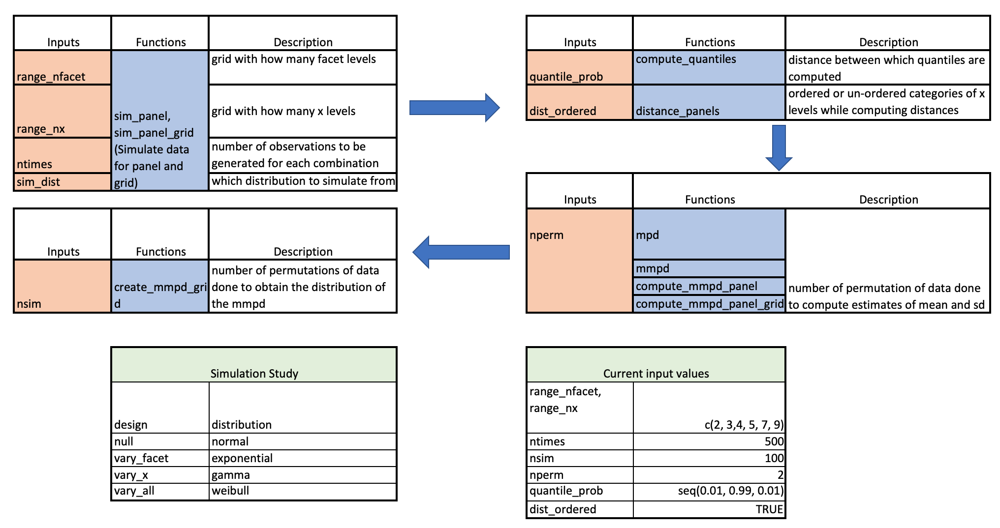

```{r initial, echo = FALSE, cache = FALSE, include = FALSE}
options("knitr.graphics.auto_pdf" = TRUE)
library(knitr)
library(tidyverse)
library(lubridate)
library(lvplot)
library(ggridges)
library(viridis)
library(tsibble)
library(gravitas)
library(ggpubr)
library(readr)
library(kableExtra)
library(distributional)
library(ggplot2)
library(sugrrants)

opts_chunk$set(
  echo = FALSE, warning = FALSE, message = FALSE, comment = "#>",
  fig.path = "figure/", fig.align = "center", fig.show = "hold",
  cache = TRUE, cache.path = "cache/",
  out.width = ifelse(is_html_output(), "100%", "\\textwidth")
)
knitr::opts_knit$set(root.dir = here::here())
#                                                                read_chunk('main.R')
read_chunk("null_distribution.R")
read_chunk("mean_null.R")
source("R/sim_panel.R")
# Set up plan
#source("_drake.R")
# Run all code required
#drake::r_make()
# load each object as required
# loadd()
```


```{r}
set.seed(321)
```


# Introduction

<!-- <introducing the problem> -->
<!-- background of the problem -->

Exploratory data analysis, as coined by John W. Tukey (Tukey 1965) involves many iterations of finding structures and patterns that allows the data to be informative. With temporal data available at finer scales, exploring periodicity and their relationships can become overwhelming with so many possible cyclic temporal granularities [@Gupta2020-vo] to explore.

```{r calendar-elec, fig.height = 10.5, fig.cap="Calendar display."}
elec <- read_rds("data/elec.rds") %>% 
  filter(date >= ymd("20180101"), date < ymd("20180701"))
rdbl <- c("Weekday" = "#d7191c", "Weekend" = "#2c7bb6")

elec <- elec %>% 
  mutate(
    wday = wday(date, label = TRUE, week_start = 1),
    weekday = if_else(wday %in% c("Sat", "Sun"), "Weekend", "Weekday")
  )
p_cal_elec <- elec %>% 
  filter(id %in% c(2, 4)) %>% 
  frame_calendar(x = time, y = kwh, date = date, nrow = 1) %>% 
    ggplot(aes(x = .time, y = .kwh, group = date)) +
    geom_line(aes(colour = as.factor(id)), size = 0.5) +
    scale_colour_brewer(name = "", palette = "Dark2", direction = 1) +
    facet_grid(id ~ ., labeller = label_both) +
    theme(legend.position = "bottom")
prettify(p_cal_elec, size = 2.5, label.padding = unit(0.1, "lines"))
```

\noindent Take the example of the calendar display of electricity smart meter data (\ref{fig:calendar-elec}) used in @wang2020calendar for four households in Melbourne, Australia. The authors show how hour-of-the-day interact with weekday and weekends and then move on to use calendar display to show daily schedules. The calendar display has several components in it, which helps us look at energy consumption across hour-of-the-day, day-of-the-week, week-of-the-month, and month-of-the-year at once. Some interaction of these cyclic granularities could also be interpreted from this display. This is a great start to have an overview of the energy consumption. However, if one wants to understand the periodicities in energy behavior and how the periodicities interact in greater details, it is not easy to comprehend the interactions of some periodicities' from this display, due to the combination of linear and cyclic representation of time. For example, this display might not be the best to understand how hour-of-the-day varies and month-of-year varies across week-of-the-month. Further, it is not clear what all interactions of cyclic granularities should be read from this display as there could be many combinations that one can look at. Moreover, calendar effects are not restricted to conventional day-of-week or month-of-year deconstructions (@Gupta2020-vo) and could include other cyclic granularities like hour-of-week or day-of-fortnight, which could potentially become useful depending on the context. 

```{r intro_all}

id2_tsibble <- elec %>% 
   filter(id == 2) %>% 
   as_tsibble(index = date_time)
  
id4_tsibble <- elec %>% 
   filter(id == 4) %>% 
   as_tsibble(index = date_time)

# hour-of-day and month-of-year (important pair) id2's behavior across different hours of the day very different across months, but for id4 behavior across different hours of the day is not likely a function of month.
p1 <- id2_tsibble %>%
   prob_plot("month_year",
             "hour_day",
             response = "kwh",
             plot_type = "quantile",
             symmetric = TRUE,
             quantile_prob = c(0.1, 0.25,0.5,0.75, 0.9)) +
  ggtitle("") + theme(
        strip.text = element_text(size = 10, margin = margin(b = 0, t = 0))) + 
  scale_colour_brewer(name = "", palette = "PiYG")

p2 <- id4_tsibble %>%
   prob_plot("month_year",
             "hour_day",
             response = "kwh",
             plot_type = "quantile",
             symmetric = TRUE,
             quantile_prob = c(0.1, 0.25,0.5,0.75, 0.9)) + 
  ggtitle("") + theme(
        strip.text = element_text(size = 10, margin = margin(b = 0, t = 0)))

# wknd_wday and week_month (important pair) id2's behavior across different hours of the day very different across months, but for id4 behavior across different hours of the day is not likely a function of month.

p3 <- id2_tsibble %>%
  create_gran("week_month") %>% 
  filter(week_month != 5) %>% 
   prob_plot("wknd_wday",
             "week_month",
             response = "kwh",
             plot_type = "quantile",
             symmetric = FALSE,
             quantile_prob = c(0.25,0.5,0.75)) +
   ggtitle("") +
#scale_x_discrete(breaks = seq(0, 23, 4))  + theme(
        theme(strip.text = element_text(size = 10, margin = margin(b = 0, t = 0)))

p4 <- id4_tsibble %>%
    create_gran("week_month") %>% 
  filter(week_month != 5) %>% 
   prob_plot("wknd_wday",
             "week_month",
             response = "kwh",
             plot_type = "quantile",
             symmetric = FALSE,
             quantile_prob = c(0.25,0.5,0.75)) +
  ggtitle("") +  #+ scale_x_discrete(breaks = seq(0, 23, 4)) + 
theme(
        strip.text = element_text(size = 10, margin = margin(b = 0, t = 0)))

```

```{r id2, fig.cap = "something"}
ggpubr::ggarrange(p1, p2, ncol = 2)
```

```{r id4, fig.cap = "something2"}
ggpubr::ggarrange(p3, p4, ncol = 2)
```

Moreover, there might be specific interactions that are interesting and others that are not and that too will vary with different households. For example, area distribution quantiles are plotted for household 2 and 4 in Figure \ref{fig:id2}a and b respectively. For the first household, the 75th and 90th percentile for Jan, Feb and July are very close, implying that energy usage for these months are generally on a much higher side due to the usage of air conditioners (in Jan and Feb) and heaters (in July). The energy consumption for household 2 is also higher relative to its own consumption for Jan, Feb and March but the 75th and 90th percentile are apart implying that contrary to the first household, the second household resorts to air conditioners and heaters much less regularly than the first one. Moreover, the 75th percentile distribution is not bimodal across hours of the day for the first household in those months, but the distribution looks similar for all months for the second household. Difference in the energy consumption seem to be varying both across month-of-year (facets) and hour-of-day (x-axis). And thus, both the cyclic granularities would deem important while studying the periodicities in the first household. However, it seems like energy consumption across hours of the day are not that different across different months for the second household. Differences seem to be more prominent across month-of-year (facets) than hour-of-day (x-axis). Again, look at \ref{fig:} c and d, where energy consumption for these two households are plotted against (weekend/weekday, week-of-month). Here, for both households, the pattern of energy consumption vary  across different weeks of the month irrespective of the fact it is a weekday or weekend. In that respect, the harmony pair (month-of-year, hour-of-day) seems to be more informative than (weekend/weekday, week-of-month) for the first household. It could be immensely useful to make the transition from all possible ways to only ways that could potentially be informative given a household. 

<!-- Take an example of a data set which are observed at fine temporal scales, like that of NYC bike usage available at https://www.citibikenyc.com/system-data. We use the `nyc_bikes` data set from the R package `tsibbledata` which takes a sample of 10 bikes for the year 2018. The `start_time` and the `stop_time` are recorded to a fineness of seconds. We can look at pair of cyclic granularities (hour_day, wknd_wday) or (week_month, day_week) to see how these periodicities interact. But there could be other pairs that are important too. How to understand which pairs are sufficient to explore given the data set without losing much information about the data. -->

<!-- When we need to understand the interplay of different periodicities in a high frequency temporal datasets, we have many choices to consider. In [@wang2019tsibble] and [@wang2020calendar], periodicities are explored across hour of the day and day of the week or months. But calendar effects are not restricted to conventional day-of-week or month-of-year deconstructions. -->

<!-- what is the dimension of the problem -->
The paper @Gupta2020-vo describes how we can compute all possible combinations of cyclic time granularities. If we have $n$ periodic linear granularities in the hierarchy table, then $n(n-1)/2$ circular or quasi-circular cyclic granularities could be constructed. Let $N_C$ be the total number of contextual circular, quasi-circular and aperiodic cyclic granularities that can originate from the underlying periodic and aperiodic linear granularities. The mapping of the graphical elements chosen in the paper implies that, for a numeric response variable, the graphics display distributions across combinations of cyclic granularities, one placed at x-axis and the other on the facet. That essentially implies there are $^{N_C}P_2$ possible pairwise plots exhaustively, where each plot would display a pair of cyclic granularities. This is large and overwhelming for human consumption.

<!-- Scagnostics literature -->
This is similar to Scagnostics (Scatterplot Diagnostics) by @tukey1988computer, which is used to discern meaningful patterns in large collections of scatterplots. Given a set of $v$ variables, there are $v(v-1)/2$ pairs of variables, and thus the same number of possible pairwise scatterplots. Therefore
for even small $v$, the number of scatterplots can be
large, and scatterplot matrices (SPLOMs) could easily run out of pixels when presenting high-dimensional data. @Dang2014-tw and @wilkinson2005graph provides potential solutions to this, where few characterizations help us to locate anomalies for defining several measures aimed to detect anomalies in density, shape, trend, and
other features in the 2D point scatters.

<!-- harmonies and why it is not enough -->
The paper (@Gupta2020-vo) narrows down the search from $^{N_C}P_2$ plots by identifying pairs of granularities that can be meaningfully examined together (a "harmony"), or when they cannot (a "clash"). However, even after excluding clashes, the list of harmonies left could be enormous for exhaustive exploration. Hence, there is a need to reduce the search even further by including only those harmonies which are informative enough. Also, ranking the remaining harmony pairs based on how well they capture the variation in the measured variable could be potentially useful.  

In this paper, we aim to build a new measure to follow through these two main objectives:

- To choose harmonies for which distributions of categories are significantly different 
- To rank the selected harmonies from highest to lowest variation in the distribution of their categories.

<!-- Talk about Scagnostics: Tukey -->

# Median Maximum Pairwise Distances (MMPD)

We are interested in assessing structure in probability distributions of the measured variable across bivariate cyclic granularities. We propose a measure called Median Maximum Pairwise Distances (MMPD) to evaluate structure in such a design.


## Idea 

The principle employed for building a new metric is explained through a simple example explained in Figure \ref{fig:null4by2}. Each of these figures have the same panel design with 2 x-axis categories and 4 facet levels. Figure \ref{fig:null4by2}a has all x categories drawn from N(5, 10) distribution for each facet. It is not an interesting display particularly, as distributions do not vary across x-axis or facet categories. Figure \ref{fig:null4by2}b has x categories drawn from the same distribution within a facet and different for different facet categories. Figure \ref{fig:null4by2}b exhibits an exact opposite situation where distribution between the x-axis categories within each facet is different but they are same across facets. Figure \ref{fig:null4by2}d takes a step further by varying the distribution across both facet and x-axis categories. If we are asked to rank the displays in order of importance from minimum to maximum, we might order it as a, b, c and then d. It might be argued that it is not clear if b should precede or succeed c. Gestalt theory suggests that when items are placed in close proximity, people assume that they are in the same group because they are close to one another and apart from other groups. Hence, displays that capture more variation within different categories in the same group would be important to bring out different patterns of the data. With this principle, display b could be considered less informative as compared to display c.

With reference to the graphical design in \ref{@Gupta2020-vo}, therefore the idea would be to rate a harmony pair higher if the variation between different levels of the x-axis variable is higher on an average across all levels of the facet variables. Thus the metric could be obtained by computing maximum pairwise distances between distributions of the continuous random variable across x-axis categories for all facets and then taking the median of those maximum pairwise distances across facets. This would help capture the average maximum difference in distribution of the measurement variable explained by the two cyclic granularities together. We call this metric MMPD which stands for Median Maximum Pairwise Distances. In the next section we shall see how we go about computing this measure.


<!-- To elaborate further, look at the examples in Figure \ref{}, where Figure \ref{}a represents the panel design with distribution of each x categories drawn from N(5, 10) distribution. It could be observed that the graph is not particularly interesting, as there is no significant change in distribution between x-axis levels or facets. Figure \ref{}b represents the same panel design with no difference in distribution of x-axis categories within a facet, but different distribution of x-axis categories for different facets. For example, if there are 4 facet levels and 2 x-axis levels, data is generated in the way as described in Table \ref{}. Figure \ref{}b exhibits an exact opposite situation where the x-axis within facets are different but not across facets. -->
<!-- Figure \ref{}d takes it further by varying the distribution across both facet and x-axis categories. -->


```{r null4by2,fig.cap=" A graphical display with two categories mapped to x-axis and 4 categories mapped to facets with the distribution of a continuous random variable plotted on the y-axis. Display a is not interesting as the distribution of the continuous rv does not depend across x-axis or facet categories. Display b and c are more interesting than a since there is a change in distribution either across facets(b) or x-axis(a). Display d is most interesting as distribution of the rv changes across both facet and x-axis variable."}

p1 <- sim_panel(nx = 2, nfacet = 3, ntimes = 500) %>%
  ggplot(aes(x = as.factor(id_x), y = sim_data)) + facet_wrap(~id_facet) + geom_boxplot()

simulated_data <- sim_panel(nx = 2,
          nfacet = 3,
          ntimes = 500,
          sim_dist = rep(dist_normal(seq(5, 15, 5), 5), each = 2)) 


p2 <- simulated_data %>% ggplot(aes(x = as.factor(id_x), y = sim_data)) + facet_wrap(~id_facet) + geom_boxplot()

p3 <- simulated_data %>% ggplot(aes(x = as.factor(id_facet), y = sim_data)) + facet_wrap(~id_x) + geom_boxplot()

p4 <- sim_panel(nx = 2,
          nfacet = 3,
          ntimes = 500,
          sim_dist = dist_normal(seq(5,30, 5), 5)) %>% 
  ggplot(aes(x = as.factor(id_x), y = sim_data)) + facet_wrap(~id_facet) + geom_boxplot()


ggpubr::ggarrange(p1, p2, p3, p4, nrow = 2, ncol = 2,
                  common.legend = TRUE,
                  labels = c("a", "b", "c", "d"))

```


<!-- in the same group would be important to bring out different patterns of the data. -->


## Computation

### Notations

Consider two cyclic granularities $C_i$ and $C_j$, such that $C_i$ maps index set to a set $\{A_k \mid k=1,\dots,K\}$ and $C_j$ maps index set to a set $\{B_\ell \mid \ell =1,\dots,L\}$. Here, $A_k$ and $B_\ell$ are the levels/categories corresponding to $C_i$ and $C_j$ respectively. Let $S_{k\ell}$ be a subset of the index set such that for all $s \in S_{k\ell}$, $C_i(s) = A_k$ and $C_j(s) = B_\ell$. There are $KL$ such data subsets, one for each combination of levels ($A_k$, $B_\ell$). Moreover, consider that in the graphical space, $C_i$ is mapped to facets and $C_j$ is mapped to x-axis. 

### Characterising distribution

Each of the $KL$ data subsets in the data structure have multiple observations and may vary widely across different subsets due to the structure of the calendar, missing observations or uneven locations of events in the time domain. The set of observations corresponding to each combination is assumed to be a sample from an unknown probability density function.
While the whole population of observations has certain characteristics, we can typically never measure all of them. Often shape, central tendency, and variability are the common characteristics used to describe the distribution. Another way to describe the probability distribution is through quantiles. (Define quantiles here) <!--There are two broad approaches to quantile estimation, viz, parameteric and non-parameteric. The benefit of using a non-parametric estimator is that there are less rigid assumptions made about the nature of the underlying distribution of the data.--> Sample quantiles could be thought to estimate the population quantiles. But there are a large number of different definitions used for sample quantiles. The median-unbiased estimator is recommended (Rob's paper) because of its desirable properties of a quantile estimator and can be defined independently of the underlying distribution. 


### Distance between distributions

<!-- One of the most important class of divergence is the f-divergence and includes measures like Kullback-Leibler divergence, Hellinger distance etc. The continuous version of f -divergence is given by -->
<!-- $$D_f(P||Q) := \int q(x)f(\frac{p(x)}{q(x)})$$, where -->
<!-- $f : [0,\infty) \rightarrow R \cup \{\infty\}$ is a continuous convex function, and $f(1) = 0$.  -->
  
The most common divergence measure between distributions is the Kullback-Leibler (KL) divergence[@Kullback1951-jy] introduced by Solomon Kullback and Richard Leibler in 1951. The KL divergence, denoted $D(p(x), q(x))$ is a non-symmetric measure of the difference between two probability distributions $p(x)$ and $q(x)$ and is interpreted as the amount of information lost when $q(x)$ is used to approximate $p(x)$. Although the KL divergence measures the “distance” between two distributions, it is not a distance measure since it is not symmetric and does not satisfy the triangle inequality. The Jensen-Shannon divergence [@Menendez1997-in] based on the Kullback-Leibler divergence is symmetric and it always has a finite value. The square root of the Jensen-Shannon divergence is a metric, often referred to as Jensen-Shannon distance. Other common measures of distance are Hellinger distance, total variation distance and Fisher information metric. 

In the context of this paper, the pairwise distances between the distributions of the measured variable are computed through Jensen-Shannon distance (JSD) which is based on Kullback-Leibler divergence and is defined by,

$$JSD(P||Q) = \frac{1}{2}D(P||M) + \frac{1}{2}D(Q||M)$$
where $M = \frac{P+Q}{2}$ and 
$D(P||Q) := \int^\infty_{-\infty} p(x)f(\frac{p(x)}{q(x)})$ is the KL divergence between distributions $p(x)$ and $q(x)$. Probability distributions are estimated through quantiles instead of kernel density so that there is minimal dependency on selecting kernel or bandwidth.

<!-- The Jensen-Shanon distance between two probability distribution $p_1$ and $p_2$ is given by $$d = [D(p_1, r) + D(p_2, r)]/2 \quad where \quad r = (p_1 + p_2)/2$$ where, -->
<!-- $$D(p_1,p_2) = \int^{\infty}_{-\infty}p_1(x)log\frac{p_1(x)}{p_2(x)}\,dx$$ is the Kullback-Leibler divergence between $p_1$ and $p_2$.   -->

<!-- We call this measure of variation as  Median Maximum Pairwise Distances (MMPD). -->


<!-- #### Distribution of Jensen-Shannon distances -->

<!-- Jensen-Shannon distances (JSD) are distributed as chi-squared with $m$ df where we discretize the continuous distribution with $m$ discrete values. Taking sample percentiles to approximate the integral would mean taking $m = 99$. -->
<!-- With large $m$, chi-squared is asymptotically normal by the CLT. Thus, by CLT, ${\chi^2}_{m} \tilde{} N(m, 2m)$, which would depend on the number of discretization used to approximate the continuous distribution. Then $b_n = 1-1/n$ quantile of the normal distribution and $a_n = 1/[n*\phi(b_n)]$ where $\phi$ is the normal density function. $n$ is the number of pairwise comparisons being made. -->


### Distance measure

The algorithm employed for computing the distance measure is summarized as follows:

1. Fix harmony pair $(C_i, C_j)$.

2. Fix $k$. Then there are $L$ groups corresponding to level $A_k$ of $C_i$.

3. Compute  $m = \binom{L}{2}$ pairwise distances between distributions of $L$ unordered levels and $m = L-1$ pairwise distances for $L$ ordered categories.

4. Identify maximum within the $m$ computed distances.

5. Compute maximum distance ($M$) using appropriate norming constants.

6. Use Steps 1-5 to compute maximum distance for $\forall k \in  \{1, 2, \ldots, K\}$.

7. Compute the distance measure MMPD_raw = median $(M_1, M_2, \dots, M_K)$.


However, median and maximum distances are not unaffected by the number of levels and hence the distance measure MMPD_raw, which is a combination of median and maximum would also be influenced by the number of levels. It would have higher values if $C_i$ or $C_j$ has higher levels. We would ideally want a higher value of the measure if there is significant difference between distributions across facet or x-axis categories, and not because the number of categories are higher. From the histogram we could see that th both the shape and scale of the distribution are different when we move across different levels.

Figure \ref{fig:mean-sd-max} shows how distribution of MMPD_raw varies for different levels of $C_i$ and $C_j$. In this example, both the cyclic granularities $C_i$ and $C_j$ are considered such that their levels vary in the range $(2, 3, 4, 5,7 ,9, 14, 21, 30, 45)$. Each of these combinations is considered a panel for each of which MMPD_raw has been constructed 100 times to compute the distribution. This shows that with the increase in the number of levels of $C_i$, the distributions shift rightward and upward. With increasing number of levels of x-axis, such a direction is not clear. This implies we need to atleast normalise for the levels of the facets so that we could correctly compare MMPD_raw across different combinations. 


both mean and standard deviation of the distribution of maximum and median varies for different sample sizes ($n$). There is a rightward shift in the location and decrease in scale with increasing $n$.

Thus these median maximum pairwise distances need to be normalized for different harmonies in a way that eliminates the effect of different levels, consequently enabling comparison across different harmonies. The Fisher–Tippett–Gnedenko theorem in the field of Extreme Value Theory states that the maximum of a sample of iid random variables after proper re-normalization can converge in distribution to only one of Weibull, Gumbel or Freschet distribution, independent of the underlying data or process.


```{r}
mmpd_raw = read_rds("../hakear-drake/data/data_all23457914n.rds")
data_long = mmpd_raw %>% pivot_longer(c(1:2), names_to = "category", values_to = "levels")


g1 <- data_long %>%
filter(category == "nfacet") %>% 
ggplot() +
ggridges::geom_density_ridges(aes(x = raw_mmpd, y = as.factor(levels)))  + ylab("facet levels") + xlab("Raw MMPD")

g2 <- data_long %>%
filter(category == "nx") %>% 
ggplot() +
geom_boxplot(aes(x = as.factor(levels) , y = raw_mmpd)) +
  xlab("x-axis levels") + ylab("Raw MMPD") +  coord_flip()

library(patchwork)
g1|g2 
```

```{r hist_plot}
 hist_plot = mmpd_raw %>% 
      ggplot() +
      geom_density(aes(x = raw_mmpd), fill = "blue") +
      facet_grid(nx~nfacet)
hist_plot
```


### Normalize distances

<!-- The harmony pairs could be arranged from highest to lowest average maximum pairwise distances across different levels of the harmonies. -->

<!-- With increasing n, mean and sd of distribution of max increases. -->


<!-- FTP theorem works for large n -->


<!-- For small n resort to bootstrapping -->

<!-- bullet points end here -->

<!-- Suppose that $X_1$, $X_2$ , ... , $X_n$ are i.i.d. random variables with expected values $E(X_i) = \mu < \infty$ and variance $Var(X_i) = \sigma^2 < \infty$. Let  -->
<!-- $Y = max(X_1, X_2, \dots, X_n)$. -->

<!-- Let $F_X(x)$ be the common distribution of the variables $X_i$ and let $F_Y(y)$ be the corresponding distribution of $Y$. $F_Y(y)$ could be obtained from $F_X(x)$ simply by using: -->
<!-- $F_Y(y) = P[(X_1 \leq y)\cap(X_2 \leq y) \cap...\cap (X_n \leq y)] = {F_X(y)}^n$. For large $n$, the distribution of $Y$ approaches a standard shape, which does not depend on $F_X$. But what about the case when $n$ is not large enough? The distribution of maximum in that case will indeed depend on $n$ and the underlying distribution of $X$. If $F_X(x)$ is the CDF of $X$, then $F_Y(y) = {F_x(y)}^n$. Suppose $\Phi$ nd $\phi$ are the cdf and pdf of a standard normal distribution, then -->
<!-- $f_Y(y) = n{\Phi(y)}^{n-1}\phi(y)$, which depends on $n$. Hence, we are trying to normalise for $n$. Also, it depends on the underlying distribution of $X$, which we have assumed as normal in our case. As $n$ grows, we  can see the right tail growing, which implies that the probability that we will get a higher maximum is more. Now, for large $n$, we used EVT to normalise for $n$, that is, we brought them to the same scale without distorting the range of the distribution. But in our case, we will mostly have small $n$. It is important to ensure that they have the same mean and variation, for being able to compare the maximum value across $n$. We observe from the following graphs that our normalisation works after $n=6$, after which the difference in mean and standard deviation flattens out a lot. -->

<!-- ### why normalize -->

Median and maximum distances are not robust to the number of levels and the metric would have higher values for harmonies with higher levels. Figure \ref{fig:mean-sd-max} shows how both mean and standard deviation of the distribution of maximum and median varies for different sample sizes ($n$). There is a rightward shift in the location and decrease in scale with increasing $n$. Thus these median maximum pairwise distances need to be normalized for different harmonies in a way that eliminates the effect of different levels, consequently enabling comparison across different harmonies. The Fisher–Tippett–Gnedenko theorem in the field of Extreme Value Theory states that the maximum of a sample of iid random variables after proper re-normalization can converge in distribution to only one of Weibull, Gumbel or Freschet distribution, independent of the underlying data or process.

More formally, $d_{1},d_{2}\ldots ,d_{n}$ be a sequence of independent and identically-distributed pairwise distances and $M_{n}=\max\{d_{1},\ldots ,d_{n}\}$. Then Fisher–Tippett–Gnedenko theorem [@De_Haan2007-yx] suggests that if a sequence of pairs of real numbers $(a_{n}, b_{n})$ exists such that each $a_{n}>0$ and $\lim _{{m\to \infty }}P\left({\frac  {M_{n}-b_{n}}{a_{n}}}\leq x\right)=F(x)$, where $F$ is a non-degenerate distribution function, then the limit distribution $F$ belongs to either the Gumbel, Fréchet or Weibull family. The normalizing constants $(a_{n}, b_{n})$ vary depending on the underlying distribution of the pairwise distances. Hence to normalize appropriately, it is 
important to assume a distribution of these distances. 

For large $n$, the distribution of $M$ approaches a standard shape. But what about the case when $n$ is not large enough? The distribution of maximum in that case will indeed depend on $n$ and the underlying distribution of $D$. For large $n$, we could use EVT and CLT to normalise for $n$, however, most of the cyclic granularities encountered in practice have low $n$. Hence, normalisation could be done by bootstrapping procedure to ensure that the distribution of maximum/median have the same mean and variation for varying $n$.

```{r create_simdata}

```

```{r create_nlevels}

```


```{r norm_max_new}

```


```{r mean-sd-max, fig.cap = "Display shows mean and standard deviation of the distribution of maximum for sample sizes ranging from 2 to 30. There is a right shift in the distribution of maximum and median with increasing sample sizes."}

library(ggridges)
library(viridis)
max_all_data <- create_nlevels(nlevels = seq(2, 30, 2),
                           nsim = 500,
                           sim_dist = distributional::dist_normal(5, 10), create_fun = max)

g1 <- max_all_data %>% ggplot() + geom_density_ridges(aes(x=sim_data, y = as.factor(ind))) + ylab("n") + xlab("max")

median_all_data <- create_nlevels(nlevels = seq(2, 30, 2),
                           nsim = 500,
                           sim_dist = distributional::dist_normal(5, 10), create_fun = median)

g2 <- max_all_data %>% ggplot() + geom_boxplot(aes(x=sim_data, y = as.factor(ind)))  + ylab("n") + xlab("median")

ggpubr::ggarrange(g1, g2, ncol = 2)


```

## Performance


# Simulation study

<!-- ### Distribution of distances -->

<!-- ### Theoretical evidence -->

<!-- JS distances are distributed as chi-squared with $m$ df where we discretize the continuous distribution with $m$ discrete values. Taking sample percentiles to approximate the integral would mean taking $m = 99$. -->
<!-- With large $m$, chi-squared is asymptotically normal by the CLT. Thus, by CLT, ${\chi^2}_{m} \tilde{} N(m, 2m)$, which would depend on the number of discretization used to approximate the continuous distribution. Then $b_n = 1-1/n$ quantile of the normal distribution and $a_n = 1/[n*\phi(b_n)]$ where $\phi$ is the normal density function. $n$ is the number of pairwise comparisons being made. -->

<!-- ### Empirical evidence -->

<!-- Distribution of JS distances is assumed to be normal but the mean and variance are estimated from the sample, rather than deducing it from the number of discretization used to approximate the continuous distribution. We look at different scenarios, where observations are collected from Normal, Exponential, Chi-squared and Gumbel distribution and found the distribution of JS distances are similar, irrespective of which distribution they are drawn from. -->


<!-- #### Initial distribution of observed variables shown in plot title -->

<!-- ```{r distv11} -->

<!-- ``` -->

<!-- ```{r distv12} -->

<!-- ``` -->


<!-- ```{r distv13} -->

<!-- ``` -->


<!-- ```{r distv14} -->

<!-- ``` -->

<!-- ### Design and analysis of simulation experiments -->

The behavior of the measure is monitored and understood through simulation experiments. A single simulation consisting of computational operations on a panel generating MMPD the value of which represents to what extent a pair of cyclic granularities would be interesting when displayed in the design. In comparing different simulation runs, we distinguish between different distributions and simulation scenarios (also iterations may be).

## Simulated designs

 D1. Same distribution of the measured variable across all x-axis and facet categories
 D2. Different distribution across facet categories but same across x-axis categories
 D3. Different distribution across x-axis categories but same across facet categories
 D4. Different across both x-axis and facet categories 
 
Each of these case scenarios tried against following distribution to check if underlying distribution has a role to play.

 a) Normal 
 b) Exponential
 c) Gamma
 d) Weibull


## Environment

R version 4.0.1 (2020-06-06) is used with platform: x86_64-apple-darwin17.0 (64-bit) running under: macOS Mojave 10.14.6


## Experimental set up

This section describes the design of simulation runs, in terms of the scenarios simulated, the number of permutations used to compute estimates and to display the distribution of MMPD.

 <!-- - seed while generating random observations `seed1 = set.seed(9999)`   -->
 <!-- - grid with how many x levels `range_nx_vec = seq(2:4)`   -->
 <!-- - grid with how many facet levels `range_nfacet_vec = seq(2:4)`   -->
 <!-- - number of observations to be generated `ntimes_val = 500`   -->
 <!-- - number of permutation of data done to compute estimates `nperm_val = 2`   -->
 <!-- - number of permutations of data done to display histogram for each panel `nsim_val = 10`    -->
 <!-- - ordered or un-ordered categories of x levels while computing distances `dist_ordered_val = TRUE`   -->
 <!-- - distance between which quantiles are computed `quantile_prob_vec = seq(0.01, 0.99, 0.01)`   -->

```{r}

```


Observations from the null distribution are chosen as:  
`sim_norm_null =   distributional::dist_normal(5, 10)`  
<!--`sim_exp_null  =   distributional::dist_expoential(5)`  -->
`sim_gamma_null  =   distributional::dist_gamma(0.5, 0.2)`  
<!--`sim_weibull_null  =   distributional::dist_weibull(1.5, 3)`-->  

The various designs are selected by increasing the mean/rate/shape of these distributions proportionally with that parameter.

<!-- To check if different distributions impact, simulate data from different distributions. A 3 way contingency table with number of facet levels, x-axis levels and distribution type should be constructed with each cell value as the p-value. -->

<!-- Table -->
<!-- Conclusions -->
<!-- (in Null distribution) -->

<!-- #### Varying distribution across facet -->
<!-- #### Varying distribution across x-axis -->
<!-- #### Varying distribution across both facets and x-axis -->
<!-- #### Repeat all with varying facet and x-axis levels -->

<!-- Table -->
<!-- Conclusions -->
<!-- (in power) -->

## Data Shuffling method


<!-- ```{r} -->
<!-- raw_data = rnorm(12, 5, 10) %>%  -->
<!--   as_tibble() %>%  -->
<!--   mutate(nfacet = rep(1:4, each = 3), -->
<!--          nx = rep(1:3, 4)) -->

<!-- raw_data %>% group_by(nfacet, nx) %>% nest() -->

<!-- raw_data2 = raw_data %>% pivot_wider(id_cols = 2, names_from = "nx", values_from = "value") -->

<!-- ``` -->

<!--  ### Original -->
<!-- | facets/x-axis     	| A_1  	| A_2  	| A_3  	| .. 	| .. 	| A_m  	| -->
<!-- |-----	|------	|------	|------	|----	|----	|------	| -->
<!-- | B_1 	| x_1 	| x_2 	| x_3 	| .. 	| .. 	| x_n 	| -->
<!-- | B_2 	| y_1 	| y_2 	| y_3 	| .. 	| .. 	| y_n 	| -->
<!-- | B_3 	|      	|      	|      	|    	|    	|      	| -->
<!-- | ..  	|      	|      	|      	|    	|    	|      	| -->
<!-- | ..  	|      	|      	|      	|    	|    	|      	| -->
<!-- | B_L 	| z_1 	| z_2 	| z_3 	| .. 	| .. 	| z_m 	| -->

<!-- ### Step1 -->

<!-- | facets/x-axis     	| A_1  	| A_2  	| A_3  	| .. 	| .. 	| A_m  	| -->
<!-- |-----	|------	|------	|------	|----	|----	|------	| -->
<!-- | B_1 	| x_1 	| x_2 	| x_3 	| .. 	| .. 	| x_n 	| -->
<!-- | B_2 	| y_1 	| y_2 	| y_3 	| .. 	| .. 	| y_n 	| -->
<!-- | B_3 	|      	|      	|      	|    	|    	|      	| -->
<!-- | ..  	|      	|      	|      	|    	|    	|      	| -->
<!-- | ..  	|      	|      	|      	|    	|    	|      	| -->
<!-- | B_L 	| z_1 	| z_2 	| z_3 	| .. 	| .. 	| z_m 	| -->

The mean and sd needs to be computed by permuting the data repeatedly. These permutations could be done in several ways given the design.

### Method 1:

All data is repeatedly shuffled $nperm$ times in random manner to obtain the measure $m = median_{facets}(max_{x}dist)$. Then the normalised $m$ is obtained by scaling the observed value by the mean and sd of all $m$ obtained from the permutated data.

### Method 2:

$m' = max_{x}dist$ is obtained for each facet.
All $x$ levels are shuffled for each facet to obtain several $m'$s. Hence $m'$ is normalized for each facet level and the facets are aggregated using $m''= median(m')$, which is basically median(norm(max)). We need to normalise this median across facets as well. So we shuffle all facets for each $x$ level and obtain several $m''$s. In this approach, data is shuffled $2*nperm$ times and hence distances are computed $2*nperm$ times. It is computationally very intensive.

Hence, it was decided that the first approach will be employed to implement normalisation. One of the advantages of the second method could be to have normalisation separately for max and median measure. There is nothing that is stopping the users to implement this with more efficient computing power. 

```{r}
# design_time <- readr::read_rds("../hakear-drake/data/design_time.rds")
# write_rds(design_time, "data/design_time.rds")
time_data <-readr::read_rds("data/design_time.rds")
time_data$design = 
  factor(time_data$design,
         levels = c("null","vary_f", "vary_x", "vary_all"))

time_data %>% 
  pivot_longer(cols = c(time_obs, time_dist),
               names_to = "type",
               values_to = "time") %>% 
  dplyr::filter(distribution == "normal") %>% 
  ggplot(aes(x= design, 
             y = log(time, exp(1)), 
             colour = type, group = nfacet)) + geom_point() + geom_line(aes(group = type)) +
  facet_grid(nx~nfacet) + ylab("ln(time)")


```


## Results 

### Null distribution 

<!-- Objective: distribution equal and hence values could be compared and normalisation works -->
Under the null hypothesis, all the combinations of x-axis and facets are obtained from the same distribution. We need to study the distribution of the mmpd values under the null hypothesis to see if comparison of their values across different x-axis and facet levels are at all possible. So, in turn it needs to be checked that if normalisation worked.

Currently, we see in Figure \ref{fig:null-dist} that the normalisation works fine for each facet since the distributions for each column are equal irrespective of the distribution type. But it does not work along the x-axis.

```{r null-dist, fig.cap="Distribution of mmpd across different facet levels (columns) and x-axis levels (rows) for null ditribution normal(5,10) and gamma(0.5, 0.2). The distribution of MMPD is unaffected by the null distribution considered. It is also the same across all facet levels but not across the x-axis, which means normalisation is failing across x-axis."}
# all_files = list.files(path = "../hakear-drake/data", pattern = ".rds")
# all_files
# 
# read_files = lapply(all_files, function(x){
#   read_rds(paste0("../hakear-drake/data/", x))
# })
# 
# names(read_files) = str_remove(all_files, pattern = ".rds")
# 
# null_all = bind_rows(normal = read_files$null_normal,
#                      exponential = read_files$null_exp,
#                      gamma = read_files$null_gamma,
#                      weibull = read_files$null_weibull,
#                      .id = "distribution")
# design_all = readr::read_rds("../hakear-drake/data/design_all.rds")
design_all = readr::read_rds("data/design_all.rds")


design_all$design = 
  factor(design_all$design,
         levels = c("null","vary_f", "vary_x", "vary_all"), labels = c("D1", "D2", "D3", "D4"))
design_all$distribution = 
  factor(design_all$distribution,
         levels = c("normal","gamma"), labels = c("norm","gam"))
library(dplyr)
library(ggplot2)
ggplot2::ggplot(design_all %>% 
                      filter(design == "D1")) +
  ggridges::geom_density_ridges(aes(y = distribution, x = mmpd.x, fill = distribution)) + 
  facet_grid(nx~nfacet) +
  scale_fill_viridis_d() +
  xlab("MMPD")
```

# The statistical test

## Algorithm

for computation for all harmony pairs

**Assumption:** random permutation without considering ordering 
(global)

1. Given the data; $\{v_t: t=0, 1, 2, \dots, T-1\}$, the MMPD is computed and is represented by $MMPD_{obs}$.

2. From the original sequence a random permutation is obtained: $\{v_t^*: t=0, 1, 2, \dots, T-1\}$.

3. MMPD is computed for all random permutation of the data and is represented by $MMPD_{sample}$.

4.  Steps (2) and (3) are repeated a large number
of times M (e.g. 1000).

5. For each permutation, one $MMPD_{sample}$ value is obtained.

6. $95^{th}$ percentile of this $MMPD_{sample}$ distribution is computed and stored in $MMPD_{threshold}$.

7. If  $MMPD_{obs}> MMPD_{threshold}$, harmony pairs are accepted. Only one threshold for all harmony pairs.

Pros: Considering thresholds global for all harmony pairs would imply less computation time.

Cons: Only one threshold for all harmony pairs means we are assuming distribution of all harmonies pairs are similar, which might not be the case.But nevertheless, it is a good benchmark.


```{r, eval = FALSE, echo = FALSE}
smart_harmony <-read_rds("data/smart_harmony_nonst.rds")
smart_harmony
```


```{r smart_harmony,eval = FALSE, echo = FALSE}

sm <- smart_meter10 %>% dplyr::filter(customer_id %in% c("10017936"))

harmonies <- sm %>% 
  harmony(ugran = "month",
          filter_in = "wknd_wday",
          filter_out = c("hhour", "fortnight"))


harmony_tbl =  harmonies

smart_harmony <- sm %>% 
  rank_harmony(harmony_tbl = harmonies,
               response = "general_supply_kwh", 
               dist_ordered = TRUE)

smart_harmony %>% 
  mutate(MMPD = round(MMPD, 3), max_pd = round(max_pd, 3)) %>% 
  mutate(rankn = row_number()) %>%
  rename("rankun" = "r") %>% kable()
```

## Size, power and confidence interval

#### Characteristics under different simulation designs   
A set of simulation runs that are conducted and some outputs of which are reported.


```{r sim_all, echo = FALSE}
bind_files = readr::read_rds("../hakear-drake/data/compute_p_value.rds")

bind_files$design = 
  factor(bind_files$design,
         levels = c("null","vary_f", "vary_x", "vary_all"), labels = c("D1", "D2", "D3", "D4"))

ggplot(bind_files %>% 
         filter(distribution == "normal")) +
  geom_point(aes(x=design, y = p_value),
                 alpha = 0.5)+
  facet_grid(nx~nfacet) +
  geom_line(aes(x = design, y = p_value, group = distribution, color = distribution))

ggplot(bind_files %>% 
         filter(distribution == "exponential")) +
  geom_point(aes(x=design, y = p_value),
                 alpha = 0.5)+
  facet_grid(nx~nfacet) +
  geom_line(aes(x = design, y = p_value, group = distribution, color = distribution))

ggplot(bind_files %>% 
         filter(distribution == "gamma")) +
  geom_point(aes(x=design, y = p_value),
                 alpha = 0.5)+
  facet_grid(nx~nfacet) +
  geom_line(aes(x = design, y = p_value, group = distribution, color = distribution))

ggplot(bind_files %>% 
         filter(distribution == "weibull")) +
  geom_point(aes(x=design, y = p_value),
                 alpha = 0.5)+
  facet_grid(nx~nfacet) +
  geom_line(aes(x = design, y = p_value, group = distribution, color = distribution))
```

```{r sim_conf, echo = FALSE, eval = FALSE}
library(dplyr)
library(ggplot2)
ggplot2::ggplot(design_all %>% 
                      filter(design == "D1", distribution == "norm")) +
  geom_boxplot(aes(x = as.factor(nx), 
                   y = mmpd.x), width = 0.1) + 
  facet_wrap(~nfacet) +
  scale_fill_viridis_d() +
  xlab("number of x levels") +
  coord_flip()

```


# Algorithm 

\noindent The algorithm employed for computing MMPD is summarized as follows:
<!-- Algorithm -->

<!-- 1. Suppose $C_i$ and $C_2$ are two cyclic granularities such that $C_i$ maps index set to a set $\{A_1, A_2, A_3, \dots, A_l$\}, and $C_2$ maps index set to a set $\{B_1, B_2, B_3, \dots, B_m$\} and $v$ is the measured variable. Hence for each combination ($A_k$, $B_l$), we have the time series variable $v_{ij} \subseteq v$, $\forall i = {1, 2, \dots, l}$ and $\forall j = {1, 2, \dots, m}$ -->

- **Input:** Data corresponding to all harmony pairs, i.e., data sets of the form $(C_i, C_j, v)$ 
$\forall i, j \in N_C$  
- **Output:** MMPD (Median Maximum Pairwise Distances) measuring the average variation across different levels of $C_i$ and $C_j$ $\forall i, j \in N_C$  

1. Fix harmony pair $(C_i, C_j)$.

2. Fix $k$. Then there are $L$ groups corresponding to level $A_k$ of $C_i$.

3. Compute  $m = \binom{L}{2}$ pairwise distances between distributions of $L$ unordered levels and $m = L-1$ pairwise distances for $L$ ordered categories.

4. Identify maximum within the $m$ computed distances.

5. Compute normalized maximum distance ($NM$) using appropriate norming constants.
<!--so that the distribution of the normalized maximum converges to a Gumbel distribution as $m\rightarrow\infty$.-->


6. Use Steps 1-5 to compute normalized maximum distance for $\forall k \in  \{1, 2, \ldots, K\}$.

7. Compute MMPD = median $(NM_1, NM_2, \dots, NM_K)$/log($K$).

8. Repeat Steps 1 to 7 for all harmony pairs.


# Applications {#sec:application}

## Smart meter data of Australia {#sec:smartmeter}

<!-- # how data looks -->


Smart meters provide large quantities of measurements on energy usage for households across Australia. One of the customer trials [@smart-meter] conducted as part of the Smart Grid Smart City project in Newcastle, New South Wales and some parts of Sydney provides customer wise data on energy consumption for every half hour from February 2012 to March 2014. <!--It would be interesting to explore the energy consumption distribution for these customers and gain insights on their energy behavior which are lost either due to aggregation or looking only at coarser temporal units.-->The idea here is to show how to visualize the distribution of the energy consumption across different cyclic granularities in a systematic way to identify different behavioral patterns.


### Cyclic granularities search and computation:
  
The tsibble object `smart_meter10` from R package `gravitas` [@R-gravitas] consisting of `reading_datetime`, `customer_id` and `general_supply_kwh` denoting the index, key and measured variable of the tsibble is used to facilitate the systematic exploration. While trying to explore the energy behavior of these customers systematically across cyclic time granularities, the first thing to consider is which cyclic time granularities we can look at exhaustively. Let us consider conventional time deconstructions for a Gregorian calendar (second, minute, half-hour, hour, day, week, month, year). Since the interval of this tsibble is 30 minutes, the temporal granularities may range from half-hour to year. Considering $6$ linear granularities half-hour, hour, day, week, month and year in the hierarchy table, $N_C = (6*5/2) = 15$. <!--(via Section \ref{sec:data-structure}) circular or quasi-circular granularities that could be formed relating two linear granularities at a time.--> If $N_C$ seem too large, the smallest and largest linear granularities could be considered to be removed from the hierarchy table. We remove half-year and year to have $N_C = (4*3/2) = 6$ and obtain cyclic granularities namely "hour_day", "hour_week", "hour_month", "day_week", "day_month" and "week_month", read as "hour of the day", etc. Further, we add cyclic granularity day-type( "wknd_wday") to capture weekend and weekday behavior. Now that we have a list of cyclic granularities to look at, we should be able to compute the multiple-order-up granularities using Section \ref{sec:cyclic-calendar}. 

```{r search, echo=FALSE, eval = FALSE}
library(gravitas)
smart_meter %>%
  search_gran(filter_out = c("semester", 
                             "quarter",
                             "fortnight"))
```


```{r search_gran_limit2, echo = FALSE, eval = FALSE}
smart_meter10 %>% search_gran(
  highest_unit = "month",
  filter_out = c("hhour", "fortnight"))%>%
  knitr::kable(format = "latex",
      booktabs = TRUE) %>%
  #row_spec(0, bold = TRUE)%>%
  kable_styling()
```


<!-- # smart_meter_limit2 <- smart_meter10 %>% search_gran(highest_unit = "month", -->
<!-- #                               filter_out = c("hhour", "fortnight") -->
<!-- # ) -->
<!-- # knitr::kable(smart_meter_limit2, format = "markdown") -->

<!-- Now that we have a list of cyclic granularities to look at, we should be able to compute them from the data using Sections \ref{sec:circular-gran-def}, \ref{sec:quasi-circular-gran-def} and \ref{sec:aperiodic-gran-def}. -->

### Screening and visualizing harmonies

From the search list, $N_C = 7$ cyclic granularities are chosen for which we would like to derive insights of energy behavior. Recalling the data structure <$C_i$, $C_j$, `general_supply_kwh`> for exploration $\forall i, j \in \{1, 2, \ldots, 7\}$, each of these $7$ cyclic granularities can either be mapped to x-axis or to facet. Choosing $2$ of the possible $7$ granularities, which is equivalent to having $^{7}P_2 = 42$ candidates for visualization. Fortunately, harmonies can be identified among those $42$ possibilities to narrow the search. \autoref{tab:harmony-tab} shows $16$ harmony pairs after removing clashes and any cyclic granularities with levels more than $31$, as effective  exploration becomes difficult with many levels (Section \ref{sec:levels}). The MMPD is also shown along with indicator (*) only when variation of measured variable across the harmony pair significant. Starting from $42$ possible pairs of cyclic granularities to visualize, we are finally left with only $6$, which is a very sizable number of displays for exploration.


Few harmony pairs are displayed in \autoref{fig:bothcust} to illustrate the significance of MMPD, threshold and the impact of different distribution plots and reverse mapping.
\noindent For each of \autoref{fig:bothcust} (b) and (c), $C_i$ is the circular granularity day-type (weekday/weekend) and $C_j$ is hour of the day. The geometry used for displaying the distribution is chosen as area-quantiles and violins in \autoref{fig:bothcust} (b and c respectively). \autoref{fig:bothcust} (a) displays reverse mapping of $C_i$ and $C_j$ with $C_i$ denoting hour of the day and $C_j$ denoting day-type with distribution geometrically displayed as boxplots.

<!-- From the search list, we found six cyclic granularities for which we would like to derive insights of energy behavior. Given the data structure <$C1$, $C2$, `general_supply_kwh`>, each of those six cyclic granularities can either be mapped to x-axis or to facet. Thus the problem is equivalent to taking 2 granularities at a time from six, which essentially is equivalent to having 30 data subsets for visualization. However, harmony/clash pairs can be identified among those 30 possibilities to determine feasibility of plotting any pairs together. \autoref{tab:harmony-tab} shows 13 harmonies pairs, each of which can be plotted together to look at the energy behavior from different perspectives. -->

<!-- We will look at few harmony pairs and see how the proposed workflow can be utilized.  -->

<!-- From the Gestalt theory with the same data  <$C1$ $C2$, `general_supply_kwh`>, mapping $C1$ on the x-axis vs facet might lead to different insights. -->

```{r harmony-tab, echo=FALSE, eval = FALSE, cache=TRUE}
# if(!dir.exists("cache/"))
# {
#   dir.create("cache")
# }
# 
# if (!file.exists("cache/smart_harmony.rds")) {
  sm <- smart_meter10 %>%
  filter(customer_id %in% c(10017936))
  
  harmonies <- sm %>%
  harmony(ugran = "month",
          filter_in = "wknd_wday", 
          filter_out = c("hhour", "fortnight"))
set.seed(12345)

global_harmony <- sm %>%
  global_threshold(harmony_tbl = harmonies,
                   response = "general_supply_kwh", nsamp = 5) %>%
  rename(`facet variable` = facet_variable,
         `x-axis variable` = x_variable,
         `facet levels` = facet_levels,
         `x-axis levels` = x_levels) %>% 
  mutate(MMPD = if_else(gt_MMPD == TRUE,
                        paste0(MMPD, "*"), paste0(MMPD))) %>%
  select(`facet variable`,`x-axis variable`,
         `facet levels`,`x-axis levels` ,MMPD) 

#   write_rds(smart_harmony,"cache/smart_harmony_ak.rds")
# }
#smart_harmony <- read_rds("cache/smart_harmony.rds")

  knitr::kable(global_harmony,
               format = "latex",
               booktabs = TRUE,
                caption = "Harmonies with a pair of cyclic granularity one placed on facet and the other on x-axis. Out of 42 possible combinations of cyclic granularities, only 16 are harmony pairs. The harmony pairs are ranked basis highest to lowest MMPD and only the first 6 show significant variation in the measured variable.") %>%
    #row_spec(0, bold = TRUE) %>%
    kable_styling()
```


In \autoref{fig:bothcust} (b), <!--the distribution of energy consumption is plotted across the harmony pair (weekday/weekend, hour of the day) through an area quantile plot-->the black line is the median, whereas the purple band covers 25th to 75th percentile, the orange band covers 10th to 90th percentile and the green band covers 1st to 99th percentile. The first facet represents the weekday behavior while the second one displays the weekend behavior and energy consumption across each hours of the day is shown inside each facet. The energy consumption is extremely (positive- or right-) skewed with the 1st, 10th and 25th percentile lying relatively close whereas 75th, 90th and 99th lying further away from each other. This is common across both weekdays and weekends. For the first few hours on weekdays, median energy consumption starts and continues to be higher for longer as compared to weekends.

Consider looking at violin plots instead of quantile plots to look at the same data in \autoref{fig:bothcust}(c). There is additional information that we can derive looking at the distribution. There is bimodality in the early hours of the day, implying both low and high energy consumption is probable in the early hours of the day both for weekdays and weekends. <!--Also the hours from 7 to 13 look most volatile.--> If we visualize the same data with reverse mapping of the cyclic granularities, then the natural tendency would be to compare weekend and weekday behavior within each hour and not across hours. For example in \autoref{fig:bothcust}(a), it can be seen that median energy consumption for the early morning hours is extremely high for weekdays compared to weekends. Also, outliers are more prominent in the latter part of the day. All of these indicate that looking at different distribution geometry or changing the mapping might shed lights on different aspect of the energy behavior for the same sample population.


```{r bothcust, fig.cap = "Energy consumption of a single customer shown with different distribution displays, and granularity arrangements. Two granularities are used: hour of the day (I) and weekday/weekend (II). Plot (a) shows granularity I facetted by granularity II, and plots (b), (c) shows the converse mapping. Plot (a) makes a comparison of usage by workday within each hour of the day using side-by-side boxplots. Generally, on a work day there is more consumption early in the day.  Plots (b) and (c) examine the temporal trend of consumption over the course of a day, separately for the type of day. Plot (b) uses an area quantile to put the emphasis on the time series, for example, the median consumption over time shows prolonged usage in the morning on weekdays. Plot (c) uses a violin plot to place emphasis on distributional differences across hours. It can be seen that the morning use on weekdays is bimodal, some work days there is low usage, which might indicate the person is working from home and also having a late start.", out.width="90%"}


cust2_quantile <- smart_meter10 %>%
  filter(customer_id %in% c(10017936)) %>%
  prob_plot("wknd_wday",
    "hour_day",
    response = "general_supply_kwh",
    plot_type = "quantile",
    symmetric = TRUE,
    quantile_prob = c(0.01, 0.1, 0.25, 0.5, 0.75, 0.9, 0.99)
  ) +
  scale_y_sqrt() +
  #ggtitle(" (b) Area quantile plot faceted by weekend-weekday") +
  ylab("electricity demand [KWh]") + xlab("hours of the day") + ggtitle("") + ylab("")+ 
  theme_minimal()

cust2_violin <- smart_meter10 %>%
  filter(customer_id %in% c(10017936)) %>%
  prob_plot("wknd_wday",
    "hour_day",
    response = "general_supply_kwh",
    plot_type = "violin"
  ) +
  scale_y_sqrt()+
  #ggtitle(" (c) Violin plot faceted by weekend-weekday") +
  ylab("") + xlab("hours of the day") + ggtitle("") +
  scale_x_discrete( breaks = seq(0, 23, 5))+ 
  theme_minimal()

cust2_box <- smart_meter10 %>%
  filter(customer_id %in% c(10017936)) %>%
  prob_plot("hour_day",
    "wknd_wday",
    response = "general_supply_kwh",
    plot_type = "boxplot"
  ) +
  scale_y_sqrt() +
  #ggtitle(" (a) Box plot faceted by hour-of-day") +
  xlab("") +
  ggtitle("") + ylab("") +
  scale_x_discrete(labels = c('wday','wend')) +
  ggplot2::theme(axis.text.x = element_text(size = 7))+ 
  theme_minimal()


#ggarrange(cust2_quantile, cust2_violin, nrow = 2)


gg_fig <- ggarrange(cust2_box,
          ggarrange(cust2_quantile, cust2_violin, nrow = 2, labels = c("b", "c")),
          ncol = 2, labels = "a")
          #label.y = "electricity demand [KWh]"\


ggpubr::annotate_figure(gg_fig,
                left = text_grob("electricity demand [KWh]",  rot = 90))
```

<!-- # ```{r cust-ridge, fig.cap ="Boxplot of energy consumption across hours of the day faceted by weekday/weekend for customer id: 10017936. The change in mapping of the cyclic granularities leads to easier comparison within weekdays and weekends for each hour. Median consumption till 6am is higher for weekends compared to weekdays although the quartiles look similar. Outliers appear more during the end of the day implying more uncertain behavior in latter hours of the day compared to early morning hours."} -->
<!-- #  -->
<!-- # smart_meter10 %>% -->
<!-- #   filter(customer_id %in% c(10017936)) %>% -->
<!-- #   prob_plot("hour_day", -->
<!-- #     "wknd_wday", -->
<!-- #     response = "general_supply_kwh", -->
<!-- #     plot_type = "boxplot" -->
<!-- #   ) + -->
<!-- #   scale_y_sqrt() -->
<!-- # ``` -->

<!-- Now, we would like to see how these customers' behavior relate to the rest of the 50 households across these two measures -   -->

<!-- - if energy distribution is skewed towards extreme? -->

<!-- - if the weekend and weekday behavior are different for most of these households? -->

If the data for all keys are visualized together, it might lead to Simpson's paradox, which occurs when one observation shows a particular behavior, but this behavior paradoxically becomes obscured by aggregation. For example in a particular neighborhood one household may have the least daily power consumption for a full week, yet still not be the household with the minimum weekly power consumption. This is an intuitive possibility, because heterogeneous `customer_id`'s with very different occupation or demographics will tend to have very different energy behavior and combining them together will somehow weaken any typical or extreme behavior. A strategy for analyzing multiple keys together could be to first group them basis time series or demographic features and then look at their energy behavior. This is beyond the scope of the current work.

<!-- For the purpose of this paper, the smart meter data is filtered for two customers to illustrate kinds of insights that can be drawn after proceeding with the systematic exploration. -->

<!-- For example, Figure \ref{fig:wknd-wday50} shows the quantile plot of energy consumption of a sample of 50 households. Quantiles for weekends and weekdays for these customers look exactly the same. It is not clear if the behaviors of most of these customers do not alter between weekdays and weekends or looking at all customers together balances out the behaviors. Consider another example in Figure \ref{fig:my-hd} showing the area quantile plots of 50 customers. The median is very close to the lower boundaries of all the other bands implying energy consumption for these households are left skewed. The pink band changes significantly in winter months (May - August) implying that much of the behavioral changes occur in the quartiles, that too in peak hours of the day. It is to be noted here that the the level of all quantiles increased too in winter months (increased energy usage in weather conditions), the interesting part is to notice that the relationship between bands other than quartile stayed same across seasons. -->

This case study shows systematic exploration of energy behavior for a household to gain exhaustive insights on periodic behavior of the households. 
<!--First, it helps us to find the list of cyclic granularities to look at, then shrinks the number of possible visualizations by identifying harmonies, visualize a harmony pair and shows the effect of different distribution plots or reverse mapping.-->

## T20 cricket data of Indian Premiere League {#sec:cricket}

The method is not only restricted to temporal data, and can be generalized to many hierarchical granularities (with  continuous and uni-directional nature). We illustrate this with an application to the sport cricket. Although there is no conventional time component in cricket, each ball can be thought to represent an ordering from past to future with the game progressing forward with each ball. In the Twenty20 format, an over will consist of 6 balls (with some exceptions), an inning is restricted to a maximum of 20 overs, a match will consist of 2 innings and a season consists of several matches. Thus, similar to time, there is a hierarchy where ball is nested within overs, overs nested within innings and innings within matches. The idea of cyclic granularities can be likewise mapped to this hierarchy. Example granularites then include ball of the over, over of the inning and ball of the inning. Although most of these cyclic granularities are circular in design of the hierarchy, in application of the rules some granularities are aperiodic. For example, in most cases an over will consist of 6 balls with some exceptions like wide balls or when an inning finishes before the over finishes. Thus, the cyclic granularity ball-of-over will be circular in most cases and aperiodic in others.

<!-- However, irrespective of the type of cyclic granularities, it can be interesting to visualize the distribution of a measured variable across these cyclic granularities to throw light on the periodic behavior of a non-temporal data set similar to any temporal data set. -->

The Indian Premier League (IPL) is a professional Twenty20 cricket league in India contested by eight teams representing eight different cities in India. The ball by ball data for IPL season 2008 to 2016 is fetched from [Kaggle](https://www.kaggle.com/josephgpinto/ipl-data-analysis/data). The `cricket` data set in the `gravitas` package summarizes the ball-by-ball data across overs and contains information for a sample of 214 matches spanning 9 seasons (2008 to 2016) such that each over has 6 balls, each inning has 20 overs and each match has 2 innings. This could be useful in a periodic world when we wish to compute any circular/quasi-circular granularity based on a hierarchy table which look like \autoref{tab:hierarchy-cric}.

```{r hierarchy-cric}
library(gravitas)
library(tibble)
hierarchy_model <- tibble::tibble(
  `linear (G)` = c("over", "inning", "match", "season"),
  `single-order-up cyclic (C)` = c("over-of-inning", "inning-of-match", "match-of-season", 1),
  `period length/conversion operator (K)` = c(20, 2, "k(match, season)", 1)
)
knitr::kable(hierarchy_model,
             format = "latex",
             booktabs = TRUE,
             caption = "Hierarchy table for cricket where overs are nested within an inning, innings nested within a match and matches within a season.") %>%
  #row_spec(0, bold = TRUE)%>%
  kable_styling()
```


However, even if the situation is not periodic and a similar hierarchy can not be formed, it can be interesting to visualize the distribution of a measured variable across relevant cyclic granularities to shed light on the aperiodic behavior of a non-temporal data set similar to aperiodic events like formal meetings, workshops, conferences, school semesters in a temporal set up. There are many interesting questions that could possibly be answered with such a data set irrespective of the type of cyclic granularities. <!--We will explore a few interesting questions and understand how the proposed approach in the paper can help answer some of the questions.-->

<!-- the two teams have a single innings each, which is restricted to a maximum of 20 overs. Hence, in this format of cricket, a match will consist of 2 innings, an innings will consist of 20 overs, an over will consist of 6 balls with some exceptions. -->

<!-- ```{r hierarchy, echo=FALSE} -->
<!-- hierarchy_model <- tibble::tibble(linear gran = c("ball", "over", "inning", "match"),  -->
<!--                                   convert_fct = c(6, 20, 2, 1)) -->
<!-- knitr::kable(hierarchy_model, caption = " A hierarchy table for T20 cricket") -->
<!-- ``` -->

<!-- Each team is given a two-and-a-half-minute "strategic timeout" during each innings; one must be taken by the bowling team between the ends of the 6th and 9th overs, and one by the batting team between the ends of the 13th and 16th overs. -->

<!-- Suppose, we are interested to see how the distribution of scores vary from the start to the end of the game. Let us brainstorm some of the questions that might help us comprehend that. -->

<!-- a) What is the most common pattern for batting and bowling teams across balls, overs, innings and matches? Which are the teams which are typical and which are exceptions? -->

<!-- How the scores per over vary across granularities/categorizations like innings of a match or matches of a season? Are these different for the winning teams in that season and the teams that couldn't qualify for the playoffs? -->

<!-- Is the outcome of the game dependent on who bats first? Do some teams have more chance to win if they are batting in the first innings? -->

<!-- We will look at the ball by ball data for all batting teams. Since we want a periodic world, where each over consists of 6 balls and each match consists of two innings, we shall filter out the matches or overs for which that is not true. Also, we look at runs per over as that would have more variability compared to runs per ball and it be easier to observe the strategies of the winning team through that.  -->

<!-- Making it short -->

<!-- First, we look at the distribution of runs (measured variable) across over-of-inning (circular granularity) and match-of-season (aperiodic cyclic granularity) in \autoref{fig:seas-over-inning}. The distribution of runs per over has not significantly changed from 2008 to 2016. There is no clear pattern/trend that runs per over is increasing or decreasing across seasons. Hence, we work with subsets of seasons to answer some of the questions: -->

First, it would be interesting to see if the distribution of total runs vary depending on if a team bats in the first or second innings. The Mumbai Indians (MI) and Chennai Super kings (CSK) <!--are considered one of the best teams in IPL with multiple winning titles and --> appeared in final playoffs from 2010 to 2015. We take their example in order to dive deeper into this question. <!--Circular granularities "over-of-inning" and "inning-of-match" can be computed using \ref{sec:circular-gran-def} with over as index of the tsibble.--> From Figure \ref{fig:cricex}(a), it can be observed that for the team batting in the first inning there is an upward trend of runs per over, while there is no clear upward trend in median and quartile deviation of runs for the teams batting in the second inning. This seem to indicate that players feel mounting pressure to score more runs as they approach towards the end of the first inning. Whereas teams batting in the second inning have a set target in mind and are not subjected to such mounting pressure and may adopt a more conservative strategy, to score runs. Thus winning teams like CSK and MI seem to employ different inning strategies when it comes to their batting order.

<!-- Also longer and more distinct letter values in the second innings suggests that the variability is more in the second innings. -->
<!-- - Q1: How their run rates vary depending on if they bat first or 2nd? Is there a chance that they are more likely to win if they bat first? -->

<!-- - Q2: Which team is more consistent in their approach in terms of run rate across different overs of the innings? -->

<!-- # ```{r seas-over-inning, fig.cap = "Quantile plot of runs per over across overs of different seasons. There is no pattern on increase or decrease of runs across overs for seasons."} -->
<!-- #   cricket_tsibble_all %>%  -->
<!-- #   prob_plot("over",  -->
<!-- #             "season", -->
<!-- #             hierarchy_model, -->
<!-- #             response = "runs_per_over", -->
<!-- #             plot_type = "quantile", -->
<!-- #             quantile_prob = c(0.25, 0.5, 0.75),  -->
<!-- #             symmetric = FALSE)  + -->
<!-- #      theme( # remove the vertical grid lines -->
<!-- #             panel.grid.major.x = element_blank() , -->
<!-- #             # explicitly set the horizontal lines (or they will disappear too) -->
<!-- #             panel.grid.major.y = element_blank()) + scale_x_discrete(breaks = seq(2008, 2016, 3)) -->
<!-- # ``` -->


Another interesting question could be: do runs per over decrease in the subsequent over if fielding (defending) was good in the previous over? For establishing the fielding quality, we apply an indicator function on dismissals (1 if there was at least one wicket in the previous over due to run out or catch, 0 otherwise). Runs in the current over is then the observation variable.  <!--If a batsman is bowled out, it does not necessarily signify good fielding. So we only include number of catches and run out in an over as a measure of good fielding.
Difference in runs across overs are likely to be negative if good fielding has an impact on the runs scored in the subsequent overs. --> Dismissals in the previous over can lead to a batsman adopting a more defensive play style. Figure \ref{fig:cricex}(b) shows that no dismissals in the previous over leads to a higher median and quartile spread of runs per over as compared to the case when there has been at least one dismissal in the previous over.

<!-- Difference in runs across over should be negative if good fielding has an impact on the runs scored in the subsequent overs.  -->

<!-- fetching raw data since dot and fielding information not available in dismissal type not available in cricket data gravitas. Also `cricket` is aggregated across overs -->

```{r cricex, fig.cap= "Runs per over shown with different distribution displays, and granularities. Plot (a) shows letter value plot across overs faceted by innings. For the team batting in the first innings there is an upward trend of runs per over, while there is no such pattern of runs for the teams batting in the second innings. Plot (b) shows quantile plot of runs per over across an indicator of wickets in previous over faceted by current over. This indicates that at least one wicket in the previous over leads to lower median run rate and quartile spread in the subsequent over.", warning = FALSE, message = FALSE, out.width = "90%"}

library(tsibble)
cricket_tsibble <- cricket %>%
  mutate(data_index = row_number()) %>%
  as_tsibble(index = data_index)

hierarchy_model <- tibble::tibble(
  units = c("index", "over", "inning", "match"),
  convert_fct = c(1, 20, 2, 1)
)

cricket_tsibble %>%
  filter(batting_team %in% c(
    "Mumbai Indians",
    "Chennai Super Kings"
  )) %>%
  mutate(inning = paste0("innings: ", inning)) %>%
  prob_plot("inning",
    "over",
    response = "runs_per_over",
    hierarchy_model,
    plot_type = "lv"
  ) +
  scale_fill_brewer(palette = "Dark2") +
  #ggtitle("(a) Runs per over across over faceted by inning") +
  theme(legend.position = "right") +
  ggtitle("a") +
  ylab("runs per over") +
  xlab("overs of the innings") +
  theme(plot.title = element_text(face = "bold")) +
  ggplot2::theme(
       strip.text = ggplot2::element_text(
        size = 10,
         margin = ggplot2::margin(b=0, t=0)
      )
     ) +  theme_minimal() 
#geom_smooth(aes( x = over,
#                               y=runs_per_over), method = lm, #formula = y ~ splines::bs(x, 3), se = FALSE)


library(tsibble)

cricket_all <- read_csv("data-raw/deliveries_all.csv")
matches_all <- read_csv("data-raw/matches_all.csv")

cricket_season <- cricket_all %>% left_join(matches_all, by = c("match_id" = "id"))

# cricket_per_over <- cricket_season %>%
#   group_by(season,
#            match_id,
#            batting_team,
#            bowling_team,
#            inning,
#            over) %>%
#   summarise(runs_per_over = sum(total_runs),
#             run_rate = sum(total_runs)/length(total_runs))
#
# cricket_tsibble_all <- cricket_per_over %>%
#   ungroup() %>%
#   mutate(data_index = row_number()) %>%
#   as_tsibble(index = data_index)

cricket_dot_field <- cricket_season %>%
  mutate(
    fielding_proxy = if_else(dismissal_kind %in%
      c("caught", "caught and bowled"), 1, 0),
    dot_ball_proxy = if_else(total_runs == 0, 1, 0),
    wicket_proxy = if_else(is.na(dismissal_kind), 0, 1)
  ) %>%
  group_by(
    season,
    match_id,
    batting_team,
    bowling_team,
    inning,
    over
  ) %>%
  summarise(
    runs_per_over = sum(total_runs),
    run_rate = sum(total_runs)*6 / length(total_runs),
    fielding_wckts = sum(fielding_proxy),
    dot_balls = sum(dot_ball_proxy)
  ) %>%
  mutate(diff_run_rate = c(0, diff(run_rate)))

cricket_tsibble <- cricket_dot_field %>%
  ungroup() %>%
  mutate(data_index = row_number()) %>%
  as_tsibble(index = data_index)

cricket_data <- cricket_tsibble %>%
  mutate(
    field = if_else(fielding_wckts == 0, "0", "1+"),
    dot = if_else(dot_balls == 0, "no dot balls", ">0 dot balls"),
    lag_field = lag(field),
    lag_dot = lag(dot)
  ) %>%
  filter(lag_field != 0, lag_dot != 0) 

cricket_data$lag_field <- factor(cricket_data$field, levels = c("0", "1+"))

# filter(fielding_wckts %in% c(0,1)) %>%
#
 cricket_data %>%
  filter(over!=1) %>%
  prob_plot("over", "lag_field",
  hierarchy_model,
  response = "run_rate",
  plot_type = "quantile",
  symmetric = FALSE,
 quantile_prob = c(0.25, 0.5, 0.75)) +
   #ggtitle("(b) Runs per over across overs faceted by number of wickets in previous over") +
  ylab("runs per over")  +
  xlab("number of wickets in previous over") +
  ggtitle("b") +
   theme(plot.title = element_text(face = "bold")) +
        theme(axis.ticks = element_blank(), legend.background = element_blank(),
            legend.key = element_blank(), panel.background = element_blank(), strip.background = element_blank(),
            plot.background = element_blank(), complete = TRUE, panel.grid.major = element_line(colour = "#E0E0E0"),
            panel.border = element_rect(colour = "#E0E0E0", fill = NA))
```

<!-- Q2: Among good fielding and bowling - which affect the runs of the subsequent overs more? -->

<!-- Q3: Are runs set to reduce in the next over for dot balls in the previous over? -->

<!-- A dot ball is a delivery bowled without any runs scored off it. The number of dot balls is reflective of the quality of bowling in the game. Run rate of an over should ideally decrease if the number of dot balls increase. However, what is the effect of dot balls on runs scored in the subsequent over. Will players batsman likely to go for big shots because they couldn't score good runs in the previous over? Or they should play consistently and avoid scoring high? Figure \ref{fig:exdot} shows the quantile plot of runs across overs for at least one dot ball per over (facet 1) or no dot balls per over (facet 2). -->
<!-- With at least one dot balls per over, the distribution of run rates in facet 1 increase slower compared to that in facet 2. This implies that run rates are likely to decrease in the subsequent over as a result of dot balls in the previous over. -->


<!-- ```{r exdot, fig.cap="25th, 50th, 75th quantiles of runs per over are drawn across overs of the innings with no (facet 2), more than zero (facet 1) dot balls per over. For all quantiles, run rates mostly increase at a higher rate in facet 2 compared to facet 1 implying run rates decrease with at least one dot ball in the previous over.", fig.pos="ht"} -->


<!-- cricket_data %>% -->
<!--   # filter(dot_balls %in% c(0, 1, 2)) %>% -->
<!--   prob_plot("lag_dot", -->
<!--     "over", -->
<!--     hierarchy_model, -->
<!--     response = "run_rate", -->
<!--     plot_type = "quantile", -->
<!--     quantile_prob = c(0.25, 0.5, 0.75), -->
<!--     symmetric = FALSE -->
<!--   ) + ggtitle("") -->
<!-- ``` -->

Wickets per over are considered as an aperiodic cyclic granularity with wickets as an aperiodic linear granularity. These granularities do not appear in the hierarchy table since it is difficult to position them in a hierarchy. These are similar to holidays or special events in temporal data.
<!-- CONTENT CUT -->
<!--While any special event that corresponds to a time domain can be treated as an aperiodic linear granularity in a temporal case, dot balls or wickets that corresponds to certain balls (index) could be treated as aperiodic events in cricket.-->


# Discussion points and future work

Exploratory data analysis involve many iterations of finding and summarizing patterns. With temporal data available at ever finer scales, exploring periodicity has become overwhelming with so many possible granularities to explore. This work refines the selection of appropriate pairs of granularities by identifying those for which the differences between the displayed distributions is greatest, and rating these selected harmony pairs in order of importance for exploration.

A future direction of work could be to look at more individuals/subjects and group them according to similar periodic behavior. Behaviors across different cyclic granularities would be different for different subjects and one way to find groups would be to actually locate clusters who have similar periodic behavior.

<!-- patterns are interesting and others are not. The subjects for which behaviors across a group of cyclic granularities are similar, could be grouped together as their periodic behavior is similar.  to group subjects  -->

# Appendix

## Null distribution

### Size: Simulated same distribution for all combinations of categories for all harmony pairs.

Failure to reject the null hypothesis when there is in fact no significant effect.

### Normalised maximum distances follow standard Gumbel distribution

### Limiting distribution of median of normalised maximum distances is normal

Let a continuous population be given with cdf F(x) (cumulative distribution function) and median $\xi$ (assumed to exist uniquely). For a sample of size $2n + 1$, let $\tilde{x}$ denote the sample median. The distribution of $\tilde{x}$,under certain conditions, to be asymptotically normal with mean $\xi$ and variance $\sigma_n^2 = \frac{1}{4} [f(\xi)]^2(2n + 1)$, where $f(x) = F'(x)$ is the pdf (probability density function).


<!-- ### Confidence interval of test statistic -->

## Power

## Confidence interval

Failure to reject the null hypothesis when there is in fact a significant effect.

To estimate the sampling distribution of the test statistic we need many samples generated under the null hypothesis. If the null hypothesis is true, changing the exposure would have no effect on the outcome. By randomly shuffling the exposures we can make up as many data sets as we like. If the null hypothesis is true the shuffled data sets should look like the real data, otherwise they should look different from the
real data. The ranking of the real test statistic among the shuffled test statistics gives a p-value.

<!-- Consider two cyclic granularities $A$ and $B$ with $2$ and $3$categories. Thus, the harmony table consisting of all possible harmony pairs (assuming all pairs are harmonies), would look like the following: -->

```{r harmony_min}
# harmonies <- tibble::tibble(facet_variable = c("A", "B", "A", "C", "B", "C"),
#                             x_variable  = c("B","A", "C", "A", "C", "B"),
#                             facet_levels = c(2, 3, 2, 4, 3, 4),
#                             x_levels = c(3, 2, 4, 2, 4, 3))
# 
# harmonies <- tibble::tibble(facet_variable = c("A", "B"),
#                             x_variable  = c("B","A"),
#                             facet_levels = c(2, 3),
#                             x_levels = c(3, 2))
#                             
# harmonies %>% knitr::kable()
```

<!-- The output table has the value of MMPD (normalized median maximum pairwise distances), gt_MMPD(global threshold of MMPD indicator). -->

<!-- # ```{r samenull_2by4, eval = FALSE} -->
<!-- #  -->
<!-- # ``` -->

<!-- # ```{r normalv21_power} -->
<!-- #  -->
<!-- # ``` -->
<!-- #  -->
<!-- #  -->
<!-- # ```{r normalv22_power} -->
<!-- #  -->
<!-- # ``` -->

### Varying distribution across facet
### Varying distribution across x-axis
### Varying distribution across both facets and x-axis
### Repeat all with varying facet and x-axis levels

<!-- ### Power: Simulated same distribution for all combinations of categories for all harmony pairs. -->


<!-- # ```{r normalv23_power} -->
<!-- #  -->
<!-- # ``` -->
<!-- #  -->
<!-- #  -->
<!-- # ```{r normalv24_power} -->
<!-- #  -->
<!-- # ``` -->


*Conclusion*: The test should reject the null hypothesis if distributions are different.

<!-- ### Scenario 2: Simulated different distributions for all combinations of categories for harmony pairs for few levels. -->


<!-- ```{r diffnull_2by4, eval = FALSE} -->

<!-- ``` -->


<!-- *Conclusion*: The test select the harmony pair for which distribution of x-axis categories are significantly different -->


<!-- ### Scenario 3: Simulated different distributions for all combinations of categories for all harmony pairs with many levels. -->


<!-- ```{r diffnull_7by11, eval = FALSE} -->
<!-- ``` -->

<!-- *Conclusion*: The test indicates that both harmony pairs do not have significant variation. -->


<!-- ### Scenario 4: Simulated different distributions for all combinations of categories for all harmony pairs with many levels - very different distribution across x-axis -->


<!-- ```{r diffnull_7by11normal, eval = FALSE} -->
<!-- ``` -->

<!-- *Conclusion*: The test indicates that only the first harmony pair has significant variation. -->


<!-- ### Scenario 5: Simulated different distributions for all combinations of categories for all harmony pairs with many levels - very different distribution across facets -->


<!-- ```{r diffnull_7by11normal2, eval = FALSE} -->
<!-- ``` -->


<!-- *Conclusion*:  -->


<!-- ## Scenario 4: Cumulative 3 levels with 2, 7 and 11 and testing level and power -->

<!-- ```{r samenull_3levels} -->

<!-- ``` -->


<!-- *Conclusion*: With 3 levels the test incorrectly chooses 1 harmony pair with similar distribution. The harmony pair which is displayed. -->

<!-- <!-- ```{r diffnull_3levels} --> 

<!-- <!-- ``` --> 

<!-- *Conclusion*: The test with MMPD selects just one pair, as opposed to the test with maximum. This needs to be checked against what we expect from the test. The harmony pairs which are selected (either through MMPD or maximum) are displayed. -->


<!-- # ```{r} -->
<!-- # harmonies <- tibble::tibble(facet_variable = c("A", "B"),x_variable  = c("B","A"), facet_levels = c(2, 3),x_levels = c(3, 2)) -->
<!-- #  -->
<!-- # har1 <- harmonies[1,] -->
<!-- #  -->
<!-- # sim_dist1 = c(rep(distributional::dist_normal(mu = 10, sigma = 5),2),rep(distributional::dist_exponential(10),2), rep(distributional::dist_weibull(0.5, 2),2)) -->
<!-- #  -->
<!-- # data1 <- sim_distharmony1(har1, sim_dist = sim_dist1) -->
<!-- # data1 -->
<!-- #  -->
<!-- # data1 %>% unnest(sim_dist) %>% -->
<!-- #   ggplot(aes(x = Var2, y = sim_dist)) + -->
<!-- #   facet_wrap(~Var1) + geom_boxplot() + ggtitle("Same distribution 2 by 3") -->
<!-- #  -->
<!-- # response = "sim_dist" -->
<!-- #  -->
<!-- # MMPD_distribution <- data1 %>% -->
<!-- #   select(-dist) %>%  -->
<!-- #   unnest(sim_dist) %>%  -->
<!-- #   list() %>%  -->
<!-- #   global_threshold(harmony_tbl = har1, -->
<!-- #                    response = "sim_dist", -->
<!-- #                    dist_distribution = "normal", -->
<!-- #                    dist_ordered = TRUE, -->
<!-- #                    create_gran_data = FALSE, nsamp = 20) -->
<!-- #  -->
<!-- # # as_tibble(sample_MMPD) %>% mutate(id = row_number()) %>%  -->
<!-- # #   ggplot() + geom_histogram(aes(x = value)) -->
<!-- #  -->
<!-- # ``` -->
<!-- #  -->

<!-- # Visualisation -->

<!-- Leader plots like in Scagnostics paper -->

