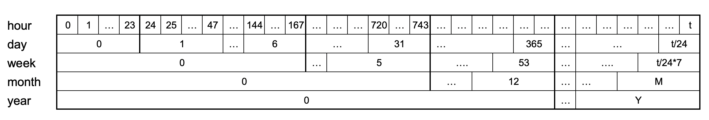
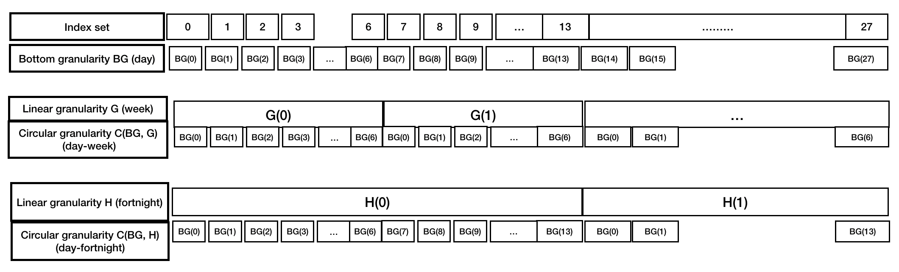

```{r initial, echo = FALSE, cache = FALSE, include = FALSE}
options("knitr.graphics.auto_pdf" = TRUE)
library(bookdown)
library(rticles)
library(knitr)
library(tidyverse)
library(lubridate)
library(lvplot)
library(ggridges)
library(tsibble)
if (requireNamespace("gravitas") == F)
  remotes::install_github("Sayani07/gravitas")
library(gravitas)
library(ggpubr)
library(xtable)
library(kableExtra)
opts_chunk$set(
  echo = FALSE, warning = FALSE, message = FALSE, comment = "#>",
  fig.path = "figure/", fig.align = "center", fig.show = "hold",
  cache = TRUE, cache.path = "cache/",
  out.width = ifelse(is_html_output(), "100%", "\\textwidth")
)
#knitr::opts_knit$set(root.dir = here::here())
```

```{r external, include = FALSE}
# read_chunk('scripts/main.R')
```

```{r load}

```

# Introduction

<!--temporal granularities and why should we care -->

<!-- problem of analyzing data with such finer scales and classical ways to deal with it -->

Temporal data are available at various resolutions depending on the context. Social and economic data like GDP is often collected and reported at coarse temporal scales such as monthly, quarterly or annually. With recent advancement in technology, more and more data are recorded at much finer temporal scales. Energy consumption may be collected every half an hour, energy supply may be collected every minute, and web search data might be recorded every second. As the frequency of data increases, the number of questions about the periodicity of the observed variable also increases. For example, data collected at an hourly scale can be analyzed using coarser temporal scales such as days, months or quarters. This approach requires deconstructing time in various possible ways called time granularities [@aigner2011visualization].

It is important to be able to navigate through all of these time granularities to have multiple perspectives on the periodicity of the observed data. This idea aligns with the notion of EDA [@Tukey1977-jx] which emphasizes the use of multiple perspectives on data to help formulate hypotheses before proceeding to hypothesis testing. Visualizing probability distributions conditional on one or more granularities is an indispensable tool for exploration. Analysts are expected to comprehensively explore the many ways to view and consider temporal data. However, the plethora of choices and the lack of a systematic approach to do so quickly becomes overwhelming.

<!-- # existing ways and challenges -->

Calendar-based graphics [@wang2020calendar] are useful in visualizing patterns in the weekly and monthly structure, and are helpful when checking for the effects of weekends or special days. Any temporal data at sub-daily resolution can also be displayed using this type of faceting [@Wickham2009pk] with days of the week, month of the year, or another sub-daily deconstruction of time. But calendar effects are not restricted to conventional day-of-week or month-of-year deconstructions. There can be many different time deconstructions, based on the calendar or on categorizations of time granularities.

Linear time granularities respect the linear progression of time and are non-repeating such as hours, days, weeks and months. One of the first attempts to characterize these granularities is due to @Bettini1998-ed. However, the definitions and rules defined are inadequate for describing cyclic or repeating granularities. Hence, there is a need to define some new cyclic time granularities, that can be useful in visualizations. Cyclic time granularities can be circular, quasi-circular or aperiodic. Examples of circular granularities are hour of the day and day of the week; an example of a quasi-circular granularity is day of the month; examples of aperiodic granularities are public holidays and school holidays.

Time deconstructions can also be based on the hierarchical structure of time. For example, hours are nested within days, days within weeks, weeks within months, and so on. Hence, it is possible to construct single-order-up granularities such as second of the minute, or multiple-order-up granularities such as second of the hour. The lubridate package [@Grolemund2011-vm] provides tools to access and manipulate common date-time objects. However, most of its accessor functions are limited to single-order-up granularities.

<!--motivation -->

The motivation for this work stems from the desire to provide methods to better understand large quantities of measurements on energy usage reported by smart meters in households across Australia, and indeed many parts of the world. Smart meters currently provide half-hourly use in kWh for each household, from the time that they were installed, some as early as 2012. Households are distributed geographically and have different demographic properties such as the existence of solar panels, central heating or air conditioning. The behavioral patterns in households vary substantially, for example, some families use a dryer for their clothes while others hang them on a line, and some households might consist of night owls, while others are morning larks. It is common to see aggregates [see @Goodwin_2012] of usage across households, such as half-hourly total usage by state, because energy companies need to plan for maximum loads on the network. But studying overall energy use hides the distribution of usage at finer scales, and makes it more difficult to find solutions to improve energy efficiency. We propose that the analysis of smart meter data will benefit from systematically exploring energy consumption by visualizing the probability distributions across different deconstructions of time to find regular patterns/anomalies. Although, the motivation came through the smart meter example, this is a problem that is relevant to any temporal data observed more than once per year.

<!-- at finer or coarser scales can be benefited from the approach of Exploratory Data Analysis (EDA). EDA calls for utilizing visualization and transformation to explore data systematically. It is a process of generating hypothesis, testing them and consequently refining them through investigations. -->

<!--existing closely related work and how ours relate -->
 <!-- This paper utilizes the nestedness of time granularities to obtain multiple-order-up granularities from single-order-up ones. -->

<!--actions on multiple order up - usage -->

<!-- Finally, visualizing data across single/multiple-order-up granularities help us to understand periodicities, pattern and anomalies in the data. Because of the large volume of data available, using displays of probability distributions conditional on one or more granularities is a potentially useful approach. However, this approach can lead to a myriad of choices all of which are not useful. Analysts are expected to alliteratively visualize these choices for exploring possible patterns in the data. But too many choices might leave him bewildered.  -->

<!-- challenges and how you are dealing wih it -->
This work provides tools for systematically exploring bivariate granularities within the tidy workflow. In particular, we

  * provide a formal characterization of cyclic granularities;
  * facilitate manipulation of single- and multiple-order-up time granularities through cyclic calendar algebra;
  * develop an approach to check the feasibility of creating plots or drawing inferences for any two cyclic granularities;
  * recommend prospective probability distributions for exploring distributions of a univariate dependent variable across pair of granularities.

<!-- Pairs of granularities can be categorized as either a *harmony* or *clash*, where = are pairs of granularities that aid exploratory data analysis, and clashes are pairs that are incompatible with each other for exploratory analysis. -->

The remainder of the paper is organized as follows: Section \ref{sec:linear-time} provides some background material on linear granularities and calendar algebra for computing different linear granularities. Section \ref{sec:cyclic-gran} formally characterizes different cyclic time granularities by extending the framework of linear time granularities. Section \ref{sec:cyclic-calendar} introduces cyclic calendar algebra for computing cyclic time granularities. Section \ref{sec:data-structure} discusses the data structure for exploring the conditional distributions of the associated time series across pairs of cyclic time granularities. Section \ref{sec:visualization} discusses the role of different factors in constructing an informative and trustworthy visualization. Section \ref{sec:application} examines how systematic exploration can be carried out for a temporal and non-temporal application. Section \ref{sec:discussion} summarizes this paper and discusses possible future direction.

# Linear time granularities {#sec:linear-time}

<!-- general calendar categorization -->
<!-- Often we partition time into months, weeks or days to relate it to data. Such discrete abstractions of time can be thought of as time granularities [@aigner2011visualization]. Examples of time abstractions may also include day-of-week, time-of-day, week-of-year, day-of-month, month-of-year, working day/non-working day, etc which are useful to represent different periodicities in the data. Classes of time abstractions may be based on arrangement or hierarchical order of time, discussed in further details in \autoref{sec:arrangement} and \autoref{sec:order}. -->

Discrete abstraction of time such as weeks, months or holidays can be thought of as "time granularities". Time granularities are **linear** if they respect the linear progression of time. There have been several attempts to provide a framework for formally characterizing time granularities, including @Bettini1998-ed which forms the basis of the work described here.

## Definitions

<!-- Arrangement: Linear vs. Circular vs. aperiodic {#sec:arrangement} -->

<!-- The arrangement of the time domain can result in deconstructing time in linear, circular or aperiodic (nearly circular) ways.  -->

<!-- There have been several attempts to provide a framework for formally characterizing time granularities. One of the first attempts was provided by @Bettini1998-ed who proposed following definitions:-->

<!-- <!-- Representation with tsibble -->
<!-- Suppose we have a tsibble with a time index in one column and keys and variables in other columns. A time domain, as defined by [@Bettini1998-ed], is essentially a mapping of row numbers (the index set) to the time index. A linear granularity is a mapping of row numbers to subsets of the time domain. For example, if the time index is days, then a linear granularity might be weeks, months or years. -->

<!-- <!-- What is calendar categorization -->
<!-- What we need to add to this are additional categorizations of time that are not linear granularities and are useful to represent periodicity. Examples include day-of-week, time-of-day, week-of-year, day-of-month, month-of-year, working day/non-working day, etc. Many of these are circular, such as day-of-week, time-of-day. Some are nearly circular such as day-of-month. Some are irregular such as working day/non-working day. Let's call all of these "calendar categorizations". Anything that maps a time index to a categorical variable can be considered a **calendar categorization**.  -->

<!-- What is circular granularity and some examples -->
<!-- We specify the circular categorizations using modular arithmetic and call these **circular granularities**. The number of categories is essentially the periodicity of a circular time granularity. For example, suppose the time index is in minutes, and let $n_i$ be the number of categories created by the circular granularity $C_i$. Then the following categorizations can be computed. -->

<!-- In the following sections, we provide a formalism to all of these abstractions and identify their relationships and symbolic representations.  -->

<!-- ### Linear {#sec:linear-gran-def} -->

\newtheorem{definition}{Definition}

\begin{definition}\label{def:definition}
A {\bf time domain} is a pair $(T; \le)$ where $T$ is a non-empty set of time instants and $\le$ is a total order on $T$.
\end{definition}

The time domain is assumed to be *discrete*, and there is unique predecessor and successor for every element in the time domain except for the first and last.

\begin{definition}\label{def:index set}
There is a unique {\bf index set}, $Z=\{z: z \in \mathbb{Z}_{\geq 0}\}$, which map the time instants to a set of non-negative integers. Often, this is thought of as $t=0, \dots, T$.
\end{definition}

\begin{definition}\label{def:linear}
A {\bf linear granularity} is a mapping $G$ from the integers (the index set, $Z$) to subsets of the time domain such that:
  (1) if $i < j$ and $G(i)$ and $G(j)$ are non-empty, then each element of $G(i)$ is less
than all elements of $G(j)$; and
  (2) if $i < k < j$ and $G(i)$ and $G(j)$ are non-empty, then $G(k)$ is non-empty.
Each non-empty subset $G(i)$ is called a {\bf granule}.
\end{definition}

\noindent This implies that the granules in a linear granularity are non-overlapping, continuous and ordering is maintained. The indexing for each granule can also be associated with textual representation, called the label.  A discrete time model often uses a fixed smallest linear granularity named by @Bettini1998-ed **bottom granularity**.<!--The label can be mapped to index for input and the index can later be mapped to this label for output. When the label set is exactly the integers, the granularities are called "full-integer" labelled granularity, such as in Definition \ref{def:linear}. Some calendar operations will only work on full-integer labelled granularities, while others can be implemented using more flexible labelings.--> \autoref{fig:linear-time} illustrates the linear time granularities. Here, "hour" is the bottom granularity and "day", "week", "month" and "year" are linear granularities which maps from index set to subsets of the hourly time domain. <!--For example, day($0$) =  {hour($0$), hour($1$), hour($2$), \dots, hour($23$)}, day($1$) =  {hour($24$), hour($25$), hour($26$), \dots, hour($47$)} and so on.--> If we have "hour" running from $\{0, 1, \dots,t\}$, we will have "day" running from $\{0, 1, \dots, \lfloor t/24\rfloor\}$. These linear granularities are ordered with ordering guided by the index set which is a set of integers. Hence, they are uni-directional and non-repeating. 


 <!--, each of which are non-repeating in nature and arranged from past to future. If we consider $T$ hours, we will have $\lfloor T/24\rfloor$ days, $\lfloor T/(24*7)\rfloor$ weeks and so on.-->

```{r linear-time, echo=FALSE, out.width = "100%", fig.cap="Illustration of time domain, linear granularities and index set.  Hour, day, week, month and year are linear granularities and can also be considered to be time domains. These are ordered with ordering guided by integers and hence is unidirectional and non-repeating. Hours could also be considered the index set, and a bottom granularity. "}

```


## Relativities

<!--@Bettini1998-ed discusses the relationships between linear time granularities, periodicities in time, and the structure of a calendar.-->

Properties of pairs of granularities fall into various categories.

\begin{definition}\label{def:finerthan}
A linear granularity $G$ is {\bf finer than} a linear granularity $H$, denoted $G \preceq H$, if for each index $i$, there exists an index $j$ such that
$G(i) \subset H(j).$
\end{definition}

\begin{definition}\label{def:groupsinto}
A linear granularity $G$ {\bf groups into} a linear granularity $H$, denoted
$G \trianglelefteq H$, if for each index $j$ there exists a (possibly infinite) subset $S$ of the integers such that $H(j) = \bigcup_{i \in S}G(i).$
\end{definition}

<!-- CONTENT CUT -->
<!-- These definitions are illustrated in \autoref{fig:groups-finer}, where both day $\trianglelefteq$ week, and day $\preceq$ week, hold true. However, weekends are finer than weeks but do not group into weeks. And weekends neither groups into or is finer than public holidays. Consider another example where day $\trianglelefteq$ month. This relationship is not fully described until we associate it with periodicity. Each month is a grouping of the same number of days over years, hence the period of the grouping (day, month) is one year, if leap years are ignored. The period becomes 400 years with the inclusion of leap years and all their exceptions. -->
\newtheorem*{example}{Example}

\begin{example}
{\rm Both $day \trianglelefteq week$ and $day \preceq week$ holds, since every granule of $week$ is the union of some set of granules of day and each day is a subset of a $week$. Consider another example where $day \trianglelefteq month$. This relationship however is incomplete without its association to periodicity. Each month is a grouping of the same number of days over years, hence the period of the grouping $(day, month)$ is one year, if leap years are ignored. This grouping period becomes 4 and 400 years with the inclusion of leap years and leap seconds respectively.}
\end{example}

<!-- CONTENT CUT -->
<!-- # ```{r groups-finer, echo=FALSE, out.width = "100%", fig.cap="Illustrations of groups into and finer than relationships. Weekends are finer than weeks but do not group into weeks. And weekends neither groups into or finer than public holidays"} -->
<!--  -->
<!-- ``` -->

\begin{definition}\label{def:periodical}
A granularity $G$ is {\bf periodical} with respect to a granularity $H$ if:
(1) $G \trianglelefteq H$; and
(2) there exist $R$, $P \in \mathbb{Z}_+$, where $R$ is less than the number of granules of $H$, such that for all $i \in \mathbb{Z}$, if $H(i) = \bigcup_{j \in S}G(j)$ and $H (i + R) \neq \phi$ then $H (i + R) = \bigcup_{j \in S} G(j + P)$.
\end{definition}

<!-- CONTENT CUT -->
<!-- A granularity $H$ which is periodical with respect to $G$ is specified by: -->
<!-- (i) the $R$ sets of indexes of $G$, ${S_0,\dots,S_{R-1}}$ describing the granules of $H$ within one period; -->
<!-- (ii) the value of $P$; -->
<!-- (iii) the indexes of first and last granules in $H$, if their value is not infinite. -->


If ${S_0,\dots,S_{R-1}}$ are the sets of indexes of $G$ describing
$H(0), \dots, H(R - 1)$, respectively, then the description of an arbitrary granule $H(j)$ is given by $\bigcup_{i \in S_j \mod R}G(P*\lfloor j/R \rfloor + i)$. Also, granularities can be periodical with respect to other granularities, except for a finite number of spans of time where they behave in an anomalous way, called **quasi-periodic** relationships by @Bettini2000-vy.

<!-- CONTENT CUT -->
<!-- Intuitively, the definition requires that all granules of $H$ within the span of time between two exceptions have the same periodical behavior, characterized by $R$ and $P$. -->


<!-- # ```{r group-periodical, echo=FALSE, out.width = "100%", fig.cap="Linear granularity $B$ groups periodically into linear granularity $G$ with $P = 5$ and $R = 2$, alternating between combining 2 and 3 granules of $B$."} -->
<!-- #  -->
<!-- # ``` -->

<!-- CONTENT CUT -->
<!-- \begin{definition}[Groups quasi-periodically]\label{def:quasi} -->
<!-- A granularity $H$ is quasi-periodical with respect to a granularity $G$ if: -->
<!-- (1) $G \trianglelefteq H$; and -->
<!-- (2) there exist a set of intervals $E_1,\dots,E_z$ (the granularity exceptions) and positive integers $R$, $P$, where $R$ is less than the minimum of the number of granules of $H$ between any two exceptions, such that for all $i \in \mathbb{Z}$, if $H(i) = \bigcup_{k \in [0,k]} G(j_r)$  and $H (i + R) \neq \phi$ and $i + R < min(E)$, where $E$ is the closest existing exception after $H (i)^2$, then $H (i + R) = \bigcup_{k \in [0,k]} G(j_r + P)$. -->
<!-- \end{definition} -->


<!-- # ```{r quasi-group-periodical, echo=FALSE, out.width = "100%", fig.cap="Linear granularity $B$ groups quasi-periodically into linear granularity $G$ with $P = 5$ and $R = 2$, alternating between combining 2 and 3 granules of $B$ with $E1$ as the exception."} -->
<!-- #  -->
<!-- # ``` -->

<!-- **Example**:  Example showing periodic and quasi-periodic linear granularities are displayed in \autoref{fig:group-periodical} and \autoref{fig:quasi-group-periodical} respectively. Each granule is represented by a box. In these figures, the granules that overlap share elements from the underlying time domain. In both of these cases, each granule of $G$ is made up of two and three granules of $B$ alternately. So the period is $P = 5$ and number of granules of $G$ in each period is given by $R=2$. The only difference in \autoref{fig:quasi-group-periodical} is that there is an exception after the first granule of $G$ which consists of one granule of $B$. Except for this exception $E1$, $B$ groups periodically into $G$.  -->

\begin{example}
{\rm In a Gregorian calendar without leap years we could say $day$ groups periodically into month with the period $P = 365$ and the number of granules of $month$ in each period given by $R=12$. In a Gregorian calendar with leap years, $day$ groups quasi-periodically into $month$ with the exceptions of the time domain corresponding to $29^{\text{th}}$ February of any year.}
\end{example}

<!-- CONTENT CUT -->
<!-- \begin{definition}[Bottom granularity]\label{def:B} -->
<!-- Given a granularity order relationship g-rel and a set of granularities having the same time domain, a granularity B in the set is a bottom granularity with respect to g-rel, if B g-rel H for each granularity H in the set. -->
<!-- \end{definition} -->

<!-- Here, g-rel could be any relationship defined between granularities as defined in @Bettini1998-ed. Given the set of all granularities defined over the time domain $(\mathbb{Z}; <)$, and the granularity relationship $\trianglelefteq$ (groups into), the granularity mapping each index into the corresponding instant (same integer number as the index) is a bottom granularity with respect to $\trianglelefteq$. -->

\begin{definition}\label{def:order}
The {\bf order} of a linear granularity is the level of coarseness associated with a linear granularity. A linear granularity G will have lower order than H if each granule of G is composed of lower number of granules of bottom granularity than each granule of H.
\end{definition}

\begin{example}
{\rm For two linear granularities $G$ and $H$, if $G$ {\em groups into} or {\em finer than} $H$ then $G$ is of lower order than $H$. Moreover, if we consider bottom granularity as day, linear granularity week will have lower order than month since each week consist of less number of days than each month. Here neither  week {\em groups into} month or  week {\em finer than} month, but their relative order could be determined.}
\end{example}


<!-- that the aperiodic linear granularities cyclic granularity $C_{G(l),G(m)}$ is either circular or quasi-circular.  -->

<!--so that the the underlying time domain can be described as a sequence of non-decomposable, consecutive time intervals of some fixed, minimal duration called _chronons_ (@Jensen1998-qn). Chronons may be grouped into granules of a bottom granularity and --> 

## Computation

Granules in bottom granularity or any finer granularity may be aggregated in some manner to form larger granules belonging to a coarser granularity. A system of multiple granularities in lattice structures is referred to as a **calendar** by @Dyreson_2000. Linear time granularities are computed through an algebraic representation for time granularities, which is referred to as calendar algebra [@Ning_2002]. It is assumed that there exists a _bottom granularity_ and calendar algebra operations are designed to generate new granularities recursively from the bottom one. Some relevant calendar algebra operations are discussed below; these will be used in Section \ref{sec:cyclic-gran} for illustrations in circular and quasi-circular granularities.


<!-- CONTENT CUT -->
<!-- For a coarser granularity $G_2$ and a finer one $G_1$, a _grouping operation_ partitions some granules of $G_1$  to form a granule of $G_2$. For example, $\text{minute} = \text{Group}_{60}(\text{second})$; $\text{hour} = \text{Group}_{60}(\text{minute})$. The _altering-tick operation_ generates new full-integer labelled granularity by periodically expanding or shrinking granules of $G_2$ in terms of granules of $G_1$. For example, <!--due to the uneven length of months, we need to use the altering-tick operation to compute months from days. We can consider a granularity "pseudomonth" which computes months only for non-leap years by grouping 31 days, and then shrink April, June, September and November by 1 day, and shrink February by 3 days [@Ning2002-tf]. For more variations of calendar algebra operations, see @Ning2002-tf.

<!-- CONTENT CUT -->
<!-- The calendar algebra consists of two kinds of operations: grouping-oriented and granule-oriented operations. The grouping-oriented operations combine certain granules of a granularity together to form the granules of the new granularity. For example, consider a calendar with only two linear granularities: "minute" and "hour", where "hour" is generated by grouping every $60$ "minutes". -->
<!-- The granule-oriented operations do not change the granules of a granularity, but rather select which granules should remain in the new granularity. For example, one can define the granularity "Monday" and hence select only Mondays from linear granularity "day". -->

<!-- \begin{definition}[Labelled granularity]\label{def:labelgran} -->

<!-- CONTENT CUT -->
<!-- The notion of a labelled granularity is introduced in @Bettini2000-qk to simplify the calendar algebra. A labelled granularity is a pair $(L, G)$, where the label set $L$ is a subset of the integers instead of the set of integers and -->
<!-- follows the conditions (1) and (2) in \ref{def:linear} where $i$, $j$, and $k$ are in $L$. When the label set $L$ is exactly the integers, the granularities are called "full-integer" labelled granularity, such as in Definition \ref{def:linear}.<!-- However, the set $L$ of labels can be an arbitrary subset of (possibly non contiguous) integers and could be used to identify granules.-->


<!-- $G$ is a mapping from $L$ to the subsets of the time domain such that: -->

<!--   1. if $i<j$ , where $i$ and $j$ are in $L$, and $G(i)$ and $G(j)$ are non-empty, then each element in $G(i)$ is less than all the elements of $G(j)$; and -->
<!--   2. if $i<k<j$ , where $i$, $j$, and $k$ are in $L$, and $G(i)$ and $G(j)$ are non-empty, then $G(k)$ is non-empty. -->

\begin{definition}\label{def:grouping_operation}
Let $G_1$ be a full-integer labelled granularity, and $m$ a positive integer. {\bf The grouping operation} Group$_m(G)$ generates a new granularity $G_2$, by partitioning the granules of $G_1$ into $m$-granule groups and making each group a granule of the resulting granularity. More precisely, $G_2 = \text{Group}_m(G_1)$ is the full-integer labelled granularity such that for each integer $i$,
$$G_2(i) = \bigcup\limits_{j = (i-1)m+1}^{im} G_1(j).$$
The grouping operation Group$_m(G)$, provides a new granularity whose granules are the integer part of the quotient when the integer set spanned by linear granularity $G$ is divided by $m$, such that, $G_2(i) = \lfloor G_1(j)/m \rfloor$.
\end{definition}

\begin{example} 
{\rm Due to even length of $day$ and $week$, we can derive them from $hour$ using the grouping operation as follows: day = G$_{24}(\text{hour})$, week = G$_{24*7}(\text{hour})$.}
\end{example}

<!-- Alternatively, given any integer $G_1(j)$ and a positive integer $m$, if there exists unique integers $G_2(i)$ and $R$ such that $G1(j) = m * G2(i) + R$ where $0 ≤ R < m$, then $G_2$ is a granularity that is formed -->

<!-- CONTENT CUT altering-tick -->
<!-- \begin{definition}\label{altering-tick} -->
<!-- Let $G_1$, $G_2$ be full-integer labelled granularities, and $l$, $k$, $m$ integers, with $G_1 \trianglelefteq G_2$, $G_1\preceq G_2$, and $1 \leq l \leq m$. {\bf The altering-tick operation} $\text{Alter}^{m}_{l,k} (G_2, G_1)$ operation modifies the granules of $G_1$ so that the $l^{\text{th}}$ granule of each period has $k$ additional granules of $G_2$. -->
<!-- \end{definition} -->

<!-- \begin{example} -->
<!-- The altering-tick operation can be used to compute the granularity $pseudomonth$, for the uneven lengths of $month$, by grouping 31 granules of $day$, followed by shrinking April, June, September and November by 1 granule of $day$, and shrinking February by 3 granules of $day$ for non-leap years.  -->
<!-- \end{example} -->

\noindent For more variations of calendar algebra operations, see @Ning_2002. 

<!-- CONTENT CUT -->
<!-- \begin{align*} -->
<!-- \text{pseudomonth} = &\text{Alter}^{12}_{11,-1}(\text{day}, \text{Alter}^{12}_{9,-1}(\text{day}, \\ -->
<!--   &~~\text{Alter}^{12}_{6,-1}(\text{day}, \text{Alter}^{12}_{4,-1)}(\text{day}, \\ -->
<!--   &~~~\text{Alter}^{12}_{(2,-3)}(\text{day}, \text{Group}_{31}(\text{day})))))), -->
<!-- \end{align*} -->


# Cyclic time granularities {#sec:cyclic-gran}

<!-- sub: regular and irregular mapping leads to circular and quasi-circular granularities -->

Cyclic granularities represent cyclical repetitions in time. They can be thought of as additional categorizations of time that are not linear.<!--Weeks is an example of a cyclical granularity because every 7 days there's another Monday.--> Cyclic granularities can be constructed by operating on two linear granularities. Cycles can be either _regular_, called **circular**, or _irregular_, **quasi-circular** when these two linear granularities relate periodically. <!-- with every granule of coarser linear granularity being made up of same (regular) or different (irregular) number of granules of finer linear granularity. For example, a regular mapping exists between  (where 60 minutes always add up to 1 hour), while an irregular mapping exists between  (as the number of days per month ranges from 28 to 31). A grouping operation in Calendar algebra could lead to a regular mapping, whereas a altering-tick operation could result in an irregular mapping. Cyclic time granularities are referred to as **circular** if mappings are regular and **quasi-circular** if the mappings are irregular. Examples of common circular granularities include hour of the day and day of the week, whereas examples for quasi-circular granularities are day of the month and week of the month.-->

<!--sub:How to relate linear granularities to tsibble and manipulation of indices required for circular and quasi-circular granularities -->

## Circular {#sec:circular-gran-def}

\begin{definition}\label{def:circular}
A {\bf circular granularity} $C_{B, G}$ relates a linear granularity $G$ to the bottom granularity B, if
\begin{equation} \label{eq:circular-gran}
\begin{split}
C_{B, G}(z) & = z\mod P(B, G) \quad \forall z \in \mathbb{Z}_{\geq 0} \\
\end{split}
\end{equation}
where
z denotes the index set,
B denotes a full-integer labelled bottom granularity which groups periodically into linear granularity $G$ with regular mapping, and $P \equiv P(B, G)$ is the number of granules of $B$ in each granule of $G$, also called the period of the grouping $(B, G)$.
\end{definition}


<!-- The label can be mapped to index for input and the index can later be mapped to this label for output. When the label set is exactly the integers, the granularities are called "full-integer" labelled granularity, such as in Definition \ref{def:linear}. Some calendar operations will only work on full-integer labelled granularities, while others can be implemented using more flexible labelings. -->

\begin{example}
{\rm \autoref{fig:circular-dow} illustrates the linear and the corresponding cyclical granularities. Cyclical granularities can be considered to be cutting the linear granularity into pieces, and stacking them to match the cycles (as shown in b). $B, G, H$ (day, week, fortnight, respectively) are linear granularities. The circular granularity $C_{B , G}$ (day-of-week)is constructed from $B$ and  $G$. The circular granularity $C_{B, H}$ (day-of-fortnight) is constructed from $B$ and $H$. These overlapping cyclical granularities share elements from the linear granularity. Each of $C_{B , G}$ and $C_{B , H}$ consist of repeated patterns  $\{0, 1, 2, \dots, 6\}$ and $\{0, 1, 2, \dots, 13\}$ with $P=7$ and $P=14$ respectively. Each circular granularity can use descriptive label mappings. Suppose ${L}$ is a label mapping that defines an unique label for each index $l \in \{ 0,1,\dots, (P-1)\}$, then the label mapping $L$ for $C_{B, G}$ can be defined as
$$
  L: \{0,1,2, \dots, 6\} \longmapsto\ \{\text{Sun}, \text{Mon}, \dots, \text{Sat}\}
$$
or
$$
  L: \{0,1,2, \dots, 6\} \longmapsto\ \{\text{Sunday}, \text{Monday}, \dots, \text{Saturday}\}
$$
for example.}
\end{example}

<!-- # ```{r circular-gran, echo=FALSE,out.width = "100%",fig.cap="Relating circular granularities and bottom linear granularity "} -->
<!-- #  -->
<!-- # ``` -->

```{r circular-dow,echo=FALSE,out.width = "100%",fig.cap="Illustration of circular relative to linear granularities (a). Circular granularities can be considered to be cutting the linear granularity into pieces and stacking them (b). The circular granularity creates repeated integer sequences."}

```

<!-- All circular granularities can be expressed in terms of the bottom linear granularity with equation \autoref{eq:eq2}. -->

In general, any circular granularity relating two linear granularity can be expressed as $C_{(G, H)}(z) = \lfloor z/P(B,G) \rfloor\mod P(G,H)$, where linear granularity $H$ is periodic with respect to linear granularity $G$ with regular mapping and $P(G,H)$ is the period of the grouping $(G, H)$  <!--such that the number of granules of $G$ in each granule of $H$ is-->. Table \ref{tab:definitions} shows representation of circular granularities $C_i$ relating two linear granularities with period $P_i$ <!--being the number of granules of the finer granularity in each granule of the coarser granularity.The representation of the resultant circular granularity will be a function of the index set.--> and minutes as the bottom granularity.

\begin{table}[ht]
\begin{center}
\begin{tabular}{lll}
\hline
circular granularity & expression & period \\
\hline
minute-of-hour                               &
  $C_1 = z \mod 60$                     &
  $P_1 = \phantom{99}60$ \\
minute-of-day                                &
  $C_j = z \mod 60*24$                  &
  $P_2= `r 60*24`$\\
hour-of-day                                  &
  $C_3 = \lfloor z/60\rfloor\mod 24$    &
  $P_3 = \phantom{99}24$ \\
hour-of-week                                 &
  $C_4 = \lfloor z/60\rfloor\mod 24*7$  &
  $P_4= \phantom{9}`r 24*7`$\\
day-of-week                                  &
  $C_5 = \lfloor z/24*60\rfloor \mod 7$ &
  $P_5= \phantom{999}7$\\
\bottomrule
\end{tabular}
\end{center}
\caption{Examples of circular granularities with bottom granularity minutes. Circular granularity $C_i$ relates two linear granularities one of which groups periodically into the other with regular mapping and period $P_i$. Circular granularities can be expressed using modular arithmetic due to their regular mapping. }
\label{tab:definitions}
\end{table}


<!-- ```{r tab-circular} -->
<!--  table_mayan <-  -->
<!--   tibble(C = c("minute-of-hour", -->
<!--                                     "minute-of-day",  -->
<!--                                     "hour-of-day", -->
<!--                                     "hour-of-week", -->
<!--                                     "day-of-week"), -->
<!--                        Expression = c("\$L\_1(z \mod 60)\$", -->
<!--                                         "\$L\_2(z \mod 60*24)\$", -->
<!--                                         "\$L\_3(\lfloor z/60\rfloor\mod 24)\$", -->
<!--                                         "\$L\_4(\lfloor z/60\rfloor\mod 24*7)\$", -->
<!--                                         "\$L\_5(\lfloor z/24*60\rfloor \mod 7)\$")) -->

<!--  kable(table_mayan, -->
<!--        format = "latex", -->
<!--        caption = "Hierarchy table for Mayan calendar. $G$ and $C$ represent the linear and single order-up cyclic granularities respectively. All cyclic granularities are circular with $K$ as the period length.") -->
<!-- ``` -->


## Quasi-circular {#sec:quasi-circular-gran-def}

A **quasi-circular** granularity can not be defined using modular arithmetic since they are formed using two linear granularities with irregular mapping. However, they are still formed with linear granularities, one of which "groups periodically into" the other. \autoref{tab:quasi} shows some example of quasi-circular granularities ($Q_i$) with ($P_i$) denoting the plausible choices of period of the grouping of two linear granularities.
<!-- number of granules of the finer granularity inside each granule of the coarser one. -->

\begin{table}[ht]
\begin{center}
\begin{tabular}{lr@{~}lr@{~}r}
\hline
quasi-circular granularity && potential period lengths\\
\hline
$Q_1 =$ day-of-month && $P_1 = 31, 30, 29, 28$\\
$Q_2 =$ hour-of-month && $P_2 = 24*31, 24*30, 24*29, 24*28$\\
$Q_3 =$ day-of-year && $P_3 = 366, 365$\\
$Q_4 =$ week-of-month && $P_4 = 5, 4$\\
\bottomrule
\end{tabular}
\end{center}
\caption{Examples of quasi-circular granularities $Q_i$ with potential period lengths $P_i$. These quasi-circular granularities relate two linear granularities one of which groups periodically into the other with irregular mapping leading to many potential period lengths and hence can not be expressed through modular arithmetic. }
\label{tab:quasi}
\end{table}


\begin{definition}\label{def:quasicircular}
A {\bf quasi-circular granularity} $Q_{B, G'}$ relates linear granularities $G'$ and bottom granularity $B$, if
\begin{equation}\label{eq:quasi}
\begin{split}
Q_{B, G'}(z) =
z - \sum_{w=0}^{k-1}\vert T_{w \mod R'} \vert, & \quad \text{for}\quad z \in T_{k}
\end{split}
\end{equation}
where,
$z \in \mathbb{Z}_{\geq 0}$ denotes the index set,
$B$ denotes a full-integer labelled bottom granularity which groups periodically into linear granularity $G'$ with irregular mapping, $P'$ and $R'$ are the period of the grouping $(B, G')$ and the number of granules of $G'$ in $P'$, $T_w$ are the sets of indices of $B$ describing $G'(w)$ such that  $G'(w) = \bigcup_{z \in T_w}B(z)$ and $\vert T_w \vert$ is the cardinality of set $T_w$.
\end{definition}

<!-- \begin{split} -->
<!-- A_{B, M}(z) & = -->
<!-- \begin{cases} -->
<!-- i, & \text{for}\quad z \in T_{i_j} \\ -->
<!-- 0  & \text{otherwise}  -->
<!-- \end{cases} -->
<!-- \end{split} -->

<!--${L}$ is a label mapping that defines an unique label for each index $l \in \{0,1,\dots, (\lceil P'/R' \rceil-1)\}$,-->

<!-- **Example**:  -->
<!-- Example showing quasi-circular granularities relating two linear granularities each with bottom granularities are visually depicted in a series of slots in \autoref{fig:quasi-circular-example}. Each granule is represented by a box.  -->

\begin{example}
{\rm Consider $G'$ such that every two consecutive granules of $G'$ are made up of $7$ and $5$ granules of $B$ respectively within each period of the grouping ($B$, $G'$). Then $Q_{B, G'}$ is a repetitive categorization of time, similar to circular granularities, except that the number of granules of $B$ is not necessarily the same across different granules of $G'$. Here, $T_0 = \{0, 1, 2, 3, 4, 5, 6\}$ and $T_1 = \{7, 8, 9, 10, 11\}$. Hence using Definition \autoref{def:quasicircular} we will have:

\begin{align*}
\begin{split}
Q_{B,H'}(10) & = 10 - \sum_{w=0}^{1-1}\vert T_{w \mod 2}\vert ,\quad since \quad 10 \in T_{1}  \\
  & = 3 \\
\end{split}
\end{align*}
}
\end{example}

<!--such that $G' = Alter^{2}_{(1,-2)}(B, Group_7(B))$, which implies it is made up of shrinking every 1st granule of $Group_7(B)$ by $2$ granules.-->

<!-- **Discussion**:  -->
If linear granularity $G'$ is periodical with respect to $B$ with irregular mapping, then there exist $R'$, $P' \in \mathbb{Z}_+$ such that if $G'(w) = \bigcup_{z \in T_w}B(z)$ then $$G'(w) = \bigcup_{z \in T_w \mod R'}B(P'*\lfloor w/R' \rfloor + z)$$ (from Definition \ref{def:periodical})<!-- - $B \trianglelefteq G'$ --> <!-- and,  number of granules of $B$ in each granule of $G'$ is not a constant (irregular mapping) -->. Here $w \mod R'$ represents the index that must be shifted to obtain $G'(w)$. The idea here is if we know the composition of each of the granules of $G'$ in terms of granules of $B$ for one period, we can find the composition of any granule of $G'$ beyond a period since the "pattern" repeats itself along the time domain due to the periodic property. The periodic property also ensures that $\vert T_w \vert = \vert T_{w\mod R'} \vert$ since every $w^{\text{th}}$ and $(w+R')^{\text{th}}$ granule of $G'$ will have the same number of granules of $B$. The term $\sum_{w=0}^{k-1}\vert T_{w}\vert$ in Definition \autoref{def:quasicircular} denotes the number of granules of $B$ till the $(k-1)^{\text{th}}$ granule of $G'$. Since $\vert T_w \vert = \vert T_{w\mod R'} \vert$, the number of granules of $B$ till the $(k-1)^{\text{th}}$ granule of $G'$ becomes $\sum_{w=0}^{k-1}\vert T_{w \mod R'}\vert$ in Definition \autoref{def:quasicircular}.

```{r quasi-circular-example, echo = FALSE, out.width = "100%",fig.cap = "Quasi-circular and aperiodic cyclic granularities illustrated through linear (a) and stack (b) display of time. The linear display shows linear granularities days, weeks, semester weeks, semester Terminology and intuition of quasi-circular granularities are shown. Panel a shows the time domain distributed as linear granularities $B$ (bottom granularity), $G$, $H'$ and quasi-circular granularities $Q(B, G)$ and $Q(B, H')$. Both $Q(B, G)$ and $Q(B, H')$ have repeating patterns unlike $G$ or $H'$ and the patterns are guided by the distribution of $B$ within $G$ and $H'$ and remains constant within a period shown by the hashed arrows. Panel b depicts the intuition through a measuring tape analogy where the folds are not of same length but has same length over a period."}

# 
```

<!-- Circular granularities illustrated through linear (a and b) and stack (c and d) display of time. The linear display is similar to a measuring tape with the measurement marking distributed as linear granularities day, week and fortnight. The stack display gives the intuition of circular granularities by cutting the measuring tape and stacking on top of one another to represent repetitive pattern of categories. The granules that overlap represent same time domain in the linear display and same category in the stack display. Circular granularities day-of-week ($C_{B, G}$) and day-of-fortnight ($C_{B, H}$) have repeating patterns unlike $B$, $G$ or $H$ which gets manifested more clearly through a stack display of time. -->

<!-- If we ignore leap years and all its exception, the periodicity of the grouping (days, months), P' = 365, R' = 12, since each month would be defined as the grouping of the same number of days (31, 28, or 30, depending on the month) every year. Considering leap years and all their exceptions, period is 400 years and hence $P' = (3*365 + 366)$, $R' = 12*400$.  \autoref{eq:eq3} can be useful to find the aperiodic granularity day-of-month in both of these cases, since the grouping is periodic is both cases.  -->

<!-- Then $f(x, y)$ can be computed using modular arithmetic as follows: -->

<!-- $$f(x, y) = \lfloor z/c(z,x) \rfloor\mod c(x,y)$$ -->

<!-- The constant c(x,y) is for granularities for groups into periodically, for granualrities which group into each other in a quasi-periodic way, no such constants exist and no such close form solution can be obtained. -->

<!-- It is easy to note here that due to unequal length of some linear granularities like months or years, these formulae can not be used for computing week-of-month or day-of-year. Thus, we start with the definition of circular granularity and then move on to computing aperiodic granularities.  -->

<!-- Formal definition of circular granularity -->

<!-- **Definition: Equivalence class** Let $m \in N \backslash{0}$. For any $a \in Z$ (set of integers), $[a]$ is defined as the equivalence class to which a belongs if $[a]$ = {$b \in Z | a \equiv (b \mod m)$}. -->

<!-- The set of all equivalence classes of the integers for a modulus $m$ is called the ring of integers modulo $m$, denoted by $Z_m$. Thus $Z_m = \{[0], [1], ..., [m-1]\}$. However, we often write $Z_m = \{0, 1, ..., (m-1)\}$, which is the set of integers modulo $m$. -->

<!-- **Definition:** A **circular granularity** $C$, joining two linear granularity with a modular period m is defined to be a mapping from the integers $Z$ (Index Set) to $Z_m$, such that -->

<!-- $C(s) = (s\mod m)$ for $s \in Z$. -->

<!-- For example, suppose $C$ is a circular granularity denoting hour-of-day and we have hourly data for 100 hours. The modular period $m = 24$, since each day consists of 24 hours and $C$ is a mapping from ${1,2,\dots, 100}$ to ${0,1,2, \dots, 23}$ such that  $C(s)= s \mod 24$ for $s \in {1,2,\dots, 100}$. -->

<!-- **Definition:** A **cycle** is defined as the progression of each circular granularity with modular period m through {$1,2,\dots,(m-1),0$} once. -->

<!-- **Definition:** A **circular granule** represents an equivalence class inside each cycle. -->

<!-- ### Aperiodic {#aperiodic-gran-def} -->
<!-- Formal definition of aperiodic circular granularity -->

 <!-- Why we need single order up and multiple order up granularities -->
<!-- A time series which is characterized by being composed of repeating cycles. -->

<!-- Identifying repeating (periodic/aperiodic) patterns are necessary in revealing patterns and future trends of a temporal data. Often there is a need for periodicity detection to find whether and how frequent a periodic/aperiodic pattern is repeated within the series. -->

<!-- The linear granularities G, H, AG and AH considered in the definitions of circular and aperiodic granularities are all periodic with respect to the bottom granularity. The only difference is G, H have regular mapping, whereas, G1 and G2 have irregular mapping with respect to BG.  -->


<!-- CONTENT CUT -->
<!-- It can be noted here that if a linear granularity $G'$ is quasi-periodic (Bettini2000-vy) <!--(Definition \autoref{def:quasi}) with respect to $B$, then \autoref{eq:quasi} can be modified as follows to account for exceptions $E = [e_{begin}, e_{end}]$.<!--(by Definition \autoref{def:quasi}).-->

<!-- \begin{equation}\label{eq6} -->
<!-- A_{B, G'}(z) = L(z - \sum_{w=0}^{k-1}\vert T_{w \mod R'} \vert - \sum_{u=0}^{e_k}\vert E_{u} \vert) -->
<!-- \end{equation} -->

<!-- for $z \in T_k$ and $e_k$ is the number of exceptions in $\bigcup\limits_{w = 0}^{k} T_w$ and $E_{u} = [e_{begin}(u), e_{end}(u)]$. -->

## Aperiodic {#sec:aperiodic-gran-def}

<!--Periodic and Quasi-periodic behavior can be defined by a repeating pattern except for a finite number of granules that can be seen as discontinuity points in the granularity in case of quasi-periodic behavior.--> Aperiodic time granularities are the ones which can not be specified as a periodic repetition of a pattern of granules. Most public holidays repeat every year, but there is no reasonably small period within which their behavior remains constant. A classic example can be that of Easter, whose dates repeat only after 5,700,000 years.<!--U.S labor day is the first Monday in September and U.S. Memorial Day is the last day in May. --> In Australia, if a standard public holiday falls on a weekend, a substitute public holiday will sometimes be observed on the first non-weekend day (usually Monday) after the weekend. Examples of aperiodic granularity may also include school holidays or a scheduled event.<!--that might cover the first and third Monday of the month between June and October, except for state holidays.--> All of these are recurring events, but with non-periodic patterns. As such, plausible $P_i$ from \autoref{tab:quasi} could be possibly infinite for aperiodic granularities.

Aperiodic cyclic granularities are defined using aperiodic linear granularities. Consider n aperiodic linear granularities $M_i$  $\forall \{i\in{1, 2, \dots, n\}}$ such that Definition \ref{def:periodical} does not hold true for them with respect to $B$ (the bottom granularity). <!--that is, none of them can be expressed as periodic or quasi-periodic with respect to the bottom granularity.--> However, $B \trianglelefteq M_i$ $\forall \{i\in{1, 2, \dots, n\}}$. Then according to Definition \ref{def:groupsinto}, for each index $j$ there exists a (possibly infinite) subset $T_{\{i_j\}}$ of the integers such that $M_{i}(j) = \bigcup_{z \in T_{i_j}}B(z)$. Suppose $M = \bigcup_{i=1}^{n}M_{i}$ is formed by collecting the granules of $\{M_1, M_2, \dots, M_n\}$. Here, index ${\{i_j\}}$ stands for the $j^{\text{th}}$ granule of the $i^{\text{th}}$ linear aperiodic granularity.

```{r aperiodic-example, echo=FALSE, out.width = "100%", fig.cap = "Quasi-circular and aperiodic cyclic granularities illustrated through linear (a) and stack (b) display of time. The linear display shows linear granularities days, weeks, semester weeks, semester week type distributed linearly from past to future. Here a semester lasts for 18.3 weeks, each starting with one week of orientation followed by an in-session period of 6 weeks, a semester-break of 1 week and again an in-session period of 7 weeks and 1 week study break before final exams which continue for 1.3 weeks. This pattern remains same for all semester and hence $Q_{H, M}$ with $P$ = 18.3 weeks will be a quasi-circular granularity with repeating patterns. $A_{B, M}$ will be an aperiodic cyclic granularity since the placement of the semester within an year varies across years."}


```

\begin{definition}\label{def:aperiodic}
An {\bf aperiodic cyclic granularity} $A_{B, M}$ relates a linear granularity $M$ to the bottom granularity $B$, if
\begin{equation}\label{eq:aperiodic}
\begin{split}
A_{B, M}(z) & =
\begin{cases}
i, & \text{for}\quad z \in T_{i_j} \\
0  & \text{otherwise}
\end{cases}
\end{split}
\end{equation}
where,
$z \in \mathbb{Z}_{\geq 0}$ denotes the index set,
$B$ denotes a full-integer labelled bottom granularity which groups into linear granularity $M$ but not periodically, $T_{i_j}$ are the sets of indices of $B$ describing aperiodic linear granularities $M_{i}$ such that $M_{i}(j) = \bigcup_{z \in T_{i_j}}B(z)$, and $M = \bigcup_{i=1}^{n}M_{i}$.
\end{definition}

<!-- \forall i \in {1, 2, \dots, n}\\ -->

\begin{example}
{\rm Consider a school semester which always lasts for 18 weeks and 2 days, starting with one week of orientation followed by an in-session period of 6 weeks, a semester-break of 1 week and again an in-session period of 7 weeks and 1 week study break before final exams which continue for 16 days. Let the linear granularities $M_1$ and $M_2$ denote in-session semester period and semester break periods respectively. Both $M_1$, $M_2$ and $M = M_{1}\bigcup M_{2}$ denoting the semester week type are aperiodic with respect to days ($B$) or weeks ($G$). Hence $A_{B, M}$ denoting day of the semester week type would be an aperiodic cyclic granularity. This is because the placement of the semester within an year would vary across years. \autoref{fig:aperiodic-example} b shows the stack display of time with granules representing same categories (semester break/in-session) stacked on top of one another. \autoref{fig:aperiodic-example} (a) representing the linear display of time is useful in manifesting how the categories would be determined with respect to the bottom granularities using Definition \ref{def:aperiodic}. It is interesting to note here that $Q_{H, M}$ denoting semester week of the semester week type would be a quasi-circular granularity since the distribution of semester weeks within a semester is assumed to remain constant over years. Here $Q_{H, M}$ with a period of 18.3 weeks will have irregular mapping since each semester week types consists of different number of semester weeks.}
\end{example}

<!--Each granule is represented by a box. The diagram also illustrates that the granules that overlap share elements from the underlying time domain. The first slot in the diagram shows the index set and $A(B, M)$ consists of three categories, $L(1)$ corresponding to the first aperiodic event $M_1$, $L(2)$ corresponding to aperiodic event $M_2$ and the $L(0)$ corresponding to no event/aperiodic linear granularity.-->

<!-- Here, $M_1$ can be an aperiodic linear granularity denoting block leaves during Christmas, $M_2$ can be the one denoting Easter, $M_n$ can be Labor day and M can be conceived as the aperiodic linear granularity denoting any holidays. <!--The number of categories obtained coincides with the number of aperiodic linear granularities considered and an additional category representing no event.-->

<!-- map a time index to a categorical variable containing binary values. It takes the value 1 whenever the time index coincides with the events in context (e.g. public or school holiday) and 0 when it does not. Here, 1 and 0 are proxies to denote the binary categorization and can be replaced with a logical vector. -->


<!-- #  -->
<!-- # <!-- To consider the exhaustive set of temporal regularities that might exist in the data, we can also define temporal granularities based on the hierarchical structure of a calendar. -->

## Relativities {#sec:cyclic-calendar}

<!-- In Section \ref{sec:cyclic-gran}, we discussed how we can define cyclic granularities by extending the framework of linear granularities defined in @Bettini1998-ed. In this section, we will see how to obtain cyclic granularities through an algebraic representation of other cyclic granularities --><!--This is similar to calendar algebra in @Ning2002-tf, where linear granularities are generated from the bottom linear granularity or from those that are already generated. Since, our method caters to computation of cyclic granularities, we shall refer to it as--> <!-- through cyclic calendar algebra operations.-->

The hierarchical structure of time creates a natural nested ordering  which can be used in the computation of relative pairs of granularities. This is illustrated using two examples, a Mayan calendar, which is simple, in addition to the more complex Gregorian calendar.

\begin{definition}\label{def:hierarchy} 
The nested ordering of linear granularities can be organized into a {\bf hierarchy table}, denoted as $H_n: (G, C, K)$, which arranges them from lowest to highest in order. It shows how the $n$ granularities relate through $K$, and how the cyclic granularities, $C$. can be defined relative to the linear granularities. Let $G_{l}$ and $G_{m}$ represent the linear granularity of order $l$ and $m$ respectively with $l<m$. Then $K \equiv P(l,m)$ represents the period length of the grouping $(G_{l}, G_{m})$, if $C_{G_{l}, G_{m}}$ is a circular granularity and $K \equiv k(l,m)$ represents the operation to obtain $G_{m}$ from $G_{l}$, if $C_{G_{l}, G_{m}}$ is quasi-circular.
\end{definition}

\begin{example}
{\rm  \autoref{tab:tab-mayan} shows the hierarchy table for the Mayan calendar. In the Mayan calendar, one day is referred to as a kin and the calendar was structured such that 1 kin = 1 day; 1 uinal = 20 kin; 1 tun  = 18 uinal (about a year); 1 katun = 20 tun (20 years) and 1 baktun = 20 katun. }
\end{example}

```{r tab-mayan}
table_mayan <- tibble(`linear (G)` = c("kin", "uinal", "tun", "katun", "baktun"),
                      `single-order-up cyclic (C)` = c("kin-of-uinal","uinal-of-tun"," tun-of-katun", "katun-of-baktun", 1),
                       `period length/conversion operator (K)`= c(20, 18, 20, 20, 1))
kable(table_mayan,
      format = "latex",
      booktabs = TRUE,
      align = "l",
      caption = "Hierarchy table for Mayan calendar with circular single-order-up granularities.") %>%
  kable_styling()
  #row_spec(0, bold = TRUE) %>%
  #row_spec(1:(nrow(table_mayan)-1), hline_after = T)
  #.
```


 <!--So far we have used examples of linear granularities from Gregorian calendar as it is the most widely used calendar. However, it is far from being the only one.-->
\noindent It is interesting to note, that in the Mayan calendar, like most calendars, that day is the basic unit of time [@Reingold2001-kf]. The structuring of larger units,  weeks, months, years and cycle of years, though, varies substantially. An exception is the French revolutionary calendar, which divides each day into 10 "hours", each "hour" into 100 "minutes" and each "minute" into 100 "seconds", the duration of which is 0.864 common seconds. Nevertheless, for any calendar a hierarchy table can be defined.
 
<!-- for a quasi-circular granularity $C_{G(l),G(m)}$, $\forall l,m \in {1, 2, \dots,n}$.  -->
<!-- so that cyclic granularities $C$ could be defined relative to these linear granularities. -->

Note that, it is not always possible to organize an aperiodic linear granularity in a hierarchy table. Hence, we assume that the hierarchy table consists of periodic linear granularities only and that the cyclic granularity $C_{G(l),G(m)}$ is either circular or quasi-circular.

\begin{definition}\label{def:norderup} 
The hierarchy table contains {\bf multiple-order-up} granularities which are cyclic granularities that are nested within multiple levels.
A {\bf single-order-up} is a cyclic granularity which is nested within a single level. It is a special case of multiple-order-up granularity.
\end{definition}

 <!--All calendars fall under three types - solar, lunar or lunisolar/solilunar-->

\begin{example}
{\rm In \autoref{tab:tab-mayan}, kin-of-tun or kin-of-baktun are examples of multiple-order-up granularities and single-order-up granularities are kin-of-uinal, uinal-of-tun etc.}
\end{example}


<!-- \begin{definition}\label{def:norderup}  -->

<!-- \end{definition} -->


## Computation

In this section, we will see how to obtain cyclic granularities through an algebraic representation of other cyclic granularities. This is similar to calendar algebra in @Ning2002-tf for linear granularities but caters to computation of cyclic granularities, we shall refer to it as through cyclic calendar algebra operations. The cyclic calendar algebra consists of broadly two kinds of operations:
(1) **single-to-multiple** and (2) **multiple-to-single** which entails the representation of _multiple-order-up_ cyclic granularities from _single-order-up_ cyclic granularities respectively. 


<!-- Thus the first linear granularity can either be the bottom granularity (finest possible) or the finest granularity within the set of linear granularities and the other granularities are subsequently more "coarse" than the earlier one. -->

<!-- If linear granularities are not provided or bottom granularity is not known, any circular granularities of hierarchy order m can be computed, provided the circular granularities till hierarchy order (m-1) are provided. -->

<!-- some discussions on primary units of calendar -->
<!-- **Example:**  -->

### Single-to-multiple {#sec:single-to-multiple}

<!-- #### All circular single order-up granularities {#sec:all-circular}   -->

<!-- Circular single-order-up granularities can be used recursively to obtain multiple order up circular granularity. -->

\noindent Methods to obtain multiple-order-up granularity will be different based on if the hierarchy consists of all circular single-order-up granularities or a mix of circular and quasi-circular single-order-up granularities. The methods require the use of integer arithmetic, and hence it is important that the label mapping of the individual single-order-up granularity is an identity function, that is, $L(x) = x\quad \forall x$. The label mapping of the resultant multiple-order-up granularity can be chosen depending on the context. Circular single-order-up granularities can be used recursively to obtain a multiple-order-up circular granularity using Equation \ref{eq:eq7} for $l < m - 1$ and $P(i, j) = 1, \quad \forall i = j \in \{0, 1, \dots, m-l-1\}$.

\begin{equation} \label{eq:eq7}
\begin{split}
C_{G_l,G_m}(z) & = C_{G_l,G_{l+1}}(z) + P(l, l+1)C_{G_{l+1},G_m}(z)\\
  & = C_{G_l,G_{l+1}}(z) + P(l, l+1)( C_{G_{l+1},G_{l+2}}(z) + P(l+1, l+2)C_{G_{l+2}, G_m}(z)) \\
  & = C_{G_l,G_{l+1}}(z) + P(l, l+1)C_{G_{l+1},G_{l+2}}(z) + P(l, l+1)P(l+1, l+2)C_{G_{l+2}, G_{m}}\\
  & = C_{G_l,G_{l+1}}(z) + P(l, l+1)C_{G_{l+1},G_{l+2}}(z) + P(l, l+2)C_{G_{l+2},G_{l+m}}(z)\\
  &\vdots\\
  & = \sum_{i=0}^{m - l - 1} P(l, l+i)C_{G_{l+i},G_{l+i+1}}(z)\\
\end{split}
\end{equation}

\noindent For example, the multiple-order-up granularity $C_{uinal,katun}$ for Mayan calendar <!--with the index set  $Z=\{z: z \in \mathbb{Z}_{\geq 0}\}$ mapping "kins" to a set of positive integers--> could be obtained using Equation \ref{eq:eq8}.

\begin{equation} \label{eq:eq8}
\begin{split}
C_{uinal, baktun}(z)  = & C_{uinal, tun}(z) + P(uinal, tun)C_{tun,katun}(z) + P(uinal, katun)C_{katun, baktun}(z) \\
               = & \lfloor z/20\rfloor \mod 18 + 18*\lfloor z/20*18\rfloor \mod 20  \\
               &~~~ + 18*20\lfloor z/20*18*20\rfloor \mod 20 \\
\end{split}
\end{equation}

<!-- #### Circular or quasi-circular single order-up granularities {#sec:notall-circular}   -->

<!-- CONTENT CUT -->
<!-- There can be three scenarios for obtaining multiple-order-granularities here:   -->
<!--  - cyclic granularities relating two linear granularities whose orders are less than day   -->
<!--  - cyclic granularities relating two linear granularities whose orders are more than month   -->
<!--  - granularities relating two linear granularities with order at most day and another with order at least month -->

<!-- The multiple-order-up cyclic granularites resulting from the first two cases are circular and has been handled in \autoref{sec:all-circular}. Any cyclic granularity resulting from the last case are quasi-circular. Examples might include hour-of-month or day-of-year. -->

\noindent We consider the case of only one quasi-circular single order-up granularity in the hierarchy table while computing a multiple-order-up quasi-circular granularity. Any multiple-order-up quasi-circular granularity $C_{l, m}(z)$ could then be obtained as a dicrete combination of circular and quasi-circular granularities.
<!--function of a single (or multiple) order-up circular granularity $C_{l,m'}(z)$ and single order-up quasi-circular granularity $C_{m',m}(z)$ or vice versa. --> Depending on the order of the combination, again two different approaches need to be employed leading to the following cases:

<!-- For example, with $C_{l, m}(z) = f(C_{l,m'}(z), C_{m',m}(z))$, -->
- $C_{l,m'}(z)$ is circular and $C_{m',m}(z)$ is quasi-circular
\begin{equation} \label{eq:multifromsingle-quasi1}
\begin{split}
C_{G_l,G_{m}}(z) & = C_{G_{l},G_{m'}}(z) + P(l, m')C_{G_{m'},G_{m}}(z) \\
\end{split}
\end{equation}

- $C_{l,m'}(z)$ is quasi-circular and $C_{m',m}(z)$ is circular
\begin{equation} \label{eq:multifromsingle-quasi2}
\begin{split}
C_{G_l,G_{m}}(z) & = C_{G_{l},G_{m'}}(z) + \sum_{w=0}^{C_{m',m}(z) -1}(\vert T_{w} \vert)\\
\end{split}
\end{equation}

\noindent where, $T_w$ is such that $G_{m'}(w) = \bigcup_{z \in T_w}G_{l}$ and $\vert T_w \vert$ is the cardinality of set $T_w$.

<!-- Let us consider the computation of $C_{hour, month}(z)$ for a $z$ such that $C_{hour, day}(z) = 12$, $C_{day, month}(z) = 20$ and $C_{month, year}(z) = 9$. -->

\noindent Consider a hierarchy using linear granularties from a Gregorian calendar in \autoref{tab:tab-gregorian}. <!--Since months consists of unequal number of days, any linear granularity with higher order than months will also have unequal number of days.--> This is an example of a hierarchy structure which has both circular and quasi-circular single-order-up granularities with day-of-month as the only single-order-up quasi-circular granularity.

\noindent Using Equations \ref{eq:multifromsingle-quasi1} and \ref{eq:multifromsingle-quasi2}, we then have:

 $$C_{hour, month}(z) = C_{hour, day}(z) + P(hour, day)*C_{day, month}(z)$$
 $$C_{day, year}(z) = C_{day,month}(z) + \sum_{w=0}^{C_{month, year}(z)-1}(\vert T_{w} \vert)$$, where $T_w$ is such that $month(w) = \bigcup_{z \in T_w}day(z)$

```{r tab-gregorian}
table_greg <- tibble(`linear (G)` = c("minute", "hour", "day", "month", "year"),
                      `single-order-up cyclic (C)` = c("minute-of-hour","hour-of-day","day-of-month", "month-of-year", 1),
                     `period length/conversion operator (K)` = c(60, 24, "k(day, month)", 12, 1))

kable(table_greg,
      format = "latex",
      booktabs = TRUE,
      caption = "Hierarchy table for the Gregorian calendar with both circular and quasi-circular single-order-up granularities.") %>%
  #row_spec(0, bold = TRUE) %>%
   kable_styling()
```


<!-- CONTENT CUT -->
<!-- Clearly, the computation of multiple-order-up granularities become more involved with quasi-circular granularities. $C_{hour, month}(z)$ can be represented as function of circular granularity $C_{hour, day}(z)$ and quasi-circular granularity $C_{day, month}(z)$, both of which are single order-up. However, $C_{day, year}(z)$ can not be computed only with single order-up granularities $C_{day, month}(z)$ and $C_{month, year}(z)$. It also requires the knowledge of the composition of the linear granularity $days$ within $months$ in an $year$ for computation of $\vert T_w \vert$. -->
<!-- If $C_{G_{l},G_{m'}}(z)$ or $C_{G_{l},G_{m'}}(z)$ are multiple-order-up circular granularities, they could be computed using similar approach in Section \ref{sec:all-circular}. -->

<!-- \begin{equation} \label{eq:multifromsingle-quasi} -->
<!-- \begin{split} -->
<!-- C_{G_l,G_m}(z) & = L(C_{G_{l},G_{m'}}(z) + P(l, m')(C_{G_{m'},G_{m}}(z))) \\  -->
<!-- & = L(\sum_{i=0}^{m' - l - 1} P(l, l+i)(C_{G_{l+i},G_{l+i+1}}(z))) + P(l, m')(C_{G_{m'},G_{m}}(z))\\ -->
<!-- \end{split} -->
<!-- \end{equation} -->

<!-- where $G_{m'}$ is the first linear granularity in the hierarchy table that groups periodically into the bottom granularity with irregular mapping. -->


<!-- The aperiodic granularity $C_{day, quarter}(z))$ in \autoref{eq:hour-month} can be broken further. -->

<!-- \begin{equation} \label{eq11} -->
<!-- \begin{split} -->
<!-- A_{(hour, month)} & = (\sum_{w=0}^{9 - 1}(\vert T(w)\vert) +  20)/24 + 12 \\ -->
<!--                   & = (\sum_{w=0}^{C_{month, year} - 1}(\vert T(w)\vert) +  A_{day, month})*k(hour_day) + A_{hour, day} \\ -->
<!--                   & = (A{day_year} - 1)*k(hour_day) + A_{hour, day} \\ -->
<!-- \end{split} -->
<!-- \end{equation} -->
<!-- where, $month(w) = \bigcup_{z \in T_w}day(z)$ -->

<!--  With one aperiodic granularity, we can write the following:  -->
<!-- A_{P, Q)} & = (A{AG_Q} - 1)*k(P_AG) + A_{P, AG} {TO REVISE: many aperiodic granularties not to be included} -->

### Multiple-to-single {#sec:multiple-to-single}

<!-- #### Multiple order-up circular granularities {#sec:all-circular-multiple}   -->

\noindent Similar to single-to-multiple operations, multiple-to-single operations also involve different approaches for all circular single-order-up granularities and a mix of circular and quasi-circular single-order-up granularities in the hierarchy. For a hierarchy table $H_n: (G, C, K)$ with only  circular single-order-up granularities in the hierarchy and $l_1, l_2, m_1, m_2 \in {1, 2, \dots, n}$ and $l_2<l_1$ and $m_2>m_1$, multiple-order-up granularities could be obtained using \ref{eq:all-circular-multiple}.

\begin{equation} \label{eq:all-circular-multiple}
C_{G_{l_1}, G_{m_1}}(z) = \lfloor C_{G_{l_2}, G_{m_2}}(z)/P(l_2,l_1) \rfloor \mod P(l_1, m_1)
\end{equation}

\noindent For example, in Mayan Calendar, it is possible to compute the single-order-up granularity tun-of-katun from uinal-of-baktun, since $C_{tun, katun}(z) =  \lfloor C_{uinal, baktun}(z)/18\rfloor \mod 20$.


#### Multiple order-up quasi-circular granularities {#sec:quasi-circular-multiple}  

<!-- \begin{equation} \label{eq:quasi-circular-multiple} -->
<!-- C_{G_{l1}, G_{m1}}(z) = C_{G_{l2}, G_{m2}}(\lfloor z/k(l_2,l_1) \rfloor\mod P(m_1, m_2)) -->
<!-- \end{equation} -->

<!-- CONTENT CHANGE -->
<!-- The representation of single order-up quasi-circular granularities using multiple-order-up quasi-circular granularities is not discussed in this paper and is left for future work. -->

Single-order-up quasi-circular granularity could be obtained from multiple-order-up quasi-circular granularity and single/multiple-order-up circular granularity using Equations \ref{eq:multifromsingle-quasi1} and \ref{eq:multifromsingle-quasi2}.

<!-- \begin{equation} \label{eq:multifromsingle-quasi3} -->
<!-- \begin{split} -->
<!-- C_{G_{l},G_{m'}}(z) & = C_{G_l,G_{m}}(z) - \sum_{w=0}^{C_{m',m}(z) -1}(\vert T_{w} \vert)\\ -->
<!-- \end{split} -->
<!-- \end{equation} -->

<!-- where, $T_w$ is such that $G_{m'}(w) = \bigcup_{z \in T_w}G_{l}$, $\vert T_w \vert$ is the cardinality of set $T_w$. -->
<!-- as they promote the exploratory analysis through visualization. -->

```{r}
# grid.arrange(p1,p2,p3,p4,nrow = 2)

#
# x <- gridExtra::arrangeGrob (p5, p6, p1, p2, p3, p4,newpage = TRUE)
# grid::grid.draw(x)

#
# gridExtra::grid.arrange(
#   p1,
#   p2,
#   p3,
#   p4,
#   p5,
#   p6,
#   nrow = 3,
#   top = "Title of the page",
#   bottom = grid::textGrob(
#     "this footnote is right-justified",
#     gp = grid::gpar(fontface = 3, fontsize = 9),
#     hjust = 1,
#     x = 1
#   )
# )
# plot.new()
# mtext('Various probability distribution plot of electricity consumption data of Victoria from 2012 to 2014 (top left) Letter Value plot by DoM and MoY (top right) Decile Plot by HoD and DoW (middle left) Box plot by DoY and DoM (middle right) Violin plot of DoM and WoM (bottom left) Ridge plot by WoM and WoY (bottom right) Decile plot by DoY and MoY', side = 3, line = - 10, outer = TRUE)
```

<!-- More generally, if we have two circular granularities C1 and C2 which has [A, B, C, D] and [X, Y, Z] categories/levels. When C1 and C2 are used as aesthetics or facets, problems arise when we encounter empty combinations. Let $S_{i,j}$ be the set of combination of the levels of C1 and C2. In this example, we have 12 such sets $S_{i,j}$ because i can take 4 values and j can take 3 values.  -->

<!-- Thus, the common link that differentiates harmonies from clashes are: -->

<!--   a) There should not be any levels of the faceted variable which is empty for one or more levels of the factor plotted across x-axis. -->

<!--   b) There should not be any level of the factor plotted across x-axis which doesn't have values for all levels of factors plotted across facets. -->

# Data structure{#sec:data-structure}

<!-- How volumes of continuously collected data can be visualized to ease further decision making?  -->

<!-- # Why data structure and basis for cyclic granularities exploration -->

\noindent Effective exploration and visualization benefits from well-organized data structures. @wang2019tsibble introduced a tidy data structure, tsibble, to support exploration and modeling of temporal data. This forms the basis of the structure for cyclic granularities. A tsibble consists of an index, key and measured variables. An index is a variable with inherent ordering from past to present and a key is a set of variables that define observational units over time. A linear granularity is a mapping of the index set to subsets of the time domain. For example, if the index of a tsibble is days, then a linear granularity might be weeks, months or years. A bottom granularity is represented by the index of the tsibble.  <!-- It is recognized that there is a crucial influence of linear vs cyclic time characteristics on the expressiveness of visualization and analysis. Moreover, one can use calendars based on application domain that define contextual system of linear and cyclic granularities.-->

<!-- #recent data structures for temporal exploration -->

<!--# our proposal of extension of tsibble data structure and -->
<!--# why looking at pair of granularities instead of all -->

\noindent All cyclic granularities can be expressed in terms of the index set, and hence, we introduce the data structure in Figure \@ref(fig:data-structure). This basic structure of a tsibble (index, key, measurements) is augmented by columns of cyclic granularities.The total number of cyclic granularities would be based on the number of linear granularities considered in the hierarchy table and presence of any aperiodic cyclic granularities, for example, if we have $n$ periodic linear granularities in the hierarchy table, $n(n-1)/2$ circular or quasi-circular cyclic granularities could be constructed. Let $N_C$ be the total number of contextual circular, quasi-circular and aperiodic cyclic granularities that could originate from $N_L$ periodic and aperiodic linear granularities. Any attempt to encode all or many of these cyclic granularities at the same time to develop insights on periodicity might fail or otherwise become too numerous for comprehensive human consumption. Instead, this big problem is broken down by focusing on pair of cyclic granularities ($C_i$, $C_j$) at a time for $i, j \in \{1, 2, \dots, N_C\}$. Data sets of the form <$C_i$, $C_j$, $v$> then forms the basis for exploration and analysis of the measured variable $v$.

<!-- CONTENT SHORT -->
<!-- Cyclic time granularities can be implemented through the tsibble [@wang2019tsibble] (Time Series taBBLE) data structure. A tsibble consists of an index, key and measured variables. An index is a variable with inherent ordering from past to present and a key is a set of variables that define observational units over time. <!--In a tsibble, each observation (row) is uniquely identified by index and key.A time domain, as defined by @Bettini1998-ed, is essentially a mapping of the index set to the index of a tsibble. A linear granularity is a mapping of the index set to subsets of the time domain. For example, if the index of a tsibble is days, then a linear granularity might be weeks, months or years. A bottom granularity is represented by the index of the tsibble.<!--Consistent with the assumption of @Bettini2000-vy, all linear granularities can be generated from the bottom granularity by calendar algebraic operations.\todo[inline]{Would it be worth to start this discussion about data structures earlier, with the linear granularity, and follow it through when appropriate; or put all discussion on implementation in the data structures section.} -->


<!-- CONTENT SHORT -->
<!-- across bivariate cyclic granularities.  -->
<!-- Let us consider two cyclic granularities $C_1$ and $C_j$, such that $C_1$ maps index set to a set $\{A_1, A_2, A_3, \dots, A_n$\}, and $C_j$ maps index set to a set $\{B_1, B_2, B_3, \dots, B_m$\} and $v$ denotes the measurement variable. Data sets of the form <$C_1$, $C_j$, $v$> can then form the basis for exploration and analysis of the measured variable across bivariate cyclic granularities.  -->


<!--Since, we are interested in detection of unknown periodic behavior of data, it makes sense to support the detection of patterns by obtaining statistical summaries across cyclic time granularities.-->
<!-- Any attempt to encode all or many cyclic granularities at the same time to develop insights on periodicity might fail or become clumsy. Instead, the big problem is broken down into smaller pieces by focusing on two cyclic granularities at a time. -->


<!--  These subsets can form the basis for exploration and analysis of the measured variable across these bivariate cyclic granularities. -->

<!-- This data representation can lead to comprehensive exploration by conditioning the levels taken by one or more of the cyclic granularities. -->

<!-- This can be an useful data structure for exploratory data analysis as we can rapidly compare patterns in different parts of the data by creating same plots using data subsets corresponding to each level of the conditioned variable. -->

<!-- These are based on conditioning the values taken on by one or more of the variables in a data set. This means creating same plots using data subsets corresponding to each level of the conditioned variable. This is a powerful tool for exploratory data analysis as we can rapidly compare patterns in different parts of the data. -->

```{r data-structure, fig.cap = "The data structure for exploring periodicities in data by including cyclic granularities in the tsibble structure with index, key and measured variables.", fig.pos="htb"}

```

## Harmonies and clashes {#sec:synergy}

<!-- Let us consider two cyclic granularities $C_1$ and $C_j$, such that $C_1$ maps index set to a set $\{A_1, A_2, A_3, \dots, A_n$\}, and $C_j$ maps index set to a set $\{B_1, B_2, B_3, \dots, B_m$\} and $v$ denotes the measurement variable. Data sets of the form <$C_1$, $C_j$, $v$> can then form the basis for exploration and analysis of the measured variable across bivariate cyclic granularities. -->

The way cyclic granularities relate become important when we consider the data structure in Figure \@ref(fig:data-structure). Let us consider two cyclic granularities $C_i$ and $C_j$, such that $C_i$ maps index set to a set $\{A_k | k \in \mathbb{N}, k \leq K\}$ and $C_j$ maps index set to a set $\{B_l | l \in \mathbb{N}, l \leq L\}$. Here, $A_k$'s or $B_l$'s are the levels/categories corresponding to $C_i$ and $C_j$ respectively. Let $S_{kl}$ be a subset of the index set such that for all $s \in S_{kl}$, $C_i(s) = A_k$ and $C_j(s) = B_l$. Data subsets for each combination of levels ($A_k$, $B_l$) like <$A_k$, $B_l$, $v(s)$> can be obtained for all $k \in {1, 2, \dots, K}$ and $l \in {1, 2, \dots, L}$  which will lead to $KL$ data subsets. Now, some situations can lead to few or many of these sets being empty. We will discuss few cases, where one or more of these $KL$ sets will be empty either due to the structure of the calendar, duration and location of events in a calendar or just by the construction of the cyclic granularities. <!--The implication of these empty sets on visualization will be discussed in Section \ref{sec:vis-interaction}. -->

\begin{definition}\label{def:harmony}
A {\bf clash} is a pair of cyclic granularities which contains structurally, event-driven or build-based empty combinations of its categories.
\end{definition}

\begin{definition}\label{def:clash}
A {\bf harmony} is a pair of cyclic granularities that does not contain any empty combinations of its categories.
\end{definition}

<!--To consider a general framework, we will define pairs of cyclic granularities as harmonies or clashes.

<!-- The cyclic time granularities which are essentially categorizations of time are discrete variable, mapped as a factor since they have an inherent order. Since two cyclic granularities are mapped to the the fixed and conditioned variable, the way in which they are related becomes important in the data structure. To define a general framework, we define harmony and clashes. -->


<!-- From the above examples, we can see that the choices of the circular granularities are harmonies while some are clashes. Also since some choices work and others don't, it must be the attributes of the circular granularities or their relationships which are in play in deciding if the resulting plot would be a good candidate for exploratory analysis. -->

<!-- Harmonies are the pair of granularities that aid the process of exploratory analysis and clashes are pair that interact in non-compatible ways and hinder the process of exploration of the dependent variable. -->

\noindent Firstly, empty combinations can arise due to the structure of the calendar or hierarchy. These are called "structurally" empty combinations. Let us take a specific example, where $C_i$ be day-of-month with 31 levels and $C_j$ be week-of-month with 5 levels. There will be $31\times 5=155$ sets $S_{kl}$ corresponding to possible combinations of $C_i$ and $C_j$. Many of these like $S_{1,5}$, $S_{21,2}$ are empty. This is also intuitive since the first day of the month can never correspond to fifth week of the month. Hence the pair (day-of-month, week-of-month) is a clash.

<!--  In fact, most of these 155 sets will be empty, making the combination of $C_i$ and $C_j$ in a graph unhelpful. -->

\noindent Secondly, empty combinations can turn up due to differences in event location or duration in a calendar. These are called "event-driven" empty combinations. Let us consider $C_i$ be day-of-week with 7 levels and $C_j$ be WorkingDay/NonWorkingDay with 2 levels. While potentially all of these 14 sets $S_{kl}$ can be non-empty (it is possible to have a public holiday on any day-of-week), in practice many of these will probably have very few observations. For example, there are few (if any) public holidays on Wednesdays or Thursdays in any given year in Melbourne, Australia.

<!-- However, this is different from the first example because these are not structurally empty. Also, the graphic may still be useful if we want to look at whether the interaction of $C_i$ and $C_j$ affects the distribution we are plotting. -->

\noindent Thirdly, empty combinations can be a result of how granularities are constructed. These are called "build-based" empty combinations. Let $C_i$ be Business-days, which are days from Monday to Friday except holidays and $C_j$ be day-of-month. Then the days denoting weekends in a month would not correspond to any Business days. This is different from structurally empty combinations because structure of the calendar does not lead to these missing combinations, but the construction of the granularities does.

\noindent An example when there will be no empty combinations could be where $C_i$ and $C_j$ maps index set to day-of-week and month-of-year respectively. Here $C_i$ can have 7 levels while $C_j$ can have 12 levels. So there are $12\times7=84$ sets $S_{kl}$. All of these are non-empty because every day-of-week can occur in every month. Hence, the pair (day-of-week, month-of-year) is a harmony.

## Summarizing the measured variable {#sec:summarize-measured}

<!-- Why we looking at probability measure -->

<!-- For a tsibble with index ranging from ${1, 2, \dots, (T + 1)}$, that is (T+1) observations -->

<!-- In linear granularities, if we consider a data set of size T where each time point corresponds to an unique value of the measured variable.  -->

Restructuring time from linear to cyclic time granularities leads to re-organisation of the data structure, where each level of a cyclic granularity corresponds to multiple values of the measured variable. <!--This is unlike the case of linear granularities where each time point corresponds to an unique value of the measured variable.--> It is common to see summarization of these multiple values through aggregation or an unique summary statistic like mean or median to have each level of cyclic granularity correspond to an unique value of the measured variable. However, this approach hides the distributions of the measured variable induced by the re-organised data structure. Summarizing the distribution of the measured variable through these multiple observations could be a potential way to explore and bring forward different features of the data. <!-- compare and contrast periodicities in the data.<!--Any attempt to encode all or many cyclic granularities together to develop insights on periodicity might become clumsy. Instead, the big problem is broken down by focusing on two cyclic granularities at a time Summarizing properties of the distribution of the measured variable can give valuable indication of features.-->

<!-- using some summary statistics, each of which can highlight different features of the data or through probability densities -->

<!-- T+1 observation not T -->
However, we need to consider the effect of number of observations on the summarization even for harmonies. Consider a data set with $(T + 1)$ observations, and two cyclic granularities $C_i$ and $C_j$ with $L$ and $M$ categories respectively. <!--Each element of $C_i$ occurs approximately $(T+1)/L$ times while each element of $C_j$ occurs approximately $(T+1)/M$ times. and there are no or very few empty combinations since we only consider harmonies.--> Let $nobs$ be the number of observations for a combination of levels from $(C_i, C_j)$. Now, $nobs$ might be equal for all combinations on an average <!--as $T\rightarrow\infty$ when the number of observations per combination is-->  so that $nobs = (T + 1)/(LM)$ as $T\rightarrow\infty$ or ideally take any value between $\{0, 1, 2, \dots, T\}$. The statistical transformation used for summarizing the measured variable for a combination should be chosen in line with  $nobs$. For example, it might be useful to compute deciles only when $nobs \ge 10$. Rarely occurring categories such as the 366th day of the year, or the 31st day of the month are more likely to suffer from this problem.


<!-- ## Summarizing the distribution of a measured variable {#sec:measured-variable} -->

<!-- <!-- Moreover, the measured variable in the considered data structure can be dicrete or continuous. -->

<!-- Summarizing properties of the distribution of the measured variable can give valuable indication of features like central tendency, skewness, multimodality, tail behavior or variation. Tukey's five number summary, letter values or quantiles can serve as examples of distributional summaries. Another way of summarizing could be estimating the probability density function (continuous) or probability mass function (dicrete). The approach can be parametric or non-parametric. A non-parametric approach makes less rigid assumptions about the distribution of the observed data making the data speak more for itself. These resonate more with the notion of EDA which advocates exploring data for patterns and relationships without requiring prior hypotheses. Several forms of non-parametric density estimators and quantile estimators exist in the literature, the most commonly used form in @Silverman1986-cl<!--,  @Jones1992-pj)is as follows:-->

<!-- <!-- The most commonly used density estimation method is the kernel density estimator.  -->

<!-- If we assume that $X_1, X_2, \dots, X_n \sim F$ are independent and identically distributed observations from an univariate distribution with probability density/mass function $f(.)$, <!--and $X_{(1)},\dots X_{(n)}$ denote the order statistics of $X_1, X_2, \dots, X_n$,the Kernel density estimator $\hat{f(x)}$ with Kernel $K$ is defined by $\hat{f(x)} = (1/nh)\sum_{i=1}^{n} K(x-X_i)/h$, where $h$ is the smoothing parameter or the bandwidth. The MSE of the estimator is given by:
<!-- \begin{equation}\label{eq:MSE} -->
<!-- \begin{split} -->
<!-- MSE(\hat{f(x)}) & = (1/4)h^4(f''(x))^2 \sigma_k^4 + (1/nh)f(x) \kappa -->
<!-- \end{split} -->
<!-- \end{equation} -->

<!-- where $\kappa = \int k^2(y)dy$. -->

<!-- CONTENT CUT -->
<!-- The sample quantile estimator  $\hat{q(u)}$ with Kernel $K$ is given by: -->


<!-- \begin{equation} -->
<!-- \hat{q(u)} = \sum_{i=2}^{n}(X_{(i)} - X_{(i-1)})K(u - (i-1)/n)) - X_{(n)}K(u-1) + X_{(1)}K(u) -->
<!-- \end{equation} -->

<!-- where $Q(u)= F^{-1}(u) = inf({x: F(x) >u)}$, $0<u< 1$ and  $q \equiv Q'$. -->
<!--  -->
<!-- MSE(\hat{q(u)}) & = (1/4)h^4(q''(u))^2 \sigma_k^4 + (1/nh)q^2(u) \kappa \\ -->

<!-- other non parametric quantile estimators proposed e.g., Harrell and Davis 1982; Sheather and Marron 1990). Also sample quantiles can be of the form that are not defined for all p including hinges, letter values (Hoaglin 1983) and related methods (Freund and Perles 1987). -->

<!-- would involve a faceting approach with one temporal granularity plotted along the x-axis, the other one across facet and the dependent time series variable on the y-axis. -->

 <!-- Instead, the big problem can be broken down into smaller pieces by focusing on specific tasks per visual representation in a 2D space. -->

# Visualization {#sec:visualization}

<!-- Why visualize -->
<!-- Analysts often want to fit their data to statistical models, either to test hypotheses or predict future values. However, improper choice of models can lead to wrong predictions. One important use of visualization is exploratory data analysis, which is gaining insight into how data is distributed to inform data transformation and modeling decisions. -->

<!-- When the data for entire population is available at our disposal, then there is no inference that is to be made for the unobserved population. We can just examine what is in front of us. -->

<!-- Include why distribution plot, why 2D, why faceting in introduction -->
<!-- Why distribution plot -->
<!-- Huge data difficult to summaries using one statistic-->

<!-- With huge amount of data being available, mean, median or any one summary statistic might not enough to understand a data set. Soon enough following questions become more interesting:   -->

<!--  - Are values clustered around mean/median or mostly around tails? In other words, what is the combined weight of tails relative to the rest of the distribution?  -->

<!--  - Does values rise very quickly between 25th percentile and median but not as quickly between median and 75th percentile? More generally, how the variation is the data set changes across different percentiles/deciles? -->

<!--   - Is the tail on the left hand side longer than that on the right side? Or are they equally balanced around mean/median? -->

<!-- This is when displaying a probability distribution becomes a potentially useful approach. -->
<!-- The entire distribution can be visualized or some contextual summary statistics can be visualized to emphasize certain properties of the distribution. These properties can throw light on central tendency, skewness, kurtosis, variation of the distribution and can also be useful in detecting extreme behavior or anomalies in the data set. -->

<!-- ## Distributions conditional on bivariate granularities -->

<!-- Why 2D -->

<!-- Graphical output devices are flat. If there are only two variables, a Cartesian graph of one variable against the other can show the configuration of points. As soon as the data move to three variables, we need to infer multi-dimensional structure by a two-dimensional medium[Cleveland, elements of graphing data]. Any attempt to encode all these temporal granularities together to develop insights on periodicity might fail or become clumsy. Instead, the big problem can be broken down into smaller pieces by focusing on specific tasks per visual representation in a 2D space.   -->

<!-- Why facet-ing -->

<!-- `ggplot2` (Wickham, 2016) is an excellent tool that facilitates the process of mapping different variables to a 2D frame through grammar of graphics. One aspect of ggplot2 is faceting, inspired by Trellis plots (Cleveland, 1993). These are based on conditioning the values taken on by one or more of the variables in a data set. This means creating same plots using data subsets corresponding to each level of the conditioned variable. This is a powerful tool for exploratory data analysis as we can rapidly compare patterns in different parts of the data.  -->

<!-- What are we visualizing -->

<!-- We will see the distribution of the time series across bivariate temporal granularities through faceting approach with one temporal granularity plotted along the x-axis, the other one across facets and the dependent time series variable on the y-axis.  -->

<!-- A well designed visual representation can replace cognitive calculations with simple perpetual inferences and improve speed of comprehension and decision making. However, creating a visualization requires a number of nuanced judgements. The challenge being given a data set, the number of visual encodings and hence the space of possible visual design is extremely huge.  -->

The grammar of graphics introduced a framework to construct statistical graphics by relating data space to the graphic space [@Wilkinson1999-nk]. The layered grammar of graphics proposed by @Wickham2009pk, which is an alternate and modified parametrization of the grammar suggests that graphics are made up of distinct layers of grammatical elements. Drawing from the grammar of graphics, if <$C_i$, $C_j$, $v$> serves as the basis of visualizing the distribution of the measured variable, the following layers can be specified:

<!-- CONTENT CUT -->
<!-- There are seven grammatical elements in total, out of which data, aesthetics and geometries are essential elements. Data are observations made on a number of variables, typically thought of as a sample from a population distribution. Aesthetic mapping describes how variables are mapped to elements of the plot, such as horizontal axis or color. Geometries determine the physical representation of the data in the plot. The remaining grammatical elements of a graphic namely facets, statistics, coordinates and themes are optional and contains detail of the plot. Facets dictates how to split up our plot and is a powerful tool for exploratory data analysis as we can rapidly compare patterns in different parts of the data and can see whether they are the same or different. -->

<!-- Briefly, the grammatical elements of any plot are as follows: -->

<!-- - **Layers**:  made up of data, mapping, statistical transformation, geometric objects and position adjustments -->

<!--   - **Data**: observations made on a number of variables, typically thought of as a sample from a population distribution -->

<!--   - **Mappings** describing how variables are mapped to elements of the plot, such as horizontal axis or color -->

<!--   - **Statistical transformation** can summarize the data in many useful ways. The geometric object determines the physical representation of the data in the graph. -->

<!--   - **Geometric objects** control the type of plot that is created and are classified by their dimensions, for example points (0 dimension), line (1 dimension), polygons(2 dimensions) and so on. -->

<!--   - **Position adjustment** of elements on the plot are needed for dense data, otherwise data points might obscure one another. -->

<!-- - **Facet** dictates how to split up our plot and is a powerful tool for exploratory data analysis as we can rapidly compare patterns in different parts of the data and can see whether they are the same or different. -->

<!-- - **Scale** controls how data is mapped to aesthetic attributes. For every aesthetic property employed in a layer, we need one scale.  -->

<!-- - **A coordinate system** maps the position of objects onto the plane of the plot, and controls how the axes and grid lines are drawn.  -->


- Data: <$C_i$, $C_j$, $v$>
- Aesthetic mapping (mapping of variables to elements of the plot): $C_i$ mapped to $x$ position and $v$ to $y$ position
- Statistical transformation (data summarization): any descriptive or smoothing statistics that summarizes distribution of $v$
- Geometric objects (physical representation of the data): any geometry displaying distribution, for example, boxplot, letter value, violin, ridge or highest density region plots
- Facet (split plots):  $C_j$

<!-- To add additional variables to a plot, we can use other aesthetics like colour, shape, and size or faceting. Faceting creates tables of graphics by displaying the same graph for each subset. -->

<!-- The three essential component layers are data, aesthetic mapping and the geometric objects. -->
<!-- Data are observations made on a number of variables, typically thought of as a sample from a population distribution. Mappings describe how variables are mapped to elements of the plot, such as horizontal axis or color -->

<!-- the second layer is the aesthetic mapping, which refers to the scales on to which we want to map our data -->
<!-- The third essential layer is the geometry which decides how the plot will look. After the essential layers, the next layer being used is the facet which dictates how to split up our plot -->

<!-- Aesthetics refers to the scales on to which we want to map our data. we create plots by layering grammatical elements on top of one another and use aesthetic maps -->

<!-- The grammar of graphics establish the building blocks for creating meaningful visualizations. It -->
<!-- This means we have a framework that allows us to communicate in a way.  -->

<!-- .  allows us to produce graphics using the same structured thinking that is used to design analysis. Briefly, any graphics are made up of **Layers**, **Facet**, **Scale** and a  **coordinate system**. **Layers** are made up of **data**, **mapping**, **statistical transformation**, **geometric objects** and **position adjustments**. -->

<!-- The three key components of every visualization is: data, aesthetic mappings between variables in the data and visual attributes, and at least one layer which describes how to render each observation. Layers are usually created with a geom function. Considering the data structure <$A_k$, $B_l(s)$, $v(s)$> $i \in {1, 2, \dots, n}$ and $j \in {1, 2, \dots, m}$, visualizations can be defined by: -->
<!-- - Data: <$A_k$, $B_l(s)$, $v(s)$> $i \in {1, 2, \dots, n}$ -->
<!-- - Aesthetic mapping: $A_k$ mapped to $x$ position and $v(s)$ to $y$ position. -->
<!-- - Layer: any geom that summarizes distribution -->

<!-- To add additional variables to a plot, we can use other aesthetics like colour, shape, and size or faceting. Faceting creates tables of graphics by displaying the same graph for each subset. -->
<!-- - Facet:  $B_l(s)$ -->

<!-- We exploit some features of layers and faceting [@Wilkinson1999-nk] and [@Wickham2009pk] to come up with a recommendation system while visualizing the distribution of the "dependent" variable across bivariate cyclic temporal granularities with the data structure <$A_k$, $B_l(s)$, $v(s)$> $i \in {1, 2, \dots, n}$ and $j \in {1, 2, \dots, m}$. The framework involves faceting approach with one cyclic granularity plotted along the x-axis, the other one across facet and the dependent time series variable on the y-axis. -->

<!-- Hence, the ingredients for the plots are subsets of numbers (or categorical measurements), and the choice of faceting or axis alignment for the subset strata. The basic plot choice is display of density. Different plots might be appropriate depending on which features of the density we arae interested to look at, the levels of time granularities being plotted, how granularities interact and number of observations available. We will look at each of these aspects separately and analyze the effect of each on visualization. While we accomplish that, we need to bear in mind that any customized species of visualization might be constructed by varying the set of mappings between data properties and visual attributes such as position, shape and color. We are trying to address problems where even with good aesthetic qualities and good data, the graph might be confusing or misleading because of how people process the information. -->

<!-- Now, due to the hierarchical arrangement of the granularities, there are certain granularities which when plotted together do not give us the layout to do exploration, for example, structurally empty combinations (clashes) are not recommended to plot together. The harmonies when plotted together can help exploration. But still the question remains that which distribution plot should be chosen to bring out the best of exploratory data analysis. This is a function of which features of the distribution we are interested to look at, how much display space is available to us and also if the number of observations are enough for that distribution plot. -->

## Choice of statistical transformations and geometric objects

<!-- Common benefits and challenges of empirical and density based visualization -->

Choice of plots are dictated by the statistical transformations and geometric objects used for the visualization. The basic plot choice for our data structure is the one that can display distributions<!--In Section \ref{sec:measured-variable}, it is discussed that these densities could be estimated.-->. We will discuss few conventional and recent ways to plot distributions using both Kernel density estimates and descriptive statistics. Descriptive statistics based displays include box plots [@Tukey1977-jx] or different variations of it like notched box plots [@Mcgill1978-hg]. More recent ways are the letter-value box plot [@Hofmann2017-sg] or quantile plots which display quantiles instead of quartiles in a traditional boxplot. Kernel density based plots for displaying a distribution include violin plots [@Hintze1998-zi], summary plot [@Potter2010-qc], ridge line plots, highest density regions (HDR) box [@Hyndman1996-ft]. Each type of density display has different parameters, that need to be estimated given the data. Each is equipped with some benefits and challenges which should be borne in mind while using them for exploration.

<!-- CONTENT CUT -->
<!-- Kernel density estimates provide more detailed information about the distribution but depend on smoothing parameters and hence can vary for the same data set. The descriptive statistics based methods do not allow us to see the shape, skewness, nature of the tail or multi-modality with so much clarity as the former. However, they avoid clutter and help us to focus on some specific properties of the data. Also, the summaries based on descriptive statistics remain free of any tuning parameters or Kernels, which is sometimes more desirable for exploration. -->


<!--  Furthermore, these methods are subject to the same sample size restrictions and challenges that apply to any density estimation.  -->
<!-- The probabilities displayed are based on actual data, which is aligned to principles that governed Tukey’s original boxplot. They can be useful in spotting multimodality, however, they might become obscuring with too many categories and information on the entire distribution can add to cognitive load. Also, the probabilities in density plot are estimated through kernel density estimation and thus makes assumptions when selecting kernel or bandwidth. As a result, the plot shows smooth summaries based on the assumptions and not only on actual observations. -->


<!-- CONTENT CUT -->
<!-- ### Descriptive statistics based displays -->

<!-- Most commonly used displays include the box plots [@Tukey1977-jx] which convey statistical features such as the median, quartile boundaries, hinges, whiskers and extreme outliers at a glance.<!--These displays are based on descriptive statistics, for example, $([n/2] + 1)/2^{\text{th}}$ and $(n + 1 - ([n/2] + 1)/2)^{\text{th}}$ order statistics are taken as estimates of the quartiles. Due to wide spread popularity and simplicity in implementation, a number of variations like Notched box plots [@Mcgill1978-hg] are proposed which provides alternate definitions of quantiles, whiskers, fences and outliers.<!--has box widths proportional to the number of points in the group and display confidence interval around medians aims to overcome some drawbacks of box plots. Challenge of boxplot. The standard box plot and all of it's variations are helpful to get an idea of the distribution at a glance. However, for data less than 1000 observations, detailed estimates of tail behavior beyond the quartiles are not trustworthy. Also, the number of outliers is large for larger data sets. -->

<!-- <!-- Description and lit review of letter-value plots -->
<!-- The letter-value box plot [@Hofmann2017-sg] was designed to adjust for number of outliers proportional to the data size and display more reliable estimates of tail and are particularly useful for large data sets.<!--“outliers” in letter value plots are those observations beyond the most extreme letter value. The letter values are displayed till the depths where the letter values are reliable estimates of their corresponding quantiles and hence might lead to a lot of letter values being shown, leading to overload of information in one plot. -->

<!-- <!-- Description and lit review of quantile plots -->

<!-- Quantile plots display quantiles instead of quartiles in a traditional boxplot. These plots give more information than box plots and yet avoid clutter by enabling us to focus just on specific probabilities. While in a boxplot and letter value plots are well defined <!--an outlier is defined as a data point that is located outside the fences (“whiskers”) of the boxplot (e.g. outside 1.5 times the interquartile range above the upper quartile and below the lower quartile), in quantile plots outliers are open to interpretation and not shown. -->

<!-- <!-- Description and lit review of density plots -->

<!-- <!-- The vase plot [@Benjamini1988-io, 1988] was a major revision from the concept of box plots where the width of box at each point is proportional to estimated density.  -->

<!-- ### Kernel density based displays -->

<!-- Traditional ways to visualize kernel densities include violin plots [@Hintze1998-zi]. The shape of the violin represents the density estimate of the variable. <!--The more data points in a specific range, the larger the violin is for that range. Adding two density plots gives a symmetric plot which makes it easier to see the magnitude of the density and compare across categories, enabling easier detection of clusters or bumps within a distribution. It becomes less useful when there are too many levels or categories to display. -->

<!-- The summary plot [@Potter2010-qc] combines a minimal box plot with glyphs representing the first five moments and a sectioned density plot crossed with a violin plot and an overlay of a reference distribution. This suffers from the same problem as boxplots or violin plot, as it is combination of those two. -->

<!-- <!-- Description and lit review of density plots -->
<!--  A Ridge line plot <!--(sometimes called Joy plot) shows the distribution for several groups. Distribution can be represented using density plots, all aligned to the same horizontal scale and presented with a slight overlap. Like other density based displays, these plots allow us to see multimodality in the distribution. However, these plots can be obscuring when there is overlap of distribution for two or more categories of the y-axis. Also, with lot of categories, it is difficult to compare the height of the densities across categories. -->

<!-- <!-- Description and lit review of HDR plots -->
<!-- The highest density region (HDR) box plot proposed by [@Hyndman1996-ft] displays a probability density region that contains points of relatively highest density. The probabilities for which the summarization is required can be chosen based on the requirement. These regions do not need to be contiguous and help identify multi-modality. -->

<!-- Each type of density display has different parameters, that need to be estimated given the data. Each is equipped with some benefits and challenges which should be borne in mind while using them for exploration. <!--For example, if we have too many categories in the variables mapped to facet or x-axis, the quantile plots might be useful for comparing patterns, whereas, other more involved methods of plotting are useful for studying anomalies, outlier or multimodal behavior-->

## Facet and aesthetic variables

### Levels {#sec:levels}

The levels of cyclic granularities has a role to play on the choice of plots <!--Recall that for cyclic granularities $C_i$ and $C_j$ such that $C_i$ maps index set to a set $\{A_1, A_2, A_3, \dots, A_n$\}, and $C_j$ maps index set to a set $\{B_1, B_2, B_3, \dots, B_m$\}. $A_k$'s and $B_l$'s are referred to as the levels of $C_i$ and $C_j$ for all $i \in {1, 2, \dots, n}$ and $j \in {1, 2, \dots, m}$ respectively.The levels have an impact on the--> since space and resolution might become a problem with too many levels. A potential approach could be to categorize the levels as very high/high/medium/low for each cyclic granularity and define some criteria based on usual cognitive power, display size available and the aesthetic mappings. Default values for these categorizations could be chosen based on levels of common temporal granularities like days of the month, days of the fortnight or days of the week.<!--For example, any levels above 31 can be considered as very high, any levels between 14 to 31 can be taken as high and that between 7 to 14 can be taken as medium and below 7 as low.>

<!-- The criteria for different levels could be based on usual cognitive power while comparing across facets and display size available to us.  -->

 <!-- - If levels of both the granularities are low, then any statistical distribution plot might be chosen depending on which feature of the distribution one is interested to look at.  -->

<!-- CONTENT CUT -->
<!-- The following principles are useful while choosing distribution plots given two temporal granularities: -->

<!--   - If levels of both granularity plotted are low/medium, then any distribution plots might be chosen depending on which feature of the distribution needs focus. -->

<!--  - If level of the granularity plotted across x-axis is more than medium, ridge plots should be avoided to escape overlap of categories. -->

<!--   - If level of the granularity plotted across x-axis is more than or equal to high, quantile plots are preferred. -->

<!--   - If levels of any granularity plotted are more than medium, quantile based methods of visualizing distribution is preferred as they use less space by design than most density based methods. -->


<!-- Let us consider case by case and see which plots are better suitable in which scenarios. -->

<!--  Assumptions should be made to ensure display is not too cluttered by the space occupied by various kinds of distribution plots.  -->
<!-- Moreover, the recommendation system ensures that there are just enough observations before choosing a distribution plot. -->

<!-- Levels are categorized as very high/high/medium/low each for the facet variable and the x-axis variable. Default values for these levels are based on levels of common temporal granularities like day of the month, day of a fortnight or day of a week. For example, any levels above 31 is considered as very high, any levels between 14 to 31 are taken as high and that between 7 to 14 is taken as medium and below 7 is low. 31, 14 and 7 are the levels of days-of-month, days-of-fortnight and days-of week respectively. These default values are decided based on usual cognitive power while comparing across facets and display size available to us. Let us consider case by case and see which plots are better suitable in which scenarios. -->

<!-- Faceting creates small multiples of data each representing a different subset of the data. Small multiples are powerful for exploratory data analysis where we can rapidly compare patterns in different parts of the data and see whether they are the same or different. But space and resolution quickly become a problem if the number of levels of facet variables is too high. Also, Cleveland suggested that a graphic should display as much information as it can, with the lowest possible cognitive strain to the viewer. -->

<!-- ## Choosing harmonies to show -->

<!-- Even after screening harmonies from the list of all possible pairs of cyclic time granularities, the options could be too many and it might be useful to rank these harmonies. Ranking could be based on how well a harmony pair displays the variation in distributions of the measured variable within and across each levels of the cyclic granularities. For each facet level, the most important display is the one in which the difference in the distribution of the measured variable between the x-axis categories is maximum. And the harmony pair which has more variation between x-axis levels for all facet levels on an average is likely to be a good measure of how important a harmony pair is displaying the insights of the data. Distances between probability distributions of the measured variable across x-axis levels are computed using Jenson-Shannon distances which is a symmetric divergence obtained from Kullback-Leibler divergence measure. Probability distributions are represented through sample percentiles instead of kernel density estimate so that there is minimal dependency on selecting kernel or bandwidth. -->
<!-- Suppose we have ${x_1, x_2, \dots, x_n} which are random sample from some underlying population. --> <!-- Let $p(x)$ and $q(x)$ be two probability distributions of a random variable x. -->
<!-- We compute Kullback-Liebler distance based on quantiles $q_1$ and $q_2$ of $v$ at probabilities $p$ corresponding to $C_i$ and $C_j$ respectively. -->

<!-- \begin{equation} -->
<!-- D(q_1,q_2) = \int^{\infty}_{-\infty}q_1(x)logq_1(x)/q_2(x)\,dx -->
<!-- \end{equation} -->

<!-- But since this is not symmetric, Jensen-Shanon distance is calculated which is based on Kullback-Liebler divergence. -->

<!-- $$JS(q_1, q_2) = [D(q_1, r) + D(q_2, r)]/2 where r = (q_1 + q_2)/2$$ -->


### Synergy of cyclic granularities {#sec:vis-interaction}

For data sets of the form ($C_i$, $C_j$, $v$) $\forall i, j \in N_C$, if there are levels of $C_i$ (or $C_j$) not spanned by levels of $C_j$ (or $C_i$), empty sets are formed leading to potential ineffective graphs. The conjecture is that the synergy of these cyclic granularities are thus playing a role while deciding if the resulting plot would be a good candidate for exploratory analysis. Harmonies are pairs of granularities that do not contain empty combinations and thus aid exploratory data analysis. Plotting Clashes should be avoided since they contain empty combinations. For illustration, \autoref{fig:allFig} (a) shows the distribution of half-hourly electricity consumption through letter value plot across months of the year faceted by quarters of the year. This plot does not work because every quarter does not correspond to all months of the year, for example, the first quarter of the year would never correspond to the month December of an year.

<!--In Section \ref{sec:synergy}, we discussed how pairs of granularities can have empty combinations either due to structure of calendar, event location or duration or due to the way they are built. In this section, we will see how these empty combinations affect the visualization when a dependent variable is plotted against these granularities.-->


<!---\autoref{fig:allFig} (c) shows box plot across days of the year by the 1st, 15th, 29th and 31st days of the month. \autoref{fig:allFig} (d) showing violin plot across days of the month faceted by week of the month. \autoref{fig:allFig} (e), variations across week of the year conditional on week of the month can be observed through a ridge plot and \autoref{fig:allFig}(b) shows decile plots across day of the year and month of the year.--->

<!-- Clearly, in \autoref{fig:allFig}, we observe that  -->

<!--In (b) we can not compare the distributions across different facets because every day-of-year cannot occur for every month. For example, 21st day of the year can never correspond to the month March or December of any year.-->
<!---In \autoref{fig:allFig} (c), there will be no observations for some combinations day-of-month and day-of-year. In particular, the 1st day of the month can never correspond to 2nd, 3rd or 4th day of the year. On the contrary, for \autoref{fig:allFig}--->  <!---Thus the graphs that don't work are those where many of the combination sets are empty.--->

<!---as they hinder the exploratory process by having missing combinations of time granularities in each panel.--->

```{r allFig, out.width="100%", fig.align= 'left',echo=FALSE, eval=TRUE, warning=FALSE,message = FALSE, fig.cap="Distribution of energy consumption displayed through letter value plots. Plot (a) displays consumption across month-of-year faceted by quarters of the year, (b) across weekday/weekend faceted by quarters of the year and (c) across quarters of the year faceted by weekday/weekend. Plots (b) and (c) both show harmonies since each quarter consists of both weekdays and weekends. Conversely, weekend and weekday can occur in every quarter. Analysts should avoid plotting such clashes. Plot (b) helps to compare weekends and weekdays for each quarter. It can be seen that for every quarter weekend and weekday consumption are fairly similar except for the second quarter where the letter values below D and E behave differently, whereas, Plot (c) helps to compare quarters within weekdays and weekends. For example, the quartile spread of consumption shrinks/lowers from first to fourth quarter for weekdays, whereas this pattern is not true for weekends. Plot (a) shows a clash since all quarters do not correspond to all months of the year. ", fig.show = 'hold'}

load("data/sm_cust50.rds")
cust50 <- sm_cust50 %>%  distinct(customer_id)

VIC <- sm_cust50 %>%
  filter(customer_id==cust50$customer_id[2])

scene1 <-  VIC %>%
  #create_gran("quarter_year") %>%
  #filter(month_year %in% c("Jan", "Mar", "Dec")) %>%
  #create_gran("day_week") %>%
  #filter(day_week %in% c("Sat", "Sun", "Mon")) %>%
  prob_plot("quarter_year", "wknd_wday",
            response = "general_supply_kwh",
            plot_type = "lv",
            symmetric = FALSE
  ) +
  ylab("") +
  #xlab("weekend/weekday") +
  scale_fill_brewer(palette = "Dark2") + theme(legend.position = "right") + ggtitle("") + scale_y_log10() + xlab("")+ 
  theme_minimal()


scene2 <- VIC %>%
  #create_gran("month_year") %>%
  #filter(month_year %in% c("Jan", "Mar", "Dec")) %>%
  #create_gran("day_week") %>%
  #filter(day_week %in% c("Sat", "Sun", "Mon")) %>%
  prob_plot("wknd_wday",
            "quarter_year",
            response = "general_supply_kwh",
            plot_type = "lv",
            symmetric = FALSE
  ) +
  ylab("") +
    xlab("quarters of the year")  +
  scale_fill_brewer(palette = "Paired") + theme(legend.position = "right") + ggtitle("") + scale_y_log10() + theme_minimal()


# VIC %>%
#   #create_gran("month_year") %>%
#   #filter(month_year %in% c("Jan", "Mar", "Dec")) %>%
#   #create_gran("day_week") %>%
#   #filter(day_week %in% c("Sat", "Sun", "Mon")) %>%
#   prob_plot("month_year",
#             "day_month",
#             response = "general_supply_kwh",
#             plot_type = "lv",
#             symmetric = FALSE
#   ) +
#   ylab("") +
#   xlab("day_month")  +
#   ggtitle("(d) Letter value plot across days of months & months")


scene3 <- VIC %>%
  #create_gran("month_year") %>%
  #filter(month_year %in% c("Jan", "Mar", "Dec")) %>%
  #create_gran("day_week") %>%
  #filter(day_week %in% c("Sat", "Sun", "Mon")) %>%
  prob_plot("quarter_year",
            "month_year",
            response = "general_supply_kwh",
            plot_type = "lv",
            symmetric = FALSE
  ) +
  ylab("") +
  xlab("months of the year") + theme(legend.position = "right") + scale_fill_brewer(palette = "Set2") + ggtitle("") + scale_y_log10()+ theme_minimal()

gg_fig <- ggarrange(scene3,
          ggarrange(scene1, scene2, ncol = 2, labels = c("b", "c")),
          nrow = 2, labels = "a")
          #label.y = "electricity demand [KWh]"\


ggpubr::annotate_figure(gg_fig,
                left = text_grob("electricity demand [KWh]",  rot = 90)) + theme_minimal()

```

### Interchangeability of mappings

We will discuss the effect of the mapping of cyclic granularities in this section. When we consider data sets of the form <$C_i$, $C_j$, $v$> with $C_i$ mapped to $x$ position and $C_j$ to facets, then $A_k$'s are placed in close proximity and each $B_l$ represent a group/facet. Gestalt theory suggests that when items are placed in close proximity, people assume that they are in the same group because they are close to one another and apart from other groups. Hence, in this case $A_k$'s are compared against each other within each group.<!-- When $C_j$ is mapped to facets and $C_i$ is mapped to $x$ axis, comparisons would ideally happen across all $B_l$ within each $A_k$--> With the mapping of $C_i$ and $C_j$ reversed, emphasis will shift to different behavior of the variables. \autoref{fig:allFig} (b) shows the letter value plot across weekday/weekend faceted by quarters of the year and \autoref{fig:allFig} (c) shows the same two cyclic granularities with their mapping reversed. \autoref{fig:allFig} (b) helps us to compare weekday and weekend within each quarter and \autoref{fig:allFig} (c) helps to compare quarters within weekend and weekday.


## Choosing harmonies to show {#sec:chooseharmonies}

<!-- Why do we need ranking system -->
<!-- set of pairs - building the ranks for N_C and N_L -->

\noindent The data structure suggests that we look at pairs of cyclic granularities at a time from $N_C$ cyclic granularities. Hence, all possible pairs of cyclic time granularities that could be analyzed together is $^{N_C} P_2$, with each of the circular granularities either mapped to facets or x-axis. Now, if $N_C$ is fairly large, even after excluding clashes, the list of harmonies left would be very large and overwhelming for human consumption. Hence, there is a need to refine our search and only look at harmonies for which variation in the categories of the cyclic granularities are significant. Moreover, there is a need to rank these selected harmonies from highest to lowest variation of their categories.

<!-- rank these harmonies basis how well they capture the variation in the measured variable.<!--The harmony pairs $(C_i, C_j)$ with higher average variation in the measured variable between different levels of $C_i$ and $C_j$ has a higher chance to bring out distinct characteristics of the data.<!-- Ranking could be based on how well a harmony pair displays the variation in distributions of the measured variable within and across each levels of the cyclic granularities. For each facet level, the most interesting display is the one in which the difference in the distribution of the measured variable between the x-axis categories is maximum. The harmony pair which has more variation between x-axis levels for all facet levels, on average, is likely to be a good measure of how important a harmony pair is displaying variation in the distributions. --> -->

<!-- Calculating distances between distributions --> 

\noindent One of the potential ways to evaluate this variation is by computing the maximum pairwise distances between the distributions of the measured variable across different levels of the cyclic granularities. <!--across different levels of $C_j$ and integrating it for all levels of $C_i$. Distances or similarity measures have been extensively studied and applied to fields like clustering, classification and anomaly detection. ---> We consider distances between probability distributions which lines up with our pivotal idea of being able to visualize probability distributions across pairs of cyclic granularities.
One of the common ways to measure distances between distributions is through Jenson-Shanon divergence (@Lin1991-fj) which is based on Kullback-Leibler divergence (@Kullback1951-jy). The Jensen-Shanon distance between two probability distribution $p_1$ and $p_2$ is given by $$d = [D(p_1, r) + D(p_2, r)]/2 \quad where \quad r = (p_1 + p_2)/2$$ where,
 $$D(p_1,p_2) = \int^{\infty}_{-\infty}p_1(x)log\frac{p_1(x)}{p_2(x)}\,dx$$ is the Kullback-Leibler divergence between $p_1$ and $p_2$. Probability distributions are estimated through quantiles instead of kernel density so that there is minimal dependency on selecting kernel or bandwidth. 

 <!-- $q_u$ and $q_v$ computed for probability vector $p$ will be given by -->

<!-- # why Normalizing required --->

\noindent The choice of data structure for visualizing data sets <$C_i$, $C_j$, $v$> leads to placing $A_k$'s in close proximity with $B_l$'s representing a group/facet. A harmony pair ($C_i$, $C_j$) would be a more interesting display if the maximum pairwise distance between $A_k$'s $\forall k \in \{1, 2, \dots, K\}$ are higher for each group/facet. A probable solution for ranking interesting harmony pairs could be to arrange from highest to lowest average maximum pairwise distances. But maximum is not robust to the number of levels and seems to be higher for harmonies with higher number of levels. Thus these maximum pairwise distances need to be normalized in a way that eliminates the effect of different levels.<!--- \noindent The Fisher–Tippett–Gnedenko theorem states that the maximum of a sample of iid random variables after proper re-normalization can converge in distribution to only one of Weibull, Gumbel or Freschet distribution, independent of the underlying data or process. --> Suppose $d_{1},d_{2}\ldots ,d_{m}$ be a sequence of independent and identically-distributed pairwise distances and $M_{m}=\max\{d_{1},\ldots ,d_{m}\}$. Then Fisher–Tippett–Gnedenko theorem [@De_Haan2007-yx] suggests that if a sequence of pairs of real numbers $(a_{m}, b_{m})$ exists such that each $a_{m}>0$ and $\lim _{{m\to \infty }}P\left({\frac  {M_{m}-b_{m}}{a_{m}}}\leq x\right)=F(x)$, where $F$ is a non-degenerate distribution function, then the limit distribution $F$ belongs to either the Gumbel, Fréchet or Weibull family. The normalizing constants $(a_{m}, b_{m})$ vary depending on the underlying distribution of the pairwise distances. Hence to normalize appropriately, it is important to assume a distribution of these distances. 

<!-- # distribution of distances and lit review -->

\noindent @Menendez1997-in and @Grosse2002-ex provide studies of the statistical properties of the Jensen-Shannon divergences and suggest that the theoretical asymptotic distribution of Jensen-Shannon divergence converges to a chi-squared distribution with degrees of freedom equal to the number of discretization used to estimate the continuous distribution. With large degrees of freedom, chi-squared is asymptotically normal by the Central Limit Theorem. Hence, the norming constants for the distribution of $M_m$ are chosen to be $b_m = \Phi^{-1}(1- 1/m)$ and $a_m = 1/m\phi(b_m)$, where $\Phi^{-1}$ and $\phi$ are the quantile and density function of a standard normal distribution. Typically normal distributions will have Gumbel limiting distribution for the maxima, which have medians that grow as $m\rightarrow\infty$ at the rate of log $m$.

<!-- Median normalized distance grows at the rate of log($K$) as $K\rightarrow\infty$ and hence is normalized for the value of $K$ in MMPD.  -->


<!--However, since we are dealing with small finite samples, a more appropriate approach would be to look at the distribution of the samples through histogram, density plots or using QQ-plot to see how well the empirical quantiles match the theoretical quantiles.-->

\noindent The algorithm employed is summarized as follows:
<!-- Algorithm -->

<!-- 1. Suppose $C_i$ and $C_2$ are two cyclic granularities such that $C_i$ maps index set to a set $\{A_1, A_2, A_3, \dots, A_l$\}, and $C_2$ maps index set to a set $\{B_1, B_2, B_3, \dots, B_m$\} and $v$ is the measured variable. Hence for each combination ($A_k$, $B_l$), we have the time series variable $v_{ij} \subseteq v$, $\forall i = {1, 2, \dots, l}$ and $\forall j = {1, 2, \dots, m}$ -->

- **Input:** Data corresponding to all harmony pairs, i.e., data sets of the form $(C_i, C_j, v)$ 
$\forall i, j \in N_C$  
- **Output:** MMPD (Median Maximum Pairwise Distances) measuring the average variation across different levels of $C_i$ and $C_j$ $\forall i, j \in N_C$  


1. Fix harmony pair $(C_i, C_j)$.

2. Fix $k$. Then there are $L$ groups corresponding to level $A_k$ of $C_i$.

3. Compute  $m = \binom{L}{2}$ pairwise distances between distributions of $L$ unordered levels and $m = L-1$ pairwise distances for $L$ ordered categories.

4. Identify maximum within the $m$ computed distances.

5. Compute normalized maximum distance ($NM$) using appropriate norming constants.
<!--so that the distribution of the normalized maximum converges to a Gumbel distribution as $m\rightarrow\infty$.-->


6. Use Steps 1-4 to compute normalized maximum distance for $\forall k \in  \{1, 2, \ldots, K\}$.

7. Compute MMPD = median $(NM_1, NM_2, \dots, NM_K)$/log($K$).

8. Repeat Steps 1 to 7 for all harmony pairs.


<!-- 1. For each pair of cyclic granularity $(C_i, C_j)$, there will be $L$ groups corresponding to each level $A_k$ of $C_i$. Thus there will be  $m = \binom{L}{2}$ pairwise distances corresponding to each $A_k$.  -->

<!-- 2. Pairwise distances are computed between different quantiles of the time series variables using Jensen-Shanon distance. Let $d_1, d_2, d_3, \dots d_m$ be the pairwise Jensen-Shannon distances. Suppose the maximum pairwise distance for $A_k$ maximum be $M_k$. -->

<!-- 3. The distribution of distances is heavy tailed. But if they are gamma or weibull could be judged by looking at the QQ-plots of the empirical distribution. The estimates of the parameters are obtained using Maximum Likelihood Estimation. -->

<!-- 4. The norming constants $(a_k, b_k)$ are obtained from @Embrechts2013-pd and each $M_k$ is normalized using normalized maximum $NM_k = \frac{M_k - b_k}{a_k}$ for each $A_k$, $k \in {1, 2, \dots, K}$. We have normalized the number of levels of $C_j$ using Steps 1-4. -->


<!-- 5. We also need to aggregate these normalized maximum across different levels of $C_i$. For this we can take the mean, median or any quantiles of these normalized maximums. The median (and any quantiles) of these maximum distributions (which converges to a Gumbel distribution) grow at the rate of (some power of) $log K$ with $K \xrightarrow{} \infty$. Hence, M/log($K$) could serve as the final measure (MMPD), where $M = median\{NM_1, NM_2, \dots, NM_K\}$. -->

<!-- 6. Steps 1 to 5 are repeated for every harmony pair and harmony pairs rearranged from highest to lowest MMPD. -->


## Number of observations and statistical transformations

Visualizing distributions can be misleading if statistical transformations are performed on rarely occurring categories (Section \ref{sec:summarize-measured}) or unevenly distributed events. For Kernel density based plots $nobs>30$ is suggested, for summary statistics based plots like boxplots $nobs = 10$ is acceptable and for quantile plots $nobs$ should at least be equal to the number of quantiles plotted.

<!-- If we require at least $k$ observations per combination to create a meaningful summarization, then only $T \ge lmk$ will be acceptable. The value of $k$ will depend on the statistical transformation we are producing. For computing deciles, $k=10$ may be acceptable, but for density estimates, $k \ge 30$ is suggested.  -->

<!-- CONTENT CUT -->
<!-- ### Rarely occurring events -->

<!-- Suppose we have $T$ observations, and two cyclic granularities $C_i$ with $n$ categories and $C_2$ with $m$ categories. Each element of $C_i$ occurs approximately $T/n$ times while each element of $C_2$ occurs approximately $T/m$ times. There are no empty combinations, and each combination will occur on average an equal number of times as $T\rightarrow\infty$, so the average number of observations per combination is $T/(mn)$. If we require at least $k$ observations to create a meaningful panel, then provided $T \ge mnk$, the visualization will be acceptable. The value of $k$ will depend on the statistical transformation we are producing. For computing deciles, $k=10$ may be acceptable, but for density estimates, we would need $k \ge 30$. Rarely occurring categories such as the 366th day of the year, or the 31st day of the month can suffer from such problem. -->

<!-- The above discussion shows that problems will occur when $n_1n_2 > T/k$, even without structurally empty combinations. -->

Even when there are no rarely occurring events, number of observations might vary hugely within or across each facet. This might happen due to missing observations in the data or uneven locations of events in time domain. In such cases, the statistical transformations based on density should be used with caution as sample sizes would directly affect both the variance and consequently the confidence interval of the estimators. <!-- (see \autoref{eq:MSE})  shows that the variance of both $\hat{f(x)}$ <!--and $\hat{q(u)}$is a function of the sample size $n$.-->

<!-- the bias in the estimation of $f(x)$ does not depend directly on the sample size($n$), but only on band width $h$,  -->

<!-- Measures such as Gini's coefficient may be used to see if sample sizes vary widely across panels. -->


# Applications {#sec:application}

## Smart meter data of Australia {#sec:smartmeter}

<!-- # how data looks -->
Smart meters provide large quantities of measurements on energy usage for households across Australia. One of the customer trials [@smart-meter] conducted as part of the Smart Grid Smart City project in Newcastle, New South Wales and some parts of Sydney provides customer wise data on energy consumption for every half hour from February 2012 to March 2014. <!--It would be interesting to explore the energy consumption distribution for these customers and gain insights on their energy behavior which are lost either due to aggregation or looking only at coarser temporal units.-->The idea here is to show how to visualize the distribution of the energy consumption across different cyclic granularities in a systematic way to identify different behavioral patterns.

<!-- and identify the extreme and regular households. -->

<!-- ### Data structure for visualization: -->

<!-- The data structure for a sample of 50 households from that trial is depicted in \autoref{tab:smart-data} where the variable `reading_datetime`, `customer_id` and `general_supply_kwh` denote the index, key and measured variable of the tsibble. -->
<!-- <!-- We take a random sample of 50 households to see how we can achieve that.  -->


```{r smart-data}
# load("data/sm_cust50.Rdata")
#
# smart_data <- smart_meter <- sm_cust50 %>%
#   as_tsibble() %>%
#   dplyr::select(
#     customer_id,
#     reading_datetime,
#     general_supply_kwh
#   ) %>% head(n = 5)
#
#   knitr::kable(smart_data,
#                format = "latex",
#                booktabs = TRUE,
#                caption = "Smart meter data structure with electricity demand for 50 households from SGSC project for every 30 minutes from 2012 to 2014.")
```

<!--of the tsibble and represents the time variable. The variable denoting different households represent the key of the tsibble and is the time series variable which needs to be analyzed.Data sets of the form <$C1$, $C2$, `general_supply_kwh`> will form the basis of exploration for each key in the data set, where the cyclic granularity $C1$ would be mapped to $x$ axis and `general_supply_kwh` to $y$ axis with the cyclic granularity $C2$ mapped to facet. Any geometry displaying the probability distribution of `general_supply_kwh` like boxplot, letter value, violin,
ridge or highest density region plots can then be used to explore the data set.-->

### Cyclic granularities search and computation:
  
The tsibble object `smart_meter10` from R package `gravitas` [@R-gravitas] is used to facilitate the systematic exploration here. While trying to explore the energy behavior of these customers systematically across cyclic time granularities, the first thing to consider is which cyclic time granularities we can look at exhaustively. Let us consider conventional time deconstructions for a Gregorian calendar (second, minute, half-hour, hour, day, week, month, year). Since the interval of this tsibble is 30 minutes, the temporal granularities may range from half-hour to year. Considering $6$ linear granularities half-hour, hour, day, week, month and year in the hierarchy table, $N_C = (6*5/2) = 15$. <!--(via Section \ref{sec:data-structure}) circular or quasi-circular granularities that could be formed relating two linear granularities at a time.--> If $N_C$ seem too large, the smallest and largest linear granularities could be considered to be removed from the hierarchy table. We remove half-year and year to have $N_C = (4*3/2) = 6$ and obtain cyclic granularities namely "hour_day", "hour_week", "hour_month", "day_week", "day_month" and "week_month", read as "hour of the day", etc. Further, we add cyclic granularity day-type( "wknd_wday") to capture weekend and weekday behavior. Now that we have a list of cyclic granularities to look at, we should be able to compute the multiple-order-up granularities using Section \ref{sec:cyclic-calendar}. <!-- The lubridate package [@Grolemund2011-vm] provides tools to compute single-order-up granularities, \ref{sec:circular-gran-def} (for hour_day, hour_week and day_week) and \ref{sec:quasi-circular-gran-def} (for hour_month, day_month, week_month).  
with the index set mapping half-hourly time periods to a set of positive integers.-->


<!-- R package **gravitas** [@R-gravitas] is used to facilitate the systematic exploration here. While trying to explore the energy behavior of these customers systematically across cyclic time granularities, the first thing we should have at our disposal is to know which all cyclic time granularities we can look at exhaustively. Let us consider conventional time deconstructions for a Gregorian calendar (second, minute, half-hour, hour, day, week, month, year). Since the interval of this tsibble is 30 minutes, the temporal granularities may range from half-hour to year. Considering $6$ linear granularities half-hour, hour, day, week, month, year, there could be $(6*5/2) = 15$ circular or quasi-circular granularities that could be formed. If these options are considered too many, the most coarse temporal unit can be set to a “month” and some intermediate temporal units which might not be pertinent to the analysis like hhour could be dropped. Then we will be left with six cyclic granularites namely "hour_day", "hour_week", "hour_month", "day_week", "day_month" and "week_month". Now that we have a list of cyclic granularities to look at, we should be able to compute the multiple-order-up granularities using Sections \ref{sec:cyclic-calendar}. <!-- The lubridate package [@Grolemund2011-vm] provides tools to compute single-order-up granularities, \ref{sec:circular-gran-def} (for hour_day, hour_week and day_week) and \ref{sec:quasi-circular-gran-def} (for hour_month, day_month, week_month).  -->
<!-- Here, the index set $Z=\{z: z \in \mathbb{Z}_{\geq 0}\}$ maps the half-hourly time instants to a set of positive integers. Then, multiple-order-up circular granularity $hour\_week$ and quasi-circular granularity $hour\_month$ could be computed from single-order-up granularities as follows: -->
<!-- <!-- $$ hour\_day(z) = \lfloor z/2 \rfloor \mod 7$$ (Definition \autoref{def:circular}) -->
<!-- \begin{align} -->
<!--   hour\_week(z) =  day\_week(z) + 24*hour\_day(z) -->
<!-- \end{align} -->

<!-- <!-- $$ day\_month(z) =   \lfloor z/2*24 \rfloor  - \sum_{w=0}^{k-1}\vert T_{w \mod 12*4} \vert$$ (\autoref{def:quasi-circular}) -->
<!-- \begin{align} -->
<!-- hour\_month(z) =  hour\_day(z) + 24*day\_month(z) -->
<!-- \end{align} -->

<!-- These cyclic granularities are a function of the index variable and are computed based on if they are circular <!--(Section \ref{sec:circular-gran-def}), quasi-circular. <!--(Section \ref{sec:quasi- circular-gran-def}) or aperiodic (Section \ref{sec:aperiodic-gran-def})-->

```{r search, echo=FALSE, eval = FALSE}
library(gravitas)
smart_meter %>%
  search_gran(filter_out = c("semester", 
                             "quarter",
                             "fortnight"))
```

<!-- #smart_smart_search <- smart_meter %>% search_gran() -->
<!-- #knitr::kable(smart_smart_search, format = "markdown") -->


<!-- CONTENT CUT -->
<!-- # ```{r search_limit1, echo=TRUE} -->
<!-- # smart_meter10 %>% -->
<!-- #   search_gran(highest_unit = "month") -->
<!-- # ``` -->

<!-- # smart_meter_limit1 <- smart_meter10 %>%  -->
<!-- #   search_gran(highest_unit = "month") -->
<!-- # knitr::kable(smart_meter_limit1, format = "markdown") -->

```{r search_gran_limit2, echo = FALSE, eval = FALSE}
smart_meter10 %>% search_gran(
  highest_unit = "month",
  filter_out = c("hhour", "fortnight"))%>%
  knitr::kable(format = "latex",
      booktabs = TRUE) %>%
  #row_spec(0, bold = TRUE)%>%
  kable_styling()
```


<!-- # smart_meter_limit2 <- smart_meter10 %>% search_gran(highest_unit = "month", -->
<!-- #                               filter_out = c("hhour", "fortnight") -->
<!-- # ) -->
<!-- # knitr::kable(smart_meter_limit2, format = "markdown") -->

<!-- Now that we have a list of cyclic granularities to look at, we should be able to compute them from the data using Sections \ref{sec:circular-gran-def}, \ref{sec:quasi-circular-gran-def} and \ref{sec:aperiodic-gran-def}. -->

### Screening and visualizing harmonies

From the search list, $N_C = 7$ cyclic granularities are chosen for which we would like to derive insights of energy behavior. Recalling the data structure <$C_i$, $C_j$, `general_supply_kwh`> for exploration $\forall i, j \in \{1, 2, ldots, 7\}$, each of these $7$ cyclic granularities can either be mapped to x-axis or to facet. Choosing $2$ of the possible $7$ granularities, which is equivalent to having ${7 \choose 2} = 21$ candidates for visualization. Fortunately, harmony granularities can be identified among those $21$ possibilities to narrow the search. \autoref{tab:harmony-tab} shows $10$ harmony pairs after removing clashes and any cyclic granularities with levels more than 31, as effective  exploration becomes difficult with many levels (Section \ref{sec:levels}). For each of \autoref{fig:bothcust} (b) and (c), $C_i$ is the circular granularity day-type (weekday/weekend) and $C_j$ is hour of the day. The geometry used for displaying the distribution is chosen as area-quantiles and violins in \autoref{fig:bothcust} (b and c respectively). \autoref{fig:bothcust} (a) displays reverse mapping of $C_i$ and $C_j$ with $C_i$ denoting hour of the day and $C_j$ denoting day-type with distribution geometrically displayed as boxplots.


<!-- From the search list, we found six cyclic granularities for which we would like to derive insights of energy behavior. Given the data structure <$C1$, $C2$, `general_supply_kwh`>, each of those six cyclic granularities can either be mapped to x-axis or to facet. Thus the problem is equivalent to taking 2 granularities at a time from six, which essentially is equivalent to having 30 data subsets for visualization. However, harmony/clash pairs can be identified among those 30 possibilities to determine feasibility of plotting any pairs together. \autoref{tab:harmony-tab} shows 13 harmonies pairs, each of which can be plotted together to look at the energy behavior from different perspectives. -->

<!-- We will look at few harmony pairs and see how the proposed workflow can be utilized.  -->

<!-- From the Gestalt theory with the same data  <$C1$ $C2$, `general_supply_kwh`>, mapping $C1$ on the x-axis vs facet might lead to different insights. -->

```{r harmony-tab, echo=FALSE, cache=TRUE}
# if(!dir.exists("cache/"))
# {
#   dir.create("cache")
# }
# if (!file.exists("cache/smart_harmony.rds")) {
  sm <- smart_meter10 %>%
  filter(customer_id %in% c(10017936))

  harmonies <- sm %>%
  harmony(ugran = "month",
          filter_in = "wknd_wday",
          filter_out = c("hhour", "fortnight"))

smart_harmony <- sm %>%
  rank_harmony(harmony_tbl = harmonies,response =  "general_supply_kwh") %>%
  rename(`facet variable` = facet_variable,
         `x-axis variable` = x_variable,
         `facet levels` = facet_levels,
         `x-axis levels` = x_levels,
         `average maximum variation` = MMPD)

#   write_rds(smart_harmony,"cache/smart_harmony_ak.rds")
# }
#smart_harmony <- read_rds("cache/smart_harmony.rds")

  knitr::kable(smart_harmony,
               format = "latex",
               booktabs = TRUE,
                caption = "Harmonies with two cyclic granularity one placed on facet and the other on x-axis along with their number of categories/levels. Out of 30 possible combinations of cyclic granularities, only these 13 are harmony pairs. The harmony pairs are ranked basis the average maximum variation which captures maximum pairwise distance between x-axis levels for each facets and then average them over facets.") %>%
    #row_spec(0, bold = TRUE) %>%
    kable_styling()
```

<!-- # smart_meter10 %>% gran_advice("wknd_wday", "hour_day") -->

<!-- The median consumption or width of other bands doesn't vary much across seasons, implying extreme behavior or extreme customers does not vary across seasons much.  -->

<!-- No need to share the same for 50 customers - cut down text and anyway nothing much interesting is coming -->

<!-- ```{r wknd-wday50, fig.cap = "Quantile plot of energy consumption of 50 households across different hours of the day faceted by weekday and weekend. The quantiles are not different for weekdays and weekends implying either the behavior balances out among these customers or most of them do not behave differently for weekdays and weekends."} -->

<!-- smart_meter <-  -->
<!--   read_rds("data/sm_cust50.rds") -->

<!-- smart_meter %>%  -->
<!--   prob_plot("wknd_wday", -->
<!--                             "hour_day", -->
<!--                             response = "general_supply_kwh", -->
<!--                             plot_type = "quantile", -->
<!--             symmetric = FALSE,  -->
<!--             quantile_prob = c(0.01, 0.1, 0.25, 0.5, 0.75, 0.9, 0.99)) + -->
<!--   scale_y_sqrt() -->
<!-- ``` -->

<!-- # ```{r wknd-wday50_df} -->
<!-- # smart_meter10 %>%  -->
<!-- #   prob_plot("month_year", -->
<!-- #                             "day_fortnight", -->
<!-- #                             response = "general_supply_kwh", -->
<!-- #                             plot_type = "quantile", -->
<!-- #             symmetric = TRUE,  -->
<!-- #             quantile_prob = c(0.01, 0.1, 0.25, 0.5, 0.75, 0.9, 0.99)) + -->
<!-- #   scale_y_sqrt(breaks = c(0.1, 0.25, 0.5, 1:3)) -->
<!-- # ``` -->

<!-- ```{r my-hd, fig.cap="Area quantile plots of energy consumption across hours of the day faceted by months of the year. The black line is the median, whereas the pink band covers 25th to 75th percentile, the orange band covers 10th to 90th percentile and the green band covers 1st to 99th percentile. The median and quartile consumption increase in winter months, but extreme behavior represented by higher bands mostly stay the same across seasons. "} -->

<!-- library(gravitas) -->
<!-- library(tsibble) -->

<!-- library(ggplot2) -->
<!-- smart_meter %>% -->
<!--   prob_plot("month_year", "hour_day", -->
<!--     response = "general_supply_kwh", -->
<!--     plot_type = "quantile", -->
<!--     quantile_prob = c(0.01, 0.05, 0.1, 0.25, 0.5, 0.75, 0.9, 0.95, 0.99), -->
<!--     symmetric = TRUE) + -->
<!--   ggtitle("") + scale_y_sqrt(breaks = c(0.01, 0.1, 0.5, 1:3)) -->
<!-- ``` -->

<!-- Figure \ref{fig:dw-hd} shows that on morning peaks for Saturday and Sunday are higher and occurs in a later hour of the day compared to weekdays. This is true for both top 50% and 75% of the customers. Hence, this is indicative of the fact that at least 50% of the households in this subset has traditional work days (Mon-Fri) and weekends(Sat-Sun). All the percentiles peaks up in the morning hours and then drops in the afternoon, before again peaking up in the evening.  -->

<!-- ```{r dw-hd} -->

<!-- # Hourly usage across days of the week -->
<!-- sm_cust50 %>% -->
<!--   prob_plot("day_week",  -->
<!--            "hour_day", -->
<!--            "general_supply_kwh",  -->
<!--            plot_type = "quantile",  -->
<!--           quantile_prob = c(0.25, 0.5, 0.75), -->
<!--            response = "general_supply_kwh", overlay = FALSE) + -->
<!--   ggtitle("") -->

<!-- ``` -->

<!-- on half-hourly energy usage and detailed information on appliance use, climate, retail and distributor product offers, and other related factors.  -->

<!-- typical and extreme behaviors of 50 households from that trial.  -->

<!-- , and indeed many parts of the world. Households are distributed geographically and have different demographic properties such as the existence of solar panels, central heating or air conditioning. The behavioral patterns in households vary substantially, for example, some families use a dryer for their clothes while others hang them on a line, and some households might consist of night owls, while others are morning larks.  -->

<!-- <!-- Existing approaches, why we need to drill down, or why we want to -- probability distributions -->
<!-- It is common to see aggregates of usage across households, total kwh used each half-hour by state, for example, because energy companies need to understand maximum loads that they will have to plan ahead to accommodate. But studying overall energy use hides the distributions of usage at finer scales, and making it more difficult to find solutions to improve energy efficiency.  -->

<!-- We want to look at the distribution of energy across coarser temporal granularities and then deep dive into finer temporal granularities. -->

<!-- In Figure \ref{fig:day-fortnight} and \ref{fig:day-fortnight-agg} , the smart meter data is filtered for two customers to illustrate what kinds of insights can be drawn for the energy behavior of these two customers. -->

<!-- can be added later -->

<!-- In Figure \ref{fig:day-fortnight},to illustrate what kinds of insights can be drawn for the energy behavior of these two customers. it can be seen that for most days of the fortnight, the second household has much less consumption than the first one. However, there is additional information that we can derive looking at the distribution. If we consider letter value F as a regular behavior and letter values beyond F as not-so-regular behavior, we can conclude that the regular behavior of the first household is more stable than the second household. However, the distribution of tail of the first household is more variable, observed through distinct letter values, implying that their not-so-regular behavior is quite extreme. This shows, how looking at the distribution of the dependent variable can throw more light on the energy behavior of the customers, which are lost using aggregate or summary statistics.  -->

<!-- # ```{r day-fortnight_agg, echo = FALSE} -->
<!-- # library(lvplot) -->
<!-- # library(ggplot2) -->
<!-- # library(dplyr) -->
<!-- # library(tibble) -->
<!-- # library(gravitas) -->
<!-- # library(tidyr) -->
<!-- # smart_meter10 %>%  -->
<!-- #   filter(customer_id %in% c(10006704, 10017936)) %>%  -->
<!-- #   create_gran("day_fortnight") %>% -->
<!-- #   as_tibble() %>%  -->
<!-- #   group_by(customer_id, day_fortnight) %>%  -->
<!-- #   summarize(median= log(median(general_supply_kwh)), -->
<!-- #             total = log(sum(general_supply_kwh))) %>%  -->
<!-- #   gather("daily_consumption", "value", - c(customer_id, day_fortnight)) %>%  -->
<!-- #   ggplot2::ggplot(aes( -->
<!-- #     x = as.factor(day_fortnight), -->
<!-- #     y = value,  -->
<!-- #     color = daily_consumption, -->
<!-- #     group = daily_consumption)) + -->
<!-- #   geom_line() + -->
<!-- #   xlab("day_fortnight") + -->
<!-- #   ylab("general_supply_kwh") +  -->
<!-- #   facet_wrap(~customer_id) +  -->
<!-- #   theme_bw()  -->

<!-- # smart_meter10 %>%  -->
<!-- #   filter(customer_id %in% c(10006704, 10017936)) %>%  -->
<!-- #   create_gran("day_fortnight") %>% -->
<!-- #   as_tibble() %>%  -->
<!-- #   group_by(customer_id, day_fortnight) %>%  -->
<!-- #   summarize(median_consumption= median(general_supply_kwh)) %>% -->
<!-- #   ggplot2::ggplot(aes( -->
<!-- #     x = as.factor(day_fortnight), -->
<!-- #     y = median_consumption, -->
<!-- #     color =  customer_id, -->
<!-- #     group = customer_id)) + -->
<!-- #   geom_line() + -->
<!-- #   xlab("day_fortnight") + -->
<!-- #   ylab("general_supply_kwh") +  -->
<!-- #   theme_bw()  -->
<!-- ``` -->

<!-- ```{r day-fortnight, fig.cap="Letter value plot of two households across days of the fortnight. M, F, E, D and C represents the letter values of energy consumption. Regular behavior (within letter value F) is more variable for the 2nd household, whereas extreme behavior (beyond letter value F) is varying more for the first household."} -->
<!-- library(lvplot) -->
<!-- library(ggplot2) -->
<!-- library(dplyr) -->
<!-- library(tibble) -->
<!-- library(gravitas) -->
<!-- smart_meter10 %>% -->
<!--   filter(customer_id %in% c(10006704, 10017936)) %>%  -->
<!--   create_gran("day_fortnight") %>% -->
<!--   ggplot2::ggplot(aes( -->
<!--     x = as.factor(day_fortnight), -->
<!--     y = general_supply_kwh)) + -->
<!--   xlab("day_fortnight") + -->
<!--   geom_lv( -->
<!--     outlier.colour = "red", -->
<!--     aes(fill = ..LV..), -->
<!--     k = 5) + -->
<!--   facet_wrap(~customer_id) +  -->
<!--   scale_fill_lv() + -->
<!--   theme_bw() + -->
<!--   scale_y_sqrt()  -->
<!-- ``` -->

<!-- Figure \autoref{fig:my-hd} shows the overlay quantile plot of energy consumption of 50 households. The black line is the median, whereas the pink band covers 25th to 75th percentile, the orange band covers 10th to 90th percentile and the green band covers 1st to 99th percentile. Each facet represents a month and energy consumption across each hours of the day is shown inside each facet. It can be observed that the median is very close (and hence not distinctly visible) to the lower boundaries of all the other bands implying energy consumption for these households are extremely left skewed.75% of the households has distinct higher evening peaks compared to morning peaks, especially in the winter months. The top 5% households behave very differently than even the top 10% households in terms of total energy consumption across hours of the day.  -->

<!-- # ```{r is_harmony, echo= TRUE} -->
<!-- # smart_meter10 %>%  -->
<!-- #   is_harmony(gran1 = "hour_day",  -->
<!-- #              gran2 = "day_week") -->
<!-- #  -->
<!-- # smart_meter10 %>% -->
<!-- #   is_harmony(gran1 = "hour_day",  -->
<!-- #              gran2 = "day_week",  -->
<!-- #              facet_h = 14) -->
<!-- #  -->
<!-- # smart_meter10 %>%  -->
<!-- #   is_harmony(gran1 = "day_month", -->
<!-- #              gran2 = "week_month") -->
<!-- # ``` -->

<!-- Boxplot of energy consumption is shown across `wknd_wday` (facet) and `hour_day` (x-axis) for the same two households. For the first household, the shape of the distribution does not change significantly for weekdays and weekends. The distribution is roughly smooth with a morning and an evening peak. -->


In \autoref{fig:bothcust} (b), the distribution of energy consumption is plotted across the harmony pair (weekday/weekend, hour of the day) through an area quantile plot. The black line is the median, whereas the purple band covers 25th to 75th percentile, the orange band covers 10th to 90th percentile and the green band covers 1st to 99th percentile. The first facet represents the weekday behavior while the second one displays the weekend behavior and energy consumption across each hours of the day is shown inside each facet. The energy consumption is extremely (positive- or right-) skewed with the 1st, 10th and 25th percentile lying relatively close whereas 75th, 90th and 99th lying further away from each other. This is common across both weekdays and weekends. For the first few hours on weekdays, median energy consumption starts and continues to be higher for longer as compared to weekends.

Consider looking at violin plots instead of quantile plots to look at the same data in \autoref{fig:bothcust}(c). There is additional information that we can derive looking at the distribution. There is bimodality in the early hours of the day, implying both low and high energy consumption is probable in the early hours of the day both for weekdays and weekends. <!--Also the hours from 7 to 13 look most volatile.--> If we visualize the same data with reverse mapping of the cyclic granularities, then the natural tendency would be to compare weekend and weekday behavior within each hour and not across hours. For example in \autoref{fig:bothcust}(a), it can be seen that median energy consumption for the early morning hours is extremely high for weekdays compared to weekends. Also, outliers are more prominent in the latter part of the day. All of these indicate that looking at different distribution geometry or changing the mapping might shed lights on different aspect of the energy behavior for the same sample population.


<!-- If we consider letter value F as a regular behavior and letter values beyond F as not-so-regular behavior, we can conclude that the regular behavior of the first household is more stable than the second household. However, the distribution of tail of the first household is more variable, observed through distinct letter values, implying that their not-so-regular behavior is quite extreme. This shows, how looking at the distribution of the dependent variable can throw more light on the energy behavior of the customers, which are lost using aggregate or summary statistics. -->


```{r bothcust, fig.cap = "Energy consumption of a single customer shown with different distribution displays, and granularity arrangements. Two granularities are used: hour of the day (I) and weekday/weekend (II). Plot (a) shows granularity I facetted by granularity II, and plots (b), (c) shows the converse mapping. Plot (a) makes a comparison of usage by workday within each hour of the day using side-by-side boxplots. Generally, on a work day there is more consumption early in the day.  Plots (b) and (c) examine the temporal trend of consumption over the course of a day, separately for the type of day. Plot (b) uses an area quantile to put the emphasis on the time series, for example, the median consumption over time shows prolonged usage in the morning on weekdays. Plot (c) uses a violin plot to place emphasis on distributional differences across hours. It can be seen that the morning use on weekdays is bimodal, some work days there is low usage, which might indicate the person is working from home and also having a late start.", out.width="90%"}

# plot for only customer is shown
# cust1 <- smart_meter10 %>%
# filter(customer_id %in% c(10006704)) %>%
#   prob_plot("wknd_wday",
#                             "hour_day",
#                             response = "general_supply_kwh",
#                             plot_type = "quantile",
#             symmetric = FALSE,
#             quantile_prob = c(0.25, 0.5, 0.75, 0.9))
#   scale_y_sqrt() +
#   ggtitle("Energy consumption distribution for customer id: 10006704")
cust2_quantile <- smart_meter10 %>%
  filter(customer_id %in% c(10017936)) %>%
  prob_plot("wknd_wday",
    "hour_day",
    response = "general_supply_kwh",
    plot_type = "quantile",
    symmetric = TRUE,
    quantile_prob = c(0.01, 0.1, 0.25, 0.5, 0.75, 0.9, 0.99)
  ) +
  scale_y_sqrt() +
  #ggtitle(" (b) Area quantile plot faceted by weekend-weekday") +
  ylab("electricity demand [KWh]") + xlab("hours of the day") + ggtitle("") + ylab("")+ 
  theme_minimal()
#
# smart_meter10 %>%
#   filter(customer_id %in% c(10006704)) %>%
#   prob_plot("wknd_wday",
#                             "hour_day",
#                             response = "general_supply_kwh",
#                             plot_type = "violin") +
#   scale_y_sqrt() +
#   ggtitle("Energy consumption distribution for customer id: 10006704")

cust2_violin <- smart_meter10 %>%
  filter(customer_id %in% c(10017936)) %>%
  prob_plot("wknd_wday",
    "hour_day",
    response = "general_supply_kwh",
    plot_type = "violin"
  ) +
  scale_y_sqrt()+
  #ggtitle(" (c) Violin plot faceted by weekend-weekday") +
  ylab("") + xlab("hours of the day") + ggtitle("") +
  scale_x_discrete( breaks = seq(0, 23, 5))+ 
  theme_minimal()

cust2_box <- smart_meter10 %>%
  filter(customer_id %in% c(10017936)) %>%
  prob_plot("hour_day",
    "wknd_wday",
    response = "general_supply_kwh",
    plot_type = "boxplot"
  ) +
  scale_y_sqrt() +
  #ggtitle(" (a) Box plot faceted by hour-of-day") +
  xlab("") +
  ggtitle("") + ylab("") +
  scale_x_discrete(labels = c('wday','wend')) +
  ggplot2::theme(axis.text.x = element_text(size = 7))+ 
  theme_minimal()


#ggarrange(cust2_quantile, cust2_violin, nrow = 2)


gg_fig <- ggarrange(cust2_box,
          ggarrange(cust2_quantile, cust2_violin, nrow = 2, labels = c("b", "c")),
          ncol = 2, labels = "a")
          #label.y = "electricity demand [KWh]"\


ggpubr::annotate_figure(gg_fig,
                left = text_grob("electricity demand [KWh]",  rot = 90))
```

<!-- # ```{r cust-ridge, fig.cap ="Boxplot of energy consumption across hours of the day faceted by weekday/weekend for customer id: 10017936. The change in mapping of the cyclic granularities leads to easier comparison within weekdays and weekends for each hour. Median consumption till 6am is higher for weekends compared to weekdays although the quartiles look similar. Outliers appear more during the end of the day implying more uncertain behavior in latter hours of the day compared to early morning hours."} -->
<!-- #  -->
<!-- # smart_meter10 %>% -->
<!-- #   filter(customer_id %in% c(10017936)) %>% -->
<!-- #   prob_plot("hour_day", -->
<!-- #     "wknd_wday", -->
<!-- #     response = "general_supply_kwh", -->
<!-- #     plot_type = "boxplot" -->
<!-- #   ) + -->
<!-- #   scale_y_sqrt() -->
<!-- # ``` -->

<!-- Now, we would like to see how these customers' behavior relate to the rest of the 50 households across these two measures -   -->

<!-- - if energy distribution is skewed towards extreme? -->

<!-- - if the weekend and weekday behavior are different for most of these households? -->

If the data for all keys are visualized together, it might lead to Simpson's paradox, which occurs when one observation shows a particular behavior, but this behavior paradoxically becomes obscured by aggregation. For example in a particular neighborhood one household may have the least daily power consumption for a full week, yet still not be the household with the minimum weekly power consumption. This is an intuitive possibility, because heterogeneous `customer_id`'s with very different occupation or demographics will tend to have very different energy behavior and combining them together will somehow weaken any typical or extreme behavior. A strategy for analyzing multiple keys together could be to first group them basis time series or demographic features and then look at their energy behavior. This is beyond the scope of the current work.

<!-- For the purpose of this paper, the smart meter data is filtered for two customers to illustrate kinds of insights that can be drawn after proceeding with the systematic exploration. -->

<!-- For example, Figure \ref{fig:wknd-wday50} shows the quantile plot of energy consumption of a sample of 50 households. Quantiles for weekends and weekdays for these customers look exactly the same. It is not clear if the behaviors of most of these customers do not alter between weekdays and weekends or looking at all customers together balances out the behaviors. Consider another example in Figure \ref{fig:my-hd} showing the area quantile plots of 50 customers. The median is very close to the lower boundaries of all the other bands implying energy consumption for these households are left skewed. The pink band changes significantly in winter months (May - August) implying that much of the behavioral changes occur in the quartiles, that too in peak hours of the day. It is to be noted here that the the level of all quantiles increased too in winter months (increased energy usage in weather conditions), the interesting part is to notice that the relationship between bands other than quartile stayed same across seasons. -->

This case study shows systematic exploration of energy behavior for a random household to gain some insights on periodic behavior of the households. First, it helps us to find the list of cyclic granularities to look at, then shrinks the number of possible visualizations by identifying harmonies, visualize a harmony pair and shows the effect of different distribution plots or reverse mapping.

## T20 cricket data of Indian Premiere League {#sec:cricket}

The method is not only restricted to temporal data, and can be generalized to many hierarchical granularities (with  continuous and uni-directional nature). We illustrate this with an application to the sport cricket. Although there is no conventional time component in cricket, each ball can be thought to represent an ordering from past to future with the game progressing forward with each ball. In the Twenty20 format, an over will consist of 6 balls (with some exceptions), an inning is restricted to a maximum of 20 overs, a match will consist of 2 innings and a season consists of several matches. Thus, similar to time, there is a hierarchy where ball is nested within overs, overs nested within innings and innings within matches. The idea of cyclic granularities can be likewise mapped to this hierarchy. Example granularites then include ball of the over, over of the inning and ball of the inning. Although most of these cyclic granularities are circular in design of the hierarchy, in application of the rules some granularities are aperiodic. For example, in most cases an over will consist of 6 balls with some exceptions like wide balls or when an inning finishes before the over finishes. Thus, the cyclic granularity ball-of-over will be circular in most cases and aperiodic in others.

<!-- However, irrespective of the type of cyclic granularities, it can be interesting to visualize the distribution of a measured variable across these cyclic granularities to throw light on the periodic behavior of a non-temporal data set similar to any temporal data set. -->

The Indian Premier League (IPL) is a professional Twenty20 cricket league in India contested by eight teams representing eight different cities in India. The ball by ball data for IPL season 2008 to 2016 is fetched from [Kaggle](https://www.kaggle.com/josephgpinto/ipl-data-analysis/data). The `cricket` data set in the `gravitas` package summarizes the ball-by-ball data across overs and contains information for a sample of 214 matches spanning 9 seasons (2008 to 2016) such that each over has 6 balls, each inning has 20 overs and each match has 2 innings. This could be useful in a periodic world when we wish to compute any circular/quasi-circular granularity based on a hierarchy table which look like \autoref{tab:hierarchy-cric}.

```{r hierarchy-cric}
library(gravitas)
library(tibble)
hierarchy_model <- tibble::tibble(
  `linear (G)` = c("over", "inning", "match", "season"),
  `single-order-up cyclic (C)` = c("over-of-inning", "inning-of-match", "match-of-season", 1),
  `period length/conversion operator (K)` = c(20, 2, "k(match, season)", 1)
)
knitr::kable(hierarchy_model,
             format = "latex",
             booktabs = TRUE,
             caption = "Hierarchy table for cricket where overs are nested within an inning, innings nested within a match and matches within a season.") %>%
  #row_spec(0, bold = TRUE)%>%
  kable_styling()
```


However, even if the situation is not periodic and a similar hierarchy can not be formed, it can be interesting to visualize the distribution of a measured variable across relevant cyclic granularities to shed light on the aperiodic behavior of a non-temporal data set similar to aperiodic events like formal meetings, workshops, conferences, school semesters in a temporal set up. There are many interesting questions that could possibly be answered with such a data set irrespective of the type of cyclic granularities. <!--We will explore a few interesting questions and understand how the proposed approach in the paper can help answer some of the questions.-->

<!-- the two teams have a single innings each, which is restricted to a maximum of 20 overs. Hence, in this format of cricket, a match will consist of 2 innings, an innings will consist of 20 overs, an over will consist of 6 balls with some exceptions. -->

<!-- ```{r hierarchy, echo=FALSE} -->
<!-- hierarchy_model <- tibble::tibble(linear gran = c("ball", "over", "inning", "match"),  -->
<!--                                   convert_fct = c(6, 20, 2, 1)) -->
<!-- knitr::kable(hierarchy_model, caption = " A hierarchy table for T20 cricket") -->
<!-- ``` -->

<!-- Each team is given a two-and-a-half-minute "strategic timeout" during each innings; one must be taken by the bowling team between the ends of the 6th and 9th overs, and one by the batting team between the ends of the 13th and 16th overs. -->

<!-- Suppose, we are interested to see how the distribution of scores vary from the start to the end of the game. Let us brainstorm some of the questions that might help us comprehend that. -->

<!-- a) What is the most common pattern for batting and bowling teams across balls, overs, innings and matches? Which are the teams which are typical and which are exceptions? -->

<!-- How the scores per over vary across granularities/categorizations like innings of a match or matches of a season? Are these different for the winning teams in that season and the teams that couldn't qualify for the playoffs? -->

<!-- Is the outcome of the game dependent on who bats first? Do some teams have more chance to win if they are batting in the first innings? -->

<!-- We will look at the ball by ball data for all batting teams. Since we want a periodic world, where each over consists of 6 balls and each match consists of two innings, we shall filter out the matches or overs for which that is not true. Also, we look at runs per over as that would have more variability compared to runs per ball and it be easier to observe the strategies of the winning team through that.  -->

<!-- Making it short -->

<!-- First, we look at the distribution of runs (measured variable) across over-of-inning (circular granularity) and match-of-season (aperiodic cyclic granularity) in \autoref{fig:seas-over-inning}. The distribution of runs per over has not significantly changed from 2008 to 2016. There is no clear pattern/trend that runs per over is increasing or decreasing across seasons. Hence, we work with subsets of seasons to answer some of the questions: -->

First, it would be interesting to see if the distribution of total runs vary depending on if a team bats in the first or second innings. The Mumbai Indians (MI) and Chennai Super kings (CSK) <!--are considered one of the best teams in IPL with multiple winning titles and --> appeared in final playoffs from 2010 to 2015. We take their example in order to dive deeper into this question. <!--Circular granularities "over-of-inning" and "inning-of-match" can be computed using \ref{sec:circular-gran-def} with over as index of the tsibble.--> From Figure \ref{fig:cricex}(a), it can be observed that for the team batting in the first inning there is an upward trend of runs per over, while there is no clear upward trend in median and quartile deviation of runs for the teams batting in the second inning. This seem to indicate that players feel mounting pressure to score more runs as they approach towards the end of the first inning. Whereas teams batting in the second inning have a set target in mind and are not subjected to such mounting pressure and may adopt a more conservative strategy, to score runs. Thus winning teams like CSK and MI seem to employ different inning strategies when it comes to their batting order.

<!-- Also longer and more distinct letter values in the second innings suggests that the variability is more in the second innings. -->
<!-- - Q1: How their run rates vary depending on if they bat first or 2nd? Is there a chance that they are more likely to win if they bat first? -->

<!-- - Q2: Which team is more consistent in their approach in terms of run rate across different overs of the innings? -->

<!-- # ```{r seas-over-inning, fig.cap = "Quantile plot of runs per over across overs of different seasons. There is no pattern on increase or decrease of runs across overs for seasons."} -->
<!-- #   cricket_tsibble_all %>%  -->
<!-- #   prob_plot("over",  -->
<!-- #             "season", -->
<!-- #             hierarchy_model, -->
<!-- #             response = "runs_per_over", -->
<!-- #             plot_type = "quantile", -->
<!-- #             quantile_prob = c(0.25, 0.5, 0.75),  -->
<!-- #             symmetric = FALSE)  + -->
<!-- #      theme( # remove the vertical grid lines -->
<!-- #             panel.grid.major.x = element_blank() , -->
<!-- #             # explicitly set the horizontal lines (or they will disappear too) -->
<!-- #             panel.grid.major.y = element_blank()) + scale_x_discrete(breaks = seq(2008, 2016, 3)) -->
<!-- # ``` -->


Another interesting question could be: do runs per over decrease in the subsequent over if fielding (defending) was good in the previous over? For establishing the fielding quality, we apply an indicator function on dismissals (1 if there was at least one wicket in the previous over due to run out or catch, 0 otherwise). Runs in the current over is then the observation variable.  <!--If a batsman is bowled out, it does not necessarily signify good fielding. So we only include number of catches and run out in an over as a measure of good fielding.
Difference in runs across overs are likely to be negative if good fielding has an impact on the runs scored in the subsequent overs. --> Dismissals in the previous over can lead to a batsman adopting a more defensive play style. Figure \ref{fig:cricex}(b) shows that no dismissals in the previous over leads to a higher median and quartile spread of runs per over as compared to the case when there has been at least one dismissal in the previous over.

<!-- Difference in runs across over should be negative if good fielding has an impact on the runs scored in the subsequent overs.  -->

<!-- fetching raw data since dot and fielding information not available in dismissal type not available in cricket data gravitas. Also `cricket` is aggregated across overs -->

```{r cricex, fig.cap= "Runs per over shown with different distribution displays, and granularities. Plot (a) shows letter value plot across overs faceted by innings. For the team batting in the first inning there is an upward trend of runs per over, while there is no clear upward trend in median and quartile deviation of runs for the teams batting in the second inning. Plot (b) shows box plot of runs per over across an indicator of wickets in previous over faceted by current over. This indicates that at least one wicket in the previous over leads to lower median run rate and quartile spread in the subsequent over.", warning = FALSE, message = FALSE, out.width = "90%"}

library(tsibble)
cricket_tsibble <- cricket %>%
  mutate(data_index = row_number()) %>%
  as_tsibble(index = data_index)

hierarchy_model <- tibble::tibble(
  units = c("index", "over", "inning", "match"),
  convert_fct = c(1, 20, 2, 1)
)

cricket_tsibble %>%
  filter(batting_team %in% c(
    "Mumbai Indians",
    "Chennai Super Kings"
  )) %>%
  mutate(inning = paste0("innings: ", inning)) %>%
  prob_plot("inning",
    "over",
    response = "runs_per_over",
    hierarchy_model,
    plot_type = "lv"
  ) +
  scale_fill_brewer(palette = "Dark2") +
  #ggtitle("(a) Runs per over across over faceted by inning") +
  theme(legend.position = "right") +
  ggtitle("a") +
  ylab("runs per over") +
  xlab("overs of the innings") +
  theme(plot.title = element_text(face = "bold")) +
  ggplot2::theme(
       strip.text = ggplot2::element_text(
        size = 10,
         margin = ggplot2::margin(b=0, t=0)
      )
     ) +  theme_minimal() 
#geom_smooth(aes( x = over,
#                               y=runs_per_over), method = lm, #formula = y ~ splines::bs(x, 3), se = FALSE)


library(tsibble)

cricket_all <- read_csv("data-raw/deliveries_all.csv")
matches_all <- read_csv("data-raw/matches_all.csv")

cricket_season <- cricket_all %>% left_join(matches_all, by = c("match_id" = "id"))

# cricket_per_over <- cricket_season %>%
#   group_by(season,
#            match_id,
#            batting_team,
#            bowling_team,
#            inning,
#            over) %>%
#   summarise(runs_per_over = sum(total_runs),
#             run_rate = sum(total_runs)/length(total_runs))
#
# cricket_tsibble_all <- cricket_per_over %>%
#   ungroup() %>%
#   mutate(data_index = row_number()) %>%
#   as_tsibble(index = data_index)

cricket_dot_field <- cricket_season %>%
  mutate(
    fielding_proxy = if_else(dismissal_kind %in%
      c("caught", "caught and bowled"), 1, 0),
    dot_ball_proxy = if_else(total_runs == 0, 1, 0),
    wicket_proxy = if_else(is.na(dismissal_kind), 0, 1)
  ) %>%
  group_by(
    season,
    match_id,
    batting_team,
    bowling_team,
    inning,
    over
  ) %>%
  summarise(
    runs_per_over = sum(total_runs),
    run_rate = sum(total_runs)*6 / length(total_runs),
    fielding_wckts = sum(fielding_proxy),
    dot_balls = sum(dot_ball_proxy)
  ) %>%
  mutate(diff_run_rate = c(0, diff(run_rate)))

cricket_tsibble <- cricket_dot_field %>%
  ungroup() %>%
  mutate(data_index = row_number()) %>%
  as_tsibble(index = data_index)

cricket_data <- cricket_tsibble %>%
  mutate(
    field = if_else(fielding_wckts == 0, "0", "1+"),
    dot = if_else(dot_balls == 0, "no dot balls", ">0 dot balls"),
    lag_field = lag(field),
    lag_dot = lag(dot)
  ) %>%
  filter(lag_field != 0, lag_dot != 0) 

cricket_data$lag_field <- factor(cricket_data$field, levels = c("0", "1+"))

# filter(fielding_wckts %in% c(0,1)) %>%
#
 cricket_data %>%
  filter(over!=1) %>%
  prob_plot("over", "lag_field",
  hierarchy_model,
  response = "run_rate",
  plot_type = "quantile",
  symmetric = FALSE,
 quantile_prob = c(0.25, 0.5, 0.75)) +
   #ggtitle("(b) Runs per over across overs faceted by number of wickets in previous over") +
  ylab("runs per over")  +
  xlab("number of wickets in previous over") +
  ggtitle("b") +
   theme(plot.title = element_text(face = "bold")) +
        theme(axis.ticks = element_blank(), legend.background = element_blank(),
            legend.key = element_blank(), panel.background = element_blank(), strip.background = element_blank(),
            plot.background = element_blank(), complete = TRUE, panel.grid.major = element_line(colour = "#E0E0E0"),
            panel.border = element_rect(colour = "#E0E0E0", fill = NA))
```

<!-- Q2: Among good fielding and bowling - which affect the runs of the subsequent overs more? -->

<!-- Q3: Are runs set to reduce in the next over for dot balls in the previous over? -->

<!-- A dot ball is a delivery bowled without any runs scored off it. The number of dot balls is reflective of the quality of bowling in the game. Run rate of an over should ideally decrease if the number of dot balls increase. However, what is the effect of dot balls on runs scored in the subsequent over. Will players batsman likely to go for big shots because they couldn't score good runs in the previous over? Or they should play consistently and avoid scoring high? Figure \ref{fig:exdot} shows the quantile plot of runs across overs for at least one dot ball per over (facet 1) or no dot balls per over (facet 2). -->
<!-- With at least one dot balls per over, the distribution of run rates in facet 1 increase slower compared to that in facet 2. This implies that run rates are likely to decrease in the subsequent over as a result of dot balls in the previous over. -->


<!-- ```{r exdot, fig.cap="25th, 50th, 75th quantiles of runs per over are drawn across overs of the innings with no (facet 2), more than zero (facet 1) dot balls per over. For all quantiles, run rates mostly increase at a higher rate in facet 2 compared to facet 1 implying run rates decrease with at least one dot ball in the previous over.", fig.pos="ht"} -->


<!-- cricket_data %>% -->
<!--   # filter(dot_balls %in% c(0, 1, 2)) %>% -->
<!--   prob_plot("lag_dot", -->
<!--     "over", -->
<!--     hierarchy_model, -->
<!--     response = "run_rate", -->
<!--     plot_type = "quantile", -->
<!--     quantile_prob = c(0.25, 0.5, 0.75), -->
<!--     symmetric = FALSE -->
<!--   ) + ggtitle("") -->
<!-- ``` -->

Wickets per over are considered as an aperiodic cyclic granularity with wickets as an aperiodic linear granularity. These granularities do not appear in the hierarchy table since it is difficult to position them in a hierarchy. These are similar to holidays or special events in temporal data.
<!-- CONTENT CUT -->
<!--While any special event that corresponds to a time domain can be treated as an aperiodic linear granularity in a temporal case, dot balls or wickets that corresponds to certain balls (index) could be treated as aperiodic events in cricket.-->

# Discussion {#sec:discussion}

Exploratory data analysis and data analysis in general involve many iterations of finding and summarizing patterns. With temporal data available at ever finer scales, exploring periodicity can become overwhelming with so many possible  granularities to explore. This work provides a framework to systematically explore distribution of an univariate measured variable across two cyclic time granularities by creating any cyclic granularity, ranking a list of harmonies and thereby identifying possible distribution plots for effective visualization based on relationship and levels of the cyclic granularities.

<!--The infrastructure of systematic exploration of observed variable across pair of cyclic time granularities has been implemented in the
R package `gravitas`. --> A missing piece is to enable user-defined temporal calendars. Also, computation of cyclic aperiodic granularities would require computing aperiodic linear granularities first. A few R packages like `almanac` and `gs` provide functionality to create recurring events that are not periodic. These functions can be imported in the `gravitas` package to accommodate for aperiodic cyclic granularities.

# Acknowledgements {-}

The authors would like to thank the cohort [NUMBATS](https://www.monash.edu/news/articles/team-profile-monash-business-analytics-team), Monash University for sharing their wisdom and experience of developing R packages and Dr. Peter Tosca [from Data61 CSIRO](https://data61.csiro.au/) for providing useful inputs on improving the analysis of smart meter application. The package `gravitas` was built during the [Google Summer of Code, 2019](https://summerofcode.withgoogle.com/archive/). We would also like to thank Nicholas Spyrison for many useful discussions, sketching figures and feedback on the manuscript. More details about the package can be found on the package website [sayani07.github.io/gravitas](https://sayani07.github.io/gravitas/). This article was created with `knitr` [@knitr, @R-knitr] and `rmarkdown` [@rmarkdown, @R-rmarkdown]. This paper's Github repository, [github.com/Sayani07/paper-gravitas](https://github.com/Sayani07/paper-gravitas), contains all materials required to reproduce this article and the code is also available online in the supplemental materials.

<!-- # Appendix -->

<!-- ```{r granadvice, echo = TRUE, warning=FALSE, message=FALSE} -->
<!-- smart_meter10 %>% -->
<!--   filter(customer_id %in% c(10017936)) %>% -->
<!--   gran_advice( -->
<!--     "wknd_wday", -->
<!--     "hour_day" -->
<!--   ) -->
<!-- ``` -->

<!-- Q3: Are runs set to reduce in the next over for dot balls in the previous over? -->

<!-- A dot ball is a delivery bowled without any runs scored off it. The number of dot balls is reflective of the quality of bowling in the game. Run rate of an over should ideally decrease if the number of dot balls increase. However, what is the effect of dot balls on runs scored in the subsequent over. Will players batsman likely to go for big shots because they couldn't score good runs in the previous over? Or they should play consistently and avoid scoring high? Figure \ref{fig:exdot} shows the quantile plot of runs across overs for at least one dot ball per over (facet 1) or no dot balls per over (facet 2). -->
<!-- With at least one dot balls per over, the distribution of run rates in facet 1 increase slower compared to that in facet 2. This implies that run rates are likely to decrease in the subsequent over as a result of dot balls in the previous over. -->


<!-- ```{r exdot, fig.cap="25th, 50th, 75th quantiles of runs per over are drawn across overs of the innings with no (facet 2), more than zero (facet 1) dot balls per over. For all quantiles, run rates mostly increase at a higher rate in facet 2 compared to facet 1 implying run rates decrease with at least one dot ball in the previous over.", fig.pos="ht"} -->


<!-- cricket_data %>% -->
<!--   # filter(dot_balls %in% c(0, 1, 2)) %>% -->
<!--   prob_plot("lag_dot", -->
<!--     "over", -->
<!--     hierarchy_model, -->
<!--     response = "run_rate", -->
<!--     plot_type = "quantile", -->
<!--     quantile_prob = c(0.25, 0.5, 0.75), -->
<!--     symmetric = FALSE -->
<!--   ) + ggtitle("") -->
<!-- ``` -->

# Supplemental Materials

**Data and scripts:** Data sets and R code to reproduce all figures in this article (main.Rmd).

**R-package:** The ideas presented in this article have been implemented in the open-source R [@R-language] package `gravitas` [@R-gravitas], available from CRAN. The R-package facilitates manipulation of single and multiple-order-up time granularities through cyclic calendar algebra, check feasibility of creating plots or drawing inferences for any two cyclic granularities by providing list of harmonies and recommend prospective probability distributions through factors described in the article. Version 0.1.2 of the package was used for the results presented in the article and is available on Github (https://github.com/Sayani07/gravitas).

**R-packages:** Each of the R packages used in this article are available online with URLs provided in the bibliography.

# Bibliography

```{r write-bib, eval = FALSE}
write_bib(c("dplyr", "tidyr", "tsibble", "magrittr", "rlang", "gravitas", "knitr", "rmarkdown"), file = "rpkgs.bib")
```
