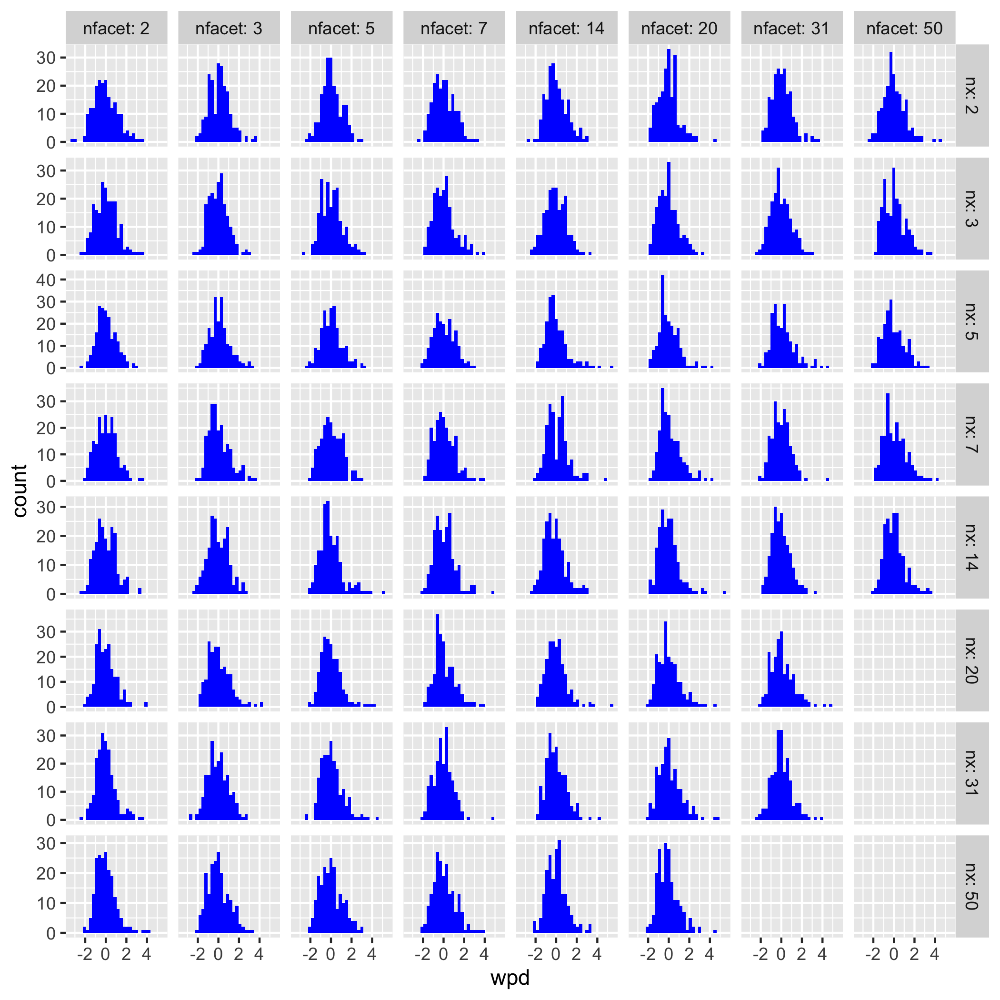
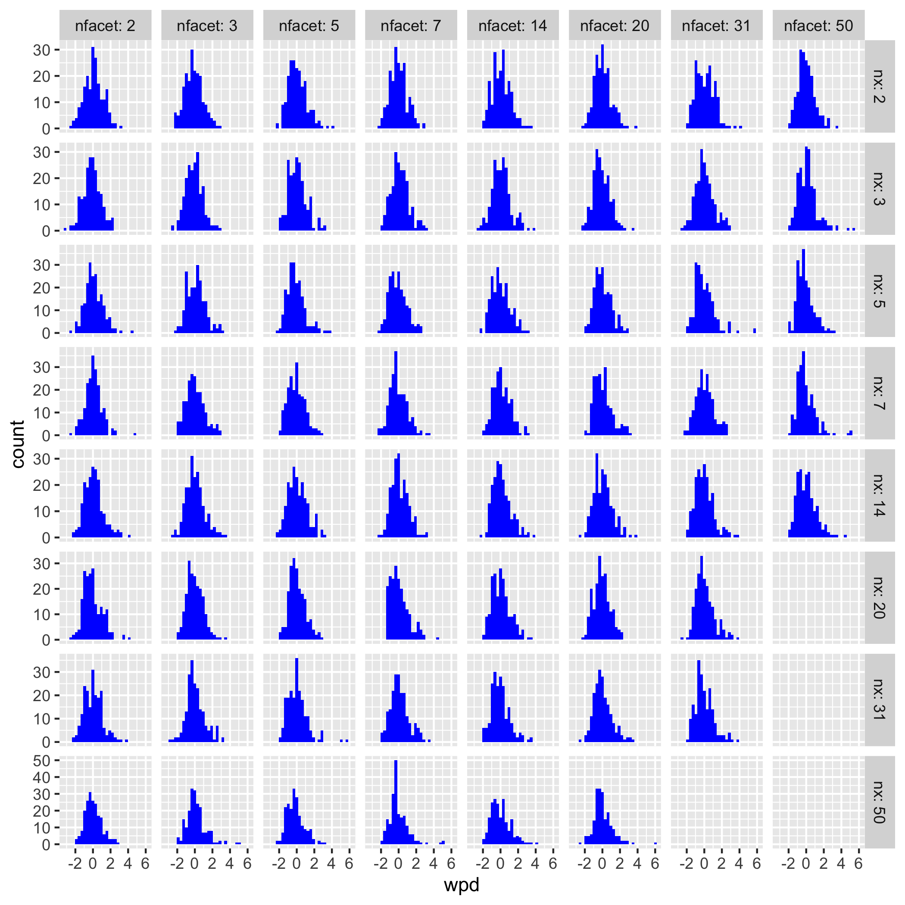
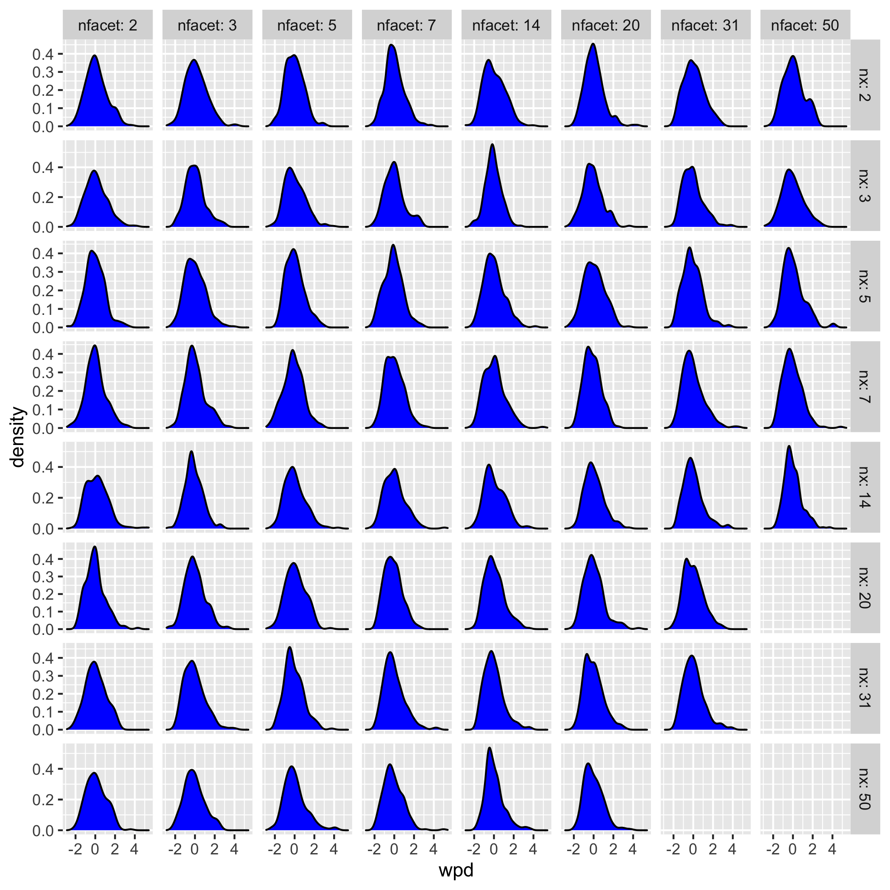

---

```{r setup, include=FALSE}
knitr::opts_chunk$set(echo = FALSE)
```

Designs

$D_{null}$  (No difference in distribution)  
$D_{var_f}$ (Difference in distribution only across facets)  
$D_{var_x}$ (Difference in distribution only across x-axis)  
$D_{var_{all}}$ (Difference in distribution in both facets and x-axis)  

# Recap of last week

## What worked?

We saw the effect on raw wpd for different choices of tuning parameter ($\lambda$) and effect of different increments ($\omega$). We saw that raw wpd has least values for null design $D_{null}$  and gradually increase with more deviation from the null case with maximum for $D_{var_{all}}$  (which was great). Values of $\lambda$ for which $D_{var_x}$ and $D_{var_f}$
interact is $0.5$ (nice as that's what we were expecting). Moreover, the raw wpd values increase with increasing  $\lambda$ for $D_{var_x}$ and decrease with increasing  $\lambda$ for $D_{var_f}$ (as expected since the measure is linearly related to $\lambda$.)

## What  didn't work?

Though the distribution of wpd remains the same with normal distribution with different means just by scaling the data as a preprossing step. The same doesn't happen for a Gamma distribution where the location of the distribution changes with different locations of the Gamma distribution. Box-cox transformations on the raw data did not work. It was suggested that we try out quantile transformation to bring back the quantiles of the raw data to standard normal.

# Results from this week

## What worked?

- Preprocess data: quantile  transformation of the data to standard normal.

[Sort the sample $x_{(1)}, x_{(2)}, \dots, x_{(n)}$. Estimate the cumulative probabilities for each point
$p_{(1)}, p_{(2)}, \dots, p_{(n)}$ such that $p_{(i)} = P(X< x_{(i)})$. Transform each observation $x_{(i)}$ into observation $y_{(i)} = \Phi^{-1}(p_{(i)})$, where $\Phi^{-1}$ is the inverse of the cumulative distribution of a standard normal distribution.]

(** All of this is being done by the R function `qqnorm`. I checked that data from different distribution ($z$) could be transformed to normal using `qqnorm(z)$x`. Please let me know if you think I am missing anything here**)

- check if the distribution of the raw wpd starting from a Gamma (0,5, 1) and Gamma(2, 1) distribution looks similar to the distribution of the raw wpd starting from a N(0,1) distribution.
(More or less it does, yippee. (**Please let me know if you think I am missing anything here
\autoref{fig:gamma-diff},
\autoref{fig:gamma-diff-trans}**)

- how mean and sd of the distribution of raw wpd changes with increasing x-axis and facet categories - more understanding of which normalisation process to choose. (\autoref{fig:mean-sd-ns-nfacet})

- Now that quantile transformation has worked, we wanted to check which process of normalization works. Suppose $\{d_1, d_2, \dots, d_D\}$ are the JS distances from a panel

a) $wpd_{norm1} = wpd/log(D)$

b) $wpd_{norm2} = wpd - mean(wpd^*)/sd(wpd^*)$, where $wpd^*$ 's are obtained by shuffling the data. The distribution of $wpd_{norm2}$ is expected to have similar mean and sd for different x-axis and facet categories.


Appoach a) did not work. But Approach b) is working. (**Please let me know if you think I am missing something in my conclusions by looking at 
\autoref{fig:normal01-norm},
\autoref{fig:gamma01-norm},
\autoref{fig:gamma21-norm}
**)


## To do now?

### Alternate designs
Behavior of $wpd_{norm2}$ under different designs need to be monitored. Designs need to be constructed such that there is no **confounding factors** while deciding how distribution of $wpd_{norm2}$ changes with different x-axis and facet categories.

- $$\mu_{j.} = \mu + j\omega$$
(for design vary_x)
- $$\mu_{.k} = \mu + k\omega$$
(for design vary_f)

If the designs are like the above, it would mean that mean and sd of the panels would also increase when x-axis and facet categories increase. 

One way to keep mean comparable across situations would be to do the following (as discussed last with Di)
Suppose we will allow a highest mean difference of $M$ unit for each panels, which means panels with different x-axis and facet categories would also have a highest mean difference of $M$ units.

For example, if $M=5$ and design = $D_{var_x}$ then $$\mu_{j.} = \mu + j\omega$$

- $\omega$ = 5, for $nx = 2$
- $\omega$ = 5/2, for $nx = 3$
- $\omega$ = 5/3, for $nx = 4$ and so on.

**Should we be bothered about it or not since we are pre-processing the data to start with?**


### Structuring the simulation section of the paper

Follow the story line like this one?
**Or you suggest some other ways?**


# Detail results:

**Assumptions:** There is no difference in distribution between any facet or x-category since it is the null design.
Process is run $nsim$ times to plot the distribution.
$nsim = 200$ 
$\lambda = 0.67$ 

**Questions:** 
- How raw value of wpd changes with different nx and nfacet for different location and scale of a Normal and non-normal distribution

## Standard normal distribution

```{r normal, fig.cap="Density plots of raw wpd is shown for N(0,1) distribution. The densities change across different facet and x levels, which implies wpd value changes with increasing x and facet levels."}

knitr::include_graphics(here::here("simulations/raw/null_design_quantrans/figs/nxbyfacet_density_wpd_N01.png"))
```


<!-- ## Location and scale of the distribution under null design -->

<!-- **Objective:** 1. Behavior of wpd under different null designs N(0,1), N(5, 1), Gamma(0.5,1), Gamma(2,1) for different nx and nfacets.  -->

## How mean and sd changes with increasing x-axis and facet levels?

```{r mean-sd-ns-nfacet, fig.cap="Movement of mean and sd for raw wpd is shown for different number of levels (nlevel) of x-axis and facets through line plots. Mean increases and sd decreases more sharply for increasing x-axis levels as compared to facet levels. It seems like both mean and standard deviation are affected more by change in the x-axis levels than the facet levels.", fig.pos="h"}
knitr::include_graphics(here::here("simulations/raw/null_design_quantrans/figs/mean_sd_nx_nfacet.png"))

```


## Normal distributions with different means

```{r normal-diff, fig.cap="Ridge plots of raw wpd is shown for N(0,1), N(0,5)  and N(5,1) distribution. The densities change across different facet and x levels but look same for the three normal distributions, which implies wpd value is unaffected by the change in mean value of the normal distribution.", fig.pos="h"}
knitr::include_graphics(here::here("simulations/raw/null_design_quantrans/figs/diff_mean3_normal.png"))
```

## Gamma Distribution with different locations before quantile transformation

```{r gamma-diff, fig.cap="Ridge plots of raw wpd is shown for G(0.5,1) and G(2,1) distribution (before quantile transformation). The densities change across different facet and x levels and also for the two distributions, which implies wpd value is affected by the change in location value when distributions are not normal.", fig.pos="h"}
knitr::include_graphics(here::here("simulations/raw/null_design_quantrans/figs/extra/gamma_ridge_nxbynfacet.png"))
```

## Gamma Distribution with different locations after quantile transformation


```{r gamma-diff-trans, fig.cap="Ridge plots of raw wpd is shown for G(0.5,1) and G(2,1) distribution after quantile transformation looks similar and hence is unaffected by change in location.", fig.pos="h"}
knitr::include_graphics(here::here("simulations/raw/null_design_quantrans/figs/diff_mean3_gamma.png"))
```

<!-- ## Normalise by dividing log(number of distances) -->

<!-- ```{r normalise-n01, fig.cap="Density plots of raw wpd is shown for N(0,1) distribution after dividing max by log(number of distances). The densities are reduced to zero and varies. So this normalisation approach is not efficient. The raw wpd values are already very low and then dividing them by logarithm of a large number brings it back to zero."} -->

<!-- knitr::include_graphics(here::here("simulations/norm/null_design_quantrans/figs/nxbyfacet_density_wpd_N01.png")) -->
<!-- ``` -->

<!--  The densities are reduced to zero and varies. So this normalisation approach is not efficient. The raw wpd values are already very low and then dividing them by logarithm of a large number brings it back to zero -->
 
## Normalise by permuting data

```{r gamma21-norm, fig.cap="Density plots of normalised wpd is shown for Gamma(2,1) distribution. The mean and sd of the distribution looks almost similar for different facet and x-axis categories", fig.pos="h"}


```

```{r gamma01-norm, fig.cap="Density plots of normalised wpd is shown for Gamma(0.5,1) distribution, which is more skewed. The mean and sd of the distribution looks almost similar for different facet and x-axis categories", fig.pos="h"}


```


```{r normal01-norm, fig.cap="Density plots of normalised wpd is shown for Normal(0,1) distribution. The mean and sd of the distribution looks almost similar for different facet and x-axis categories.", fig.pos="h"}


```
# How to design the alternate designs when distributions are actually different?


